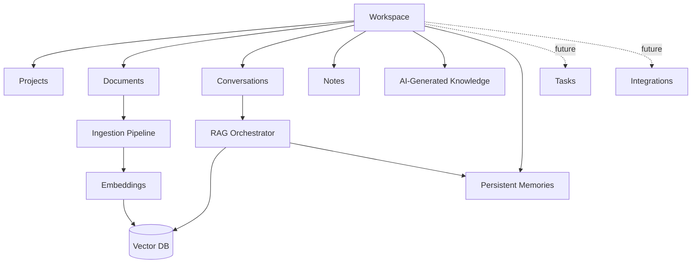
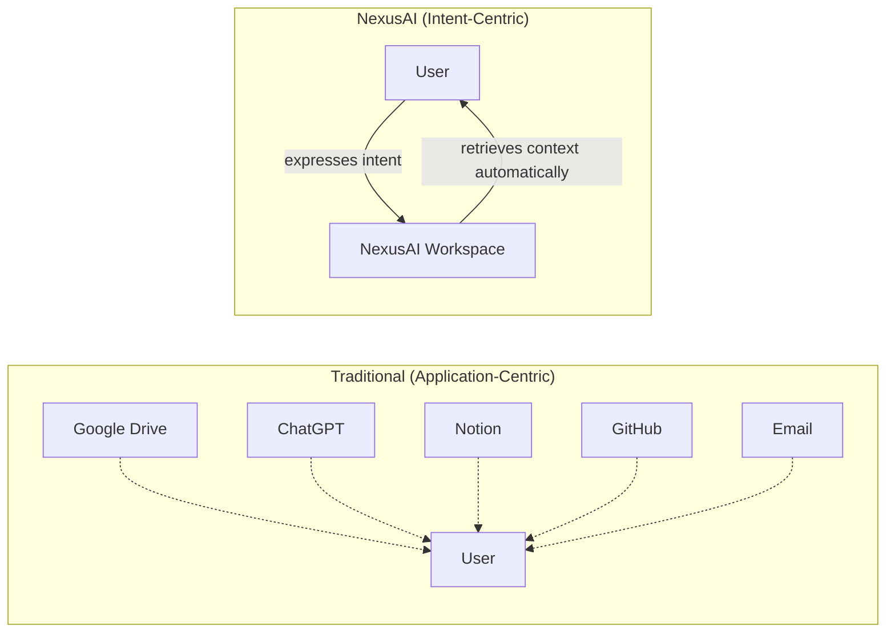
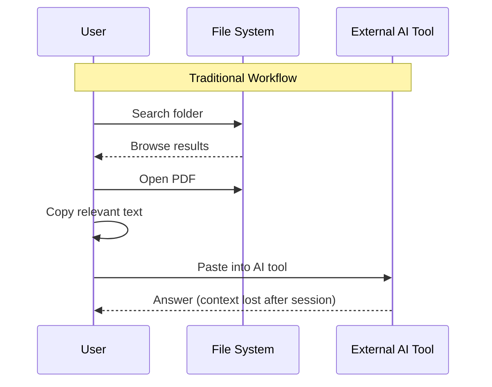
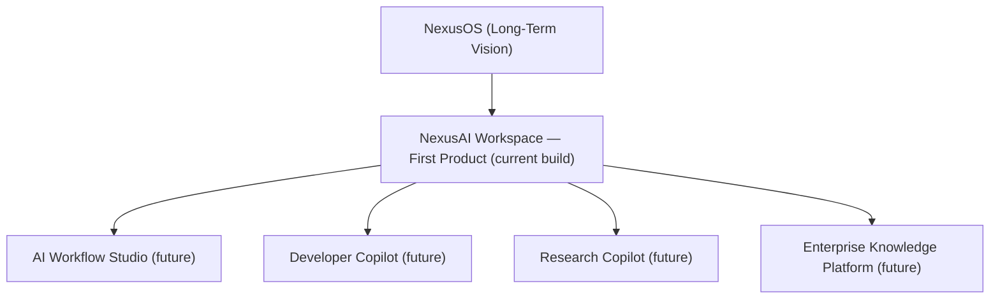

# Chapter 1 — Executive Summary

**Document:** NexusAI Workspace — Product Requirements Document (PRD)
**Chapter:** 1 of N
**Status:** Final
**Owner:** Product & Engineering
**Source:** Original PRD v1.0, Chapter 1

---

## Purpose

This chapter establishes the *why* of NexusAI Workspace before any *what* or *how*. Every architectural decision made in later chapters (SAD, BIS) will be justified against the objectives defined here. If a future technical decision cannot be traced back to a goal in this chapter, that is a signal the decision needs re-justification — not that this chapter needs to bend to fit the decision.

## Scope

This chapter covers:
- Product vision, mission, and philosophy
- The problem space and its business motivation
- Product category and competitive positioning
- Long-term roadmap (NexusOS)
- Product-level and engineering-level objectives
- Success criteria

This chapter explicitly does **not** cover:
- System architecture, data models, or infrastructure (→ SAD)
- API contracts, service boundaries, or persistence (→ BIS)
- Pricing, monetization, or go-to-market strategy (not yet defined — see [Identified Gaps](#senior-engineering-review) below)
- User personas and detailed workflows (recommended as a new chapter — see Future Enhancements)

## Objectives of This Chapter

1. Give every future contributor (engineer, reviewer, or hiring manager reading this as a portfolio piece) a precise, non-ambiguous understanding of what is being built and why.
2. Provide the criteria against which architectural trade-offs in later chapters will be judged.
3. Surface product-level ambiguities *now*, while they're cheap to fix, rather than after the SAD locks in an architecture around an unstated assumption.

---

## 1.1 Introduction (Expanded)

NexusAI Workspace is a production-grade, AI-native knowledge workspace for individuals and teams. It is deliberately positioned **against** two existing categories rather than as a member of either:

| Existing Category | What It Solves | What It Doesn't Solve |
|---|---|---|
| Document management (Google Drive, Notion, Confluence) | Storage, organization, collaboration | Understanding; retrieval requires the user to already know where to look |
| Standalone AI chat (ChatGPT, Claude.ai, Gemini) | Reasoning over provided context | Persistence; every session starts from zero unless the user manually re-supplies context |

NexusAI Workspace's differentiated bet is **knowledge continuity**: the system's usefulness compounds over time because it accumulates and indexes understanding, rather than resetting per session or per file.

**Engineering implication:** this means the core hard problem is not "call an LLM" — it is **retrieval quality and memory correctness over time**, which is a data-engineering and information-retrieval problem wearing an AI UI. This should set expectations for where engineering effort concentrates in later chapters (ingestion pipeline, embedding/chunking strategy, retrieval ranking, memory lifecycle) rather than on prompt engineering.

## 1.2 Vision Statement (Expanded)

> Build the world's most intelligent AI-native workspace where every document, conversation, project, note, and piece of knowledge becomes instantly understandable, searchable, and reusable through artificial intelligence.

A vision statement this broad is useful for orienting direction but is **not falsifiable** — it can't tell you whether a given release succeeded. That gap is intentional at the vision level (visions are aspirational by design) but it means Chapter/Section 1.12 (Success Definition) has to do the real work of making this measurable. Flagged there.

**NexusOS** is the long-horizon extension of this vision: an "AI-native operating layer" where computing shifts from application-driven to intent-driven. For the purposes of this project, NexusOS should be treated as **north-star framing only** — it should influence naming and extensibility decisions (e.g., don't hard-code assumptions that only make sense for a single-product workspace) but should not pull scope into the current build. This boundary is worth stating explicitly so "vision creep" doesn't leak into the SAD.

## 1.3 Mission Statement (Expanded)

The mission decomposes into six pillars. Each pillar below is annotated with what it *requires architecturally* — this is the bridge between PRD and SAD.

| Pillar | Product Promise | Architectural Requirement (preview) |
|---|---|---|
| Persistent AI memory | AI remembers across sessions | Durable memory store, memory-scoping rules, retention/expiry policy |
| Intelligent document understanding | Documents are parsed, chunked, and semantically indexed | Async ingestion pipeline, embedding generation, vector storage |
| Context-aware conversations | Conversations use relevant prior knowledge automatically | Retrieval-augmented generation (RAG) orchestration layer |
| Semantic knowledge retrieval | Natural-language query replaces keyword/folder search | Vector database + hybrid search (semantic + keyword fallback) |
| AI-assisted productivity | Summarization, Q&A, synthesis across sources | LLM provider abstraction, prompt/response pipeline |
| Scalable knowledge management | Grows from individual → team → enterprise | Multi-tenant data model, workspace isolation |

This table is the single most important artifact in Chapter 1 for engineering purposes: **every row is a future subsystem.** The SAD should be organized so each pillar maps cleanly to one or more chapters, so nothing in the mission is architecturally orphaned.

## 1.4 Product Overview (Expanded)

A workspace is the top-level tenancy boundary. Its current and future contents:

**Unresolved question worth settling before the SAD:** the PRD says "users create workspaces" but doesn't yet state the **workspace-to-user cardinality**. Is it:
- (a) one user → many personal workspaces, no sharing (simplest, fastest to ship), or
- (b) one workspace → many users with roles/permissions (needed for "teams," which the PRD's long-term vision implies)?

This single decision changes the auth model, data model, and RAG scoping logic significantly (memory and retrieval must never leak across workspace boundaries). Recommend resolving this explicitly in the PRD before the SAD's data model chapter is written, rather than letting the BIS default to whichever is easiest to code.

## 1.5 Product Category (Expanded)

| Category | Direct Competitors (context, not exhaustive) | NexusAI's Differentiator |
|---|---|---|
| AI Knowledge Workspace (primary) | Notion AI, Mem, Reflect | Deeper RAG + explicit persistent memory model rather than bolt-on AI search |
| AI Productivity Platform | ChatGPT, Claude.ai | Knowledge persists and compounds across the whole workspace, not per-thread |
| Developer Productivity Tool | GitHub Copilot Workspace, Cursor | Not code-execution focused; focused on knowledge/document reasoning |
| Research Assistant | Elicit, Perplexity | Operates over the user's *own* private corpus, not the open web |
| Enterprise Knowledge Platform (future) | Glean, Guru | Not yet in scope — correctly deferred per PRD |

This table isn't in the original PRD; it's added because "product category" claims are hard to evaluate without naming what you're implicitly being compared against. It also gives future chapters a concrete bar: if a design decision makes retrieval quality worse than what Notion AI or Glean already do, that's a regression against the stated positioning, not just an internal trade-off.

## 1.6 Product Philosophy (Expanded)

The philosophy is sound, but it's worth naming the risk explicitly rather than treating it as solved by architecture alone: **retrieval quality is the entire product.** If semantic search returns irrelevant or stale context, the "ask instead of search" promise breaks worse than a traditional folder search does — because the user has no fallback mental model (no folder tree to manually check) when the AI is wrong. This raises the bar on chunking strategy, re-ranking, and — critically — giving the user a way to see *what was retrieved* so they can catch and correct bad retrieval (a transparency/trust requirement that should be a UX requirement in a later chapter, not just a backend concern).

## 1.7 Core Product Principle (Expanded)

The original PRD illustrates this as two linear flows. Rendered as an actual sequence diagram for precision:

```mermaid
sequenceDiagram
    participant User
    participant Nexus as NexusAI Workspace
    participant KB as Knowledge Base (Vector DB + Memory)
    participant LLM as LLM Provider

    Note over User,LLM: NexusAI Workflow
    User->>Nexus: Ask question (natural language)
    Nexus->>KB: Semantic retrieval (scoped to workspace)
    KB-->>Nexus: Relevant chunks + memory
    Nexus->>LLM: Question + retrieved context
    LLM-->>Nexus: Grounded answer
    Nexus-->>User: Answer + source citations
    Nexus->>KB: Update memory (if relevant)
```

Note the addition of **"source citations"** and **"update memory"** steps — these aren't in the original diagram but are implied requirements: a RAG answer without visible sourcing undermines trust (see 1.6), and a memory system that's write-only without a defined update policy will accumulate stale or contradictory facts over time (see Section 1.13 and the Senior Engineering Review below).

## 1.8 Business Motivation (Expanded)

| Repetitive Activity | Estimated Cost Pattern | How NexusAI Addresses It |
|---|---|---|
| Searching documents | Time-linear with corpus size; worsens over time | Semantic retrieval, sub-linear perceived effort |
| Re-uploading files to AI tools | Repeated per session | Persistent ingestion, indexed once |
| Repeating context to AI | Repeated per conversation | Persistent memory + RAG |
| Finding previous conversations | Manual scrollback / search | Conversations indexed like documents |
| Managing notes across tools | Fragmented across apps | Unified workspace |
| Switching applications | Context-switch cost (well-documented in productivity research) | Single intent-driven interface |

The PRD's framing — "current AI assistants solve reasoning; current storage platforms solve organization; few systems solve knowledge continuity" — is a reasonable and testable market thesis. Its risk is real, though: incumbents (Notion, Glean, ChatGPT with memory/projects features) are actively moving into this exact gap. Worth an explicit **competitive-durability note** in the PRD: what specifically resists incumbents extending their existing products to add this (i.e., is there a defensible moat here, or is this exercise correctly scoped as a demonstration project rather than a company)? Given Chapter 1.13's framing ("showcase engineering capability"), this is likely intentional and fine — but it should be stated as a conscious scope decision rather than left ambiguous.

## 1.9 Why This Product Exists (Expanded)

The student example (OS notes → DBMS notes → Computer Networks notes) is a good concrete scenario. Worth extending it to surface a requirement the original text doesn't state: **cross-document synthesis.** The value isn't just "remembering" three separate uploads — it's the AI being able to answer "compare how OS and DBMS both handle concurrency" by reasoning *across* previously-separate documents. That's a materially harder retrieval problem (multi-hop retrieval across chunks from different source documents) than single-document RAG, and it should be named as a target capability now so the SAD's retrieval design doesn't accidentally optimize only for single-source lookup.

## 1.10 Long-Term Vision (Expanded, with corrected roadmap)

**Documentation defect found:** the original roadmap diagram draws a single downward arrow chain starting at *NexusOS* and ending at *AI Operating Layer*, which reads as "NexusOS comes first, then Workspace." That contradicts Section 1.10's own text: *"NexusAI Workspace is not the final destination... it is the first product within [NexusOS]."* Corrected version, showing NexusOS as the encompassing vision rather than a sequential first step:

**Confirmed (D3, resolved):** NexusOS is the long-term vision layer, not a sequential first step. NexusAI Workspace — the project currently being built — is the first product realizing that vision. Future products branch from the Workspace rather than chain linearly: **AI Workflow Studio, Developer Copilot, Research Copilot, and Enterprise Knowledge Platform**. This corrected version replaces the original in the canonical PRD.

## 1.11 Product Objectives (Expanded)

| Objective | Original Statement | Expanded Definition | Primary Trade-off |
|---|---|---|---|
| Knowledge Understanding | AI understands rather than stores | Requires chunking + embedding strategy tuned per content type (code vs. prose vs. tables) | Understanding quality vs. ingestion latency/cost |
| Persistent Memory | Remember across sessions, respect boundaries | Requires an explicit memory *lifecycle*: creation, scoping, update, conflict resolution, expiry, deletion | Recall usefulness vs. staleness/privacy risk |
| Intelligent Retrieval | Replace keyword search | Hybrid semantic + keyword (pure semantic search underperforms on exact terms: IDs, error codes, proper nouns) | Retrieval accuracy vs. system complexity |
| Productivity | Reduce repetitive work | Summarization/Q&A must be *grounded* (cite sources) to be trustworthy, not just fluent | Response speed vs. groundedness verification |
| Scalability | Individual → team → enterprise, no redesign | Requires the workspace cardinality decision from Section 1.4 to be made *now* | Early simplicity vs. costly future migration |
| Extensibility | Support future agents/plugins | Requires a provider-abstraction and plugin boundary designed from day one | Initial flexibility vs. initial complexity |

The "Scalability" and "Extensibility" objectives are the two most likely to be silently violated by expedient early implementation choices (e.g., hard-coding single-tenant assumptions because it's faster to ship v1). Recommend the SAD treat multi-tenancy and provider-abstraction as **non-negotiable from the first chapter**, even in an MVP, since retrofitting tenant isolation into a RAG/memory system after the fact is a rewrite, not a refactor — vector DB namespacing and memory scoping have to be correct on day one.

## 1.12 Success Definition (Expanded — made measurable)

The original list is entirely qualitative. Reframed with concrete, testable criteria:

| Original Criterion | Measurable Reframing (proposed) |
|---|---|
| Ask questions in natural language | ≥90% of test queries return a syntactically valid, on-topic response |
| Retrieve accurate information from own documents | Retrieval precision/recall benchmarked against a labeled eval set (requires building one — see Future Enhancements) |
| Continue conversations without repeating context | Multi-turn conversation retains referenced entities/facts across N turns without re-statement (testable via scripted eval) |
| Organize projects with minimal manual effort | Time-to-first-value for a new workspace (upload → first useful answer) under a target threshold |
| Trust the system as knowledge base grows | Retrieval quality does not degrade as corpus size increases (regression-tested at 10x, 100x corpus size) |

These are proposed, not decided — flagging that a future chapter (or an addendum to this one) should own turning these into an actual **eval framework**, since "success" for a RAG system is meaningless without a benchmark corpus and query set to measure against.

## 1.13 Engineering Objectives (Expanded — stack conflict flagged)

The original list is a reasonable checklist of practices to demonstrate. Two things need resolution before they can drive architecture:

**Confirmed (D2, resolved):** the stack is an intentional polyglot: **MERN** (MongoDB, Express, React, Node.js) for the application layer, and **Python** for the AI layer — specifically **LangGraph** (not LangChain) for orchestration, **Qdrant** for the vector store, and **Hugging Face** for embeddings/models. This is a deliberate two-runtime architecture, not an accidental byproduct of two documents written independently.

One nuance worth carrying into the SAD: the master prompt's original stack list said "LangChain only where it provides value," but the confirmed choice is **LangGraph** — a graph/state-machine orchestration model rather than LangChain's linear-chain model. This is the right call for this product specifically, because RAG-with-persistent-memory (Section 1.3) is inherently stateful and often non-linear (retrieve → check memory → maybe re-retrieve → synthesize → update memory), which maps naturally onto a graph of nodes and conditional edges rather than a fixed chain. The SAD's orchestration chapter should treat this as the reason for the choice, not just a library preference.

| Layer | Runtime | Responsibility |
|---|---|---|
| Application / API layer | Node.js (Express) | Auth, workspace/project CRUD, WebSocket/real-time, API gateway |
| Data layer (application state) | MongoDB | Users, workspaces, projects, metadata, conversation records |
| Frontend | React | UI |
| AI orchestration | Python (LangGraph) | RAG pipeline, memory read/write logic, multi-step reasoning graphs |
| Vector storage | Qdrant | Embedding storage + semantic search |
| Embeddings / models | Hugging Face (Sentence Transformers) | Document + query embedding generation |

This still leaves one open item for the SAD to resolve: **the inter-service contract** between the Node app layer and the Python AI layer (REST vs. gRPC vs. message queue for async ingestion jobs). Flagging it here so it's the SAD's first architectural decision rather than an implicit default.

---

## Design Decisions & Trade-offs Log

| # | Decision Needed | Options | Recommendation | Status |
|---|---|---|---|---|
| D1 | Workspace-to-user cardinality | Single-user v1 workspaces with an extensible data model | Design for multi-user from the start | **Resolved** |
| D2 | Service runtime split | Node+Python polyglot vs. single-runtime | MERN (app layer) + Python/LangGraph/Qdrant/HuggingFace (AI layer) | **Resolved — confirmed by user** |
| D3 | Roadmap diagram | Original (sequential) vs. corrected (hierarchical) | NexusOS (vision) → NexusAI Workspace (first product) → AI Workflow Studio / Developer Copilot / Research Copilot / Enterprise Knowledge Platform (future, parallel) | **Resolved — confirmed by user** |
| D4 | Success metrics | Qualitative vs. measurable | Adopt measurable reframing + build an eval corpus | Proposed — carried forward, not yet confirmed |
| D5 | Node↔Python inter-service contract | Query-time calls use synchronous REST; ingestion remains queue-based | Resolved | **Resolved** |

## Security Considerations (Chapter-Level)

- **Tenant isolation** is the single highest-severity risk implied by this chapter: a bug that lets Workspace A's retrieval touch Workspace B's vectors or memories is a data breach, not a bug. This must be a first-class constraint in the SAD's data model, not an application-layer afterthought.
- **Persistent memory and privacy**: "respecting workspace boundaries and user privacy" (1.11) is stated as a goal but has no defined mechanism yet — e.g., does the user have a way to view/delete what the AI remembers about them? This has real-world compliance implications (GDPR right-to-erasure, CCPA) if this ever moves beyond a demo project.
- **Document ingestion** of arbitrary user-uploaded files (PDFs, docs) is a common injection/exploit surface (malicious file parsing, prompt injection embedded in document text designed to hijack the RAG pipeline). Should be named explicitly as a threat in the SAD's ingestion chapter.

## Scalability Considerations

- Vector database growth is not linear with document count alone — chunking strategy determines vector count per document; this should be benchmarked early, not assumed.
- The "no redesign" scalability objective (1.11) is only achievable if tenancy (D1) and provider abstraction are decided correctly at this stage — see above.

## Performance Considerations

- RAG introduces a multi-hop latency chain (embed query → vector search → construct prompt → LLM call). Chapter 1 should set a rough target (e.g., "p95 response time under Xs") so later chapters have a number to design against, rather than optimizing without a target.

## Best Practices Applied in This Expansion

- Preserved all original PRD content verbatim in meaning; nothing removed, only expanded.
- Converted informal ASCII-art flows into precise Mermaid diagrams that render deterministically.
- Surfaced every "future" or "TBD" implication as an explicit open decision rather than letting it remain implicit.
- Cross-referenced product objectives to their eventual architectural consequence, so the SAD can be written traceably.

## Implementation Notes for Later Chapters

- The SAD should open with the D1 and D2 decisions above, since nearly every subsequent architecture chapter depends on them.
- The BIS will need an explicit memory lifecycle spec (create/update/expire/delete) — flagged here so it isn't discovered as a gap mid-implementation.
- An eval framework (labeled query/answer pairs against a test corpus) should be scoped as its own deliverable, likely alongside the RAG chapter.

## Future Enhancements (Chapter-Level)

- Add a **User Personas & Core Workflows** chapter (referenced above) — Chapter 1 asserts users are "individuals and teams" and mentions students/engineers as examples, but no formal persona definitions exist yet to drive UX decisions.
- Add a **Competitive Positioning** appendix expanding the table in 1.5 with a more rigorous feature-comparison matrix.
- Define pricing/tiers once the multi-tenancy decision (D1) is resolved, since pricing models are usually tenancy-shaped (per-seat vs. per-workspace).

---

## Senior Engineering Review

**Overall assessment:** Chapter 1 is a strong, coherent product vision with real technical substance (it correctly identifies retrieval + memory as the hard problem, not the LLM call). It is not yet fully self-consistent, and it defers two decisions (tenancy, runtime split) that materially shape everything downstream. Recommend resolving D1 and D2 before starting the SAD, since both are expensive to change after code exists.

**Do not simply approve:** per the working instructions, here is what I would push back on if this were an internal design review:
1. The roadmap diagram (D3) actively contradicts its own supporting text — small thing, but this is the kind of internal inconsistency that undermines credibility in a document meant to demonstrate engineering rigor.
2. "Success" (1.12) as written is unfalsifiable. A PRD that can't be used to determine ship/no-ship is incomplete, even at v1.
3. The MERN vs. Python-AI-stack tension (1.13) is the most consequential open item — it should be resolved with a named decision record, not left for the SAD to quietly default.

## Summary

Chapter 1 answers: what NexusAI Workspace is, why it exists, what makes it different, and what "done" should mean. This expansion preserves every original claim, adds the reasoning and diagrams needed to make those claims actionable, and surfaces four decisions (D1–D4) that should be resolved — ideally by you, since they're product calls, not engineering ones — before Chapter 2 (Software Architecture Document) begins.

**Next step:** confirm or adjust D1–D4 above, then provide the SAD (or tell me to proceed to expanding it) so Chapter 2 can be built on settled foundations rather than assumptions.
