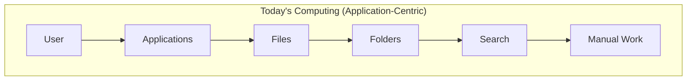
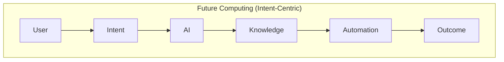
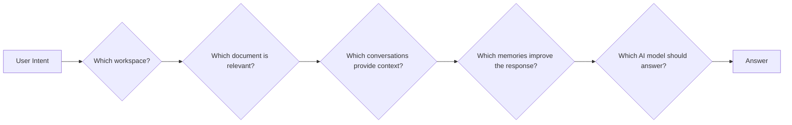
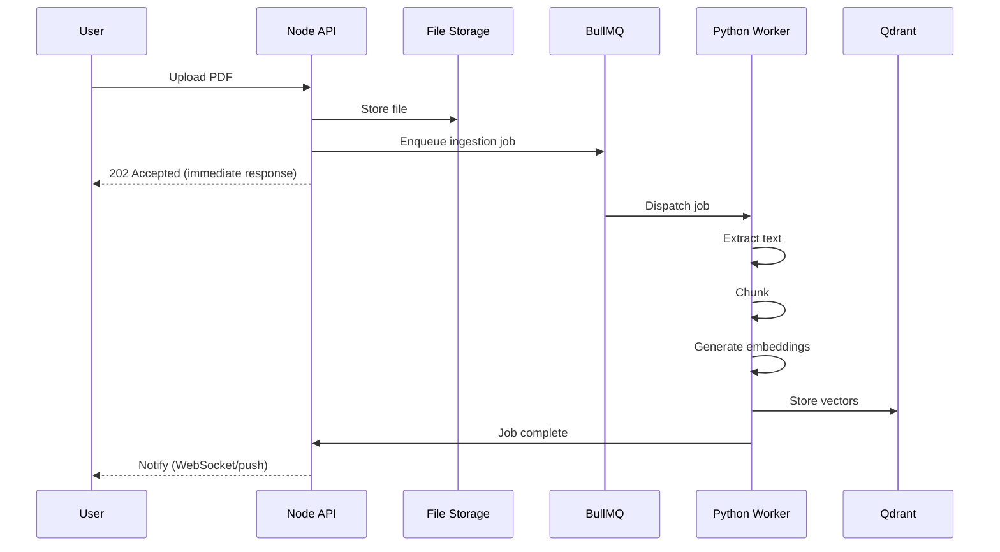
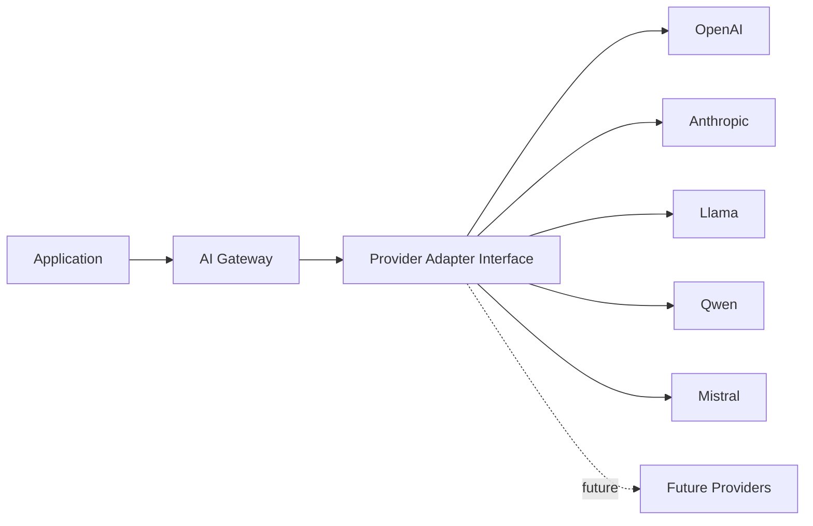

# Chapter 2 — Product Vision & Philosophy

**Document:** NexusAI Workspace — Product Requirements Document (PRD)
**Chapter:** 2 of 8
**Status:** Expanded / Under Review
**Depends on:** Chapter 1 (Executive Summary) — D1–D5 decision log
**Source:** Original PRD v1.0, Chapter 2 (preserved in full, expanded below)

---

## Purpose

Chapter 1 established *what* NexusAI Workspace is and *why* it exists. Chapter 2 goes one level deeper: it defines the **design philosophy** every future decision — product, UX, and architectural — must be checked against. Where Chapter 1 is externally facing (positioning, market), Chapter 2 is internally facing: it's the constitution engineers and designers use to resolve ambiguity when a spec doesn't cover a specific case.

## Scope

Covers: vision restated in philosophical terms, the seven design principles, product values, the eight engineering principles, UX principles, product goals, explicit product boundaries (is/is not), and the post-v1 roadmap.

Does not cover: specific architecture (→ SAD), specific APIs (→ BIS), or the tenancy/runtime decisions already logged in Chapter 1 (D1–D5) — this chapter is referenced against those, not a place to re-litigate them.

## Objectives of This Chapter

1. Translate vision into **testable design principles** — the kind that can produce a "no" during a design review, not just an aspiration.
2. Give engineering a checklist to evaluate whether a proposed feature or shortcut violates the product's philosophy.
3. Reconcile this chapter against Chapter 1's open decisions — notably, check whether anything here resolves D1 (it does — see below).

---

## 2.1 Vision (Expanded)

> To create the world's most intelligent AI-native knowledge workspace that understands, remembers, and assists users throughout their entire digital workflow instead of simply storing their information.

This restates Chapter 1's vision with one addition worth calling out explicitly: **"throughout their entire digital workflow."** That's a broader claim than "workspace" implies — a workflow spans multiple tools, not just what's uploaded into NexusAI. Chapter 2.12 later confirms this via planned integrations (GitHub, Google Drive, Notion, Slack, Calendar), so the phrase is intentional, not accidental scope creep. Worth flagging now so the SAD's ingestion/connector architecture is designed with external-tool integration in mind from the start, even though v1 won't build those integrations (per 2.12, they're future).

**The burden being removed** (original list — where is it stored, which app, which folder, which conversation, which document) is essentially a description of **information retrieval cost**. Reframed for engineering precision: the product's job is to drive the user's *cost of retrieval* toward zero relative to the *cost of asking*. This reframing matters because it gives a design test for any feature: *does this reduce retrieval cost, or does it just move it around?* (e.g., a feature that requires the user to manually tag documents so search works better technically works, but it re-introduces manual organization — the exact burden being removed. Tagging should be AI-assisted or automatic, not a user chore.)

## 2.2 Long-Term Vision (Expanded)

The two diagrams are effectively Chapter 1's Section 1.6/1.7 restated at the philosophy level rather than the workflow level — that's intentional repetition across chapters (vision → philosophy → workflow), but worth noting so it doesn't read as duplicated content by accident when all chapters are assembled into one document. Recommend a short cross-reference note in the final compiled PRD ("see also §1.6–1.7") rather than four independent explanations of the same idea across chapters.

**Engineering risk in this framing:** "Automation" as a step between Knowledge and Outcome is a bigger promise than anything scoped in Chapter 1 — Chapter 1's objectives stop at retrieval and reasoning (RAG, memory), not action-taking. If "Automation" implies the AI *does things* (not just answers questions), that has real safety and reversibility implications — this directly connects to **Principle 7: Human Control** (2.5), which explicitly says the platform should never perform destructive actions automatically. Recommend this diagram carry an implicit asterisk: for v1, "Automation" = generating drafts/plans/artifacts for the user to approve, not autonomous action. Worth stating explicitly rather than leaving "Automation" ambiguous next to a competing principle that constrains it.

## 2.3 Product Philosophy (Expanded)

The core reframing — traditional software assumes *users know where information is stored*, NexusAI assumes *users only know what they want* — is the clearest single sentence in the PRD so far and should probably anchor any pitch/README for this project.

Each decision node above (R1–R5) is a system responsibility the original PRD lists as prose bullets. Rendered as a chain, it's clear this is a **routing/orchestration problem**, not a single retrieval call — this is exactly the kind of multi-step, stateful decision chain that justifies the LangGraph choice confirmed in Chapter 1 (D2): a linear LangChain-style pipeline handles R2→R3→R4 reasonably, but R1 (workspace routing) and R5 (model selection) are better modeled as conditional graph nodes than as fixed pipeline steps, especially once multi-workspace or multi-model scenarios exist.

## 2.4 Core Belief (Expanded)

> Knowledge is significantly more valuable than files. Files are static. Knowledge evolves.

This is a strong philosophical claim, but it implies a concrete technical requirement that isn't yet specified anywhere: **if knowledge evolves, the system needs a way to detect and reconcile contradictions** — e.g., a user uploads a document in January stating one architecture decision, then a March conversation reverses that decision. If the system just accumulates chunks in a vector store, "knowledge" degrades into "an unordered pile of possibly-contradictory files," which is the opposite of the stated goal.

| Static (File Model) | Evolving (Knowledge Model, as claimed) | What This Requires |
|---|---|---|
| One version, one truth | Multiple versions over time, possibly conflicting | Temporal metadata on every ingested chunk/memory (when was this true?) |
| Retrieval returns whatever matches | Retrieval should prefer the *current* truth, but expose history if asked | Recency-aware ranking + explicit "superseded by" links |
| No relationship modeling | Relationships, dependencies, decisions | Some form of light knowledge-graph structure, not just flat vector chunks |

This is the single biggest **hidden requirement** found in Chapter 2 — recommend it become an explicit line item in the SAD's data model chapter (temporal versioning / contradiction handling), since "knowledge evolves" as a stated core belief, without a mechanism to handle evolution, is just marketing language.

## 2.5 Design Principles (Expanded)

| # | Principle | Original Intent | Engineering Consequence | Tension With |
|---|---|---|---|---|
| 1 | AI Native | AI is architecture, not a feature | Every ingestion/query path routes through the AI layer by default, not as an opt-in add-on | Cost — AI-native-by-default means every action has an inference cost; needs a cost-control strategy (caching, model tiering) |
| 2 | Knowledge First | Store knowledge, not documents | Documents are inputs to a processing pipeline, never the system of record on their own | Storage — raw files still need to be retained (compliance, re-processing, user download); "knowledge first" ≠ "files discarded" |
| 3 | Intent Driven | Users state goals; platform executes | Requires a planning/decomposition layer (goal → sub-tasks), shown in the interview-prep example | Principle 7 (Human Control) — decomposition should produce a *plan*, not autonomous execution, for anything irreversible |
| 4 | Memory by Default | System remembers without manual config | Requires passive signal capture (usage patterns) in addition to explicit memory writes | Privacy — "by default" memory capture needs an opt-out and visibility mechanism (see Security below) |
| 5 | Explainability | Responses show evidence | Every RAG answer must carry retrieved-source metadata through to the UI, not just the generated text | Latency/complexity — sourcing adds a rendering and citation-mapping step |
| 6 | Transparency | User can see why/what/which model | Requires a "reasoning trace" surfaced to the user, not just logged internally | Same as above |
| 7 | Human Control | AI assists, never destructively acts alone | Any delete/overwrite/irreversible action requires explicit confirmation, even if AI "decided" it's correct | Principle 3 (Intent Driven) — the more autonomous the system feels, the stronger this guardrail needs to be |

**Principle 3's example** (interview prep: find notes → retrieve questions → generate revision → create flashcards → prepare quiz → generate schedule) is a good concrete illustration, but note it's a chain of **six** AI-driven steps triggered by one user sentence. Worth naming as a formal capability tier now — this is qualitatively different from single-turn RAG Q&A, and is really an early example of **agentic planning**, which the PRD doesn't formally introduce until 2.12 ("Agent orchestration (LangGraph)" is listed as *future*, post-v1). Recommend flagging this inconsistency: either the interview-prep example is aspirational (post-v1, same as agent orchestration) and should be labeled as such, or agentic planning needs to move into v1 scope. As written, a reader could reasonably expect this six-step automation in v1, which the roadmap (2.12) contradicts.

**Principles 5 and 6 (Explainability, Transparency) are effectively the same principle at two levels of detail** — 5 is about the *answer* (show evidence), 6 is about the *system* (show process/model/memories used). Not a contradiction, but recommend merging their engineering requirements into a single "Response Transparency" requirement in the SAD/BIS so it isn't implemented as two separate, possibly inconsistent features.

## 2.6 Product Values (Expanded)

The original list (Accuracy, Reliability, Privacy, Productivity, Scalability, Transparency, Security, Extensibility, Maintainability, Performance) is comprehensive but, as a flat list, gives no guidance for when two values conflict — which they will. Reframed as a priority-tension table for the cases most likely to arise:

| Tension | Example | Recommended Default (proposed — confirm) |
|---|---|---|
| Accuracy vs. Performance | Slower, higher-quality retrieval (re-ranking, larger context) vs. fast response | Accuracy wins for first answers on a topic; performance wins for follow-ups (can cache/reuse retrieval) |
| Privacy vs. Memory-by-Default (Principle 4) | Passive memory capture improves usefulness but reduces user control | Memory capture opt-out must exist per Chapter 1's security notes; default should be "on with visibility," not "on, hidden" |
| Extensibility vs. Maintainability | Provider-agnostic abstractions add indirection/complexity | Extensibility wins for the LLM/embedding provider boundary specifically (named as a Chapter 1 objective); elsewhere, prefer simplicity |

This table is new — it's not in the original PRD — but is included because an unordered list of values reads as complete while actually deferring every hard call to whoever implements it later, usually inconsistently across features.

## 2.7 Engineering Principles (Expanded)

**Modular Architecture / Separation of Concerns** — the original stack table (Frontend/Backend/Python/Redis/MongoDB/BullMQ/Qdrant) is the first place in the PRD that names the **full** stack, including **Redis** and **BullMQ**, which Chapter 1's stack table (built during that chapter's expansion) did not yet include. Reconciled version:

| Layer | Technology | Responsibility | Confirmed In |
|---|---|---|---|
| Frontend | React | User interface | Ch.1 §1.13, Ch.2 §2.7 |
| Backend (API) | Node.js / Express | Business logic, auth, orchestration of requests | Ch.1 §1.13, Ch.2 §2.7 |
| AI Layer | Python (LangGraph) | AI reasoning, RAG orchestration | Ch.1 D2, Ch.2 §2.7 & §2.12 |
| Cache | Redis | Caching (session, hot queries — scope TBD in SAD) | **New in Ch.2** |
| Persistence | MongoDB | Application data (users, workspaces, projects) | Ch.1 §1.13, Ch.2 §2.7 |
| Background Jobs | BullMQ | Async processing (ingestion pipeline) | Ch.1 §1.13, Ch.2 §2.7 |
| Vector Storage | Qdrant | Embeddings / semantic search | Ch.1 D2, Ch.2 §2.7 |

**Reconciliation note:** Chapter 1's stack table should be amended to include Redis and BullMQ so a reader doesn't encounter the "complete" stack for the first time in Chapter 2. Recommend treating this document's Chapter 1 file as amended accordingly (noted in that chapter's changelog once all 8 PRD chapters are done, to avoid repeated file churn mid-review).

**Event-Driven principle**, rendered as an actual async sequence rather than a linear flow list:

This is the clearest, most implementation-ready diagram in the PRD so far — recommend the BIS lift this sequence directly as the ingestion pipeline's reference contract, including the "202 Accepted then async notify" pattern, which is the correct choice for anything crossing the Node↔Python boundary (Chapter 1's D5, still open — this diagram implicitly answers *part* of D5 by showing a queue-based contract rather than synchronous REST for ingestion specifically; synchronous REST may still be right for lightweight query-time calls).

**API First** — good practice; worth adding one concrete implication: if frontend consumes APIs "exactly as external clients would" (as stated), this implies an API versioning strategy should exist from day one, since v1's own frontend becomes, in effect, the first external consumer to break on a breaking change.

**AI Provider Independence:**

Good principle, correctly generalized. One gap: the same independence principle isn't explicitly extended to **embedding models**, even though Hugging Face/Sentence Transformers is named as the embedding choice in Chapter 1. Embedding model choice is arguably *harder* to change later than LLM choice, because switching embedding models invalidates the entire existing vector index (all documents must be re-embedded). Recommend the SAD treat "embedding provider independence" as at least as important as LLM provider independence, and specifically design for **re-embedding/migration** as a first-class operational capability, not an afterthought.

**Scalability (100 → 1M users)** — the stated target is aspirational and fine as a north star, but as with Chapter 1's success criteria, an unqualified "no redesign" claim across three orders of magnitude of growth is optimistic for *any* architecture without specifying which layer is expected to bear that scale first (likely: vector search and LLM inference cost/throughput, not the Node CRUD layer). Recommend the SAD name the actual expected bottleneck layer rather than treating scalability as uniform across the stack.

## 2.8 User Experience Principles (Expanded)

The six UX principles (minimal clicks/configuration/waiting, maximum automation/context-awareness/consistency) are good direction but are in **direct tension with Principle 7 (Human Control)** from 2.5: "minimal clicks" and "maximum automation" push toward the system acting without confirmation; "human control" requires confirmation for destructive/irreversible actions. This isn't a flaw — it's a normal product tension — but it should be resolved with a concrete rule rather than left implicit: e.g., *"minimal friction applies to all reversible actions (search, summarize, draft); explicit confirmation applies to all irreversible actions (delete, overwrite, send)."* Recommend adding this as an explicit UX rule so the tension doesn't get resolved inconsistently feature-by-feature.

## 2.9 Product Goals (Expanded)

The original list is a reasonable feature-category summary but overlaps heavily with Chapter 1's mission pillars (§1.3) and objectives (§1.11). Rather than re-list, the useful addition here is mapping each goal to a **v1 vs. future** cut, since 2.12 already implies some of these (collaboration) are post-v1:

| Goal | v1 or Future? | Basis |
|---|---|---|
| Understand documents faster | v1 | Core ingestion pipeline |
| Search knowledge semantically | v1 | Core RAG |
| Chat with project-specific AI | v1 | Core RAG, scoped to project |
| Remember previous work | v1 | Persistent memory (Ch.1 §1.3) |
| Build reusable knowledge | v1 | Same as above |
| Reduce repetitive work | v1 | Emergent from above |
| Improve developer productivity | v1 (as a use case, not a dedicated feature set) | — |
| Support education | v1 (as a use case) | — |
| Support research | v1 (as a use case) | — |
| Support collaboration | **Future** | Explicitly deferred in §2.12; **this also resolves Chapter 1's open D1 decision** — see note below |

**Cross-chapter resolution:** Chapter 1 (D1) left open whether workspaces are personal-only or multi-user with roles from the start. Section 2.12 here states *"the first release focuses on individual knowledge work"* and lists *"Team workspaces"* under future versions. **This resolves D1: v1 = single-user workspaces; multi-user/team support is explicitly post-v1.** Recommend the SAD build the data model to be *extensible* to multi-user later (e.g., don't hard-code a 1:1 user:workspace foreign key in a way that can't become many:many), but v1 implementation itself should not build sharing/roles/permissions — that would be scope the PRD doesn't ask for yet.

## 2.10 Product Boundaries (Expanded)

| Is | Is Not | Relationship |
|---|---|---|
| AI Knowledge Platform | General-purpose OS | Category, not literal — "OS" here is metaphorical (NexusOS branding), not a literal kernel/OS product |
| Developer Workspace | Replacement for GitHub | Complements — no code hosting/version control planned |
| Document Intelligence Platform | Replacement for Google Drive | Complements — no claim to be a file storage/sync product (though it does store uploaded files) |
| Semantic Search Platform | Replacement for VS Code | Complements — no code editing/execution environment |
| AI Memory System | Replacement for Notion | Complements — no general-purpose note/wiki editing surface implied |
| Productivity Platform | — | — |

This table is valuable because it's the first place scope is bounded by explicit exclusion rather than inclusion. One boundary case worth raising: if v1 supports uploading and indexing arbitrary documents (Chapter 1 §1.4), users will inevitably use it *as* lightweight storage, whether or not that's the intent. Recommend the SAD/BIS define basic file-lifecycle expectations (retention, size limits, supported formats) even though "being a storage platform" is explicitly out of scope as a *positioning* claim — the underlying system still needs storage behavior defined.

## 2.11 Guiding Question (Expanded)

> Does this help users think less about managing information and more about solving problems?

This is a strong, usable design filter — recommend it literally be added as a checklist item in PR/design-review templates for this project, not just documentation prose. It's also a good tie-breaker for the Principle 5/6 tension and the UX/Human-Control tension noted above: when in doubt, the guiding question is the fallback arbiter.

## 2.12 Vision Beyond Version 1 (Expanded)

The future list (team workspaces, shared AI memory, workflow automation, agent orchestration via LangGraph, plugins, GitHub/Drive/Notion/Slack/Calendar integrations, enterprise deployment) is consistent with Chapter 1's roadmap (D3: AI Workflow Studio, Developer Copilot, Research Copilot, Enterprise Knowledge Platform) — each future item here maps cleanly onto one of those four future products:

| Chapter 2 Future Item | Maps To (Chapter 1 Future Product) |
|---|---|
| Team workspaces, shared AI memory | Enterprise Knowledge Platform |
| AI workflow automation, agent orchestration (LangGraph) | AI Workflow Studio |
| GitHub integration | Developer Copilot |
| Google Drive, Notion, Slack, Calendar integrations | AI Workflow Studio / Enterprise Knowledge Platform (cross-cutting) |
| Enterprise deployment | Enterprise Knowledge Platform |

No item here maps to **Research Copilot** — worth flagging as a minor gap: either Chapter 1's roadmap or this list should name something research-specific (e.g., citation management, literature review synthesis) so the two roadmaps are fully consistent with each other, not just non-contradictory.

---

## Design Decisions & Trade-offs Log (Chapter 2 additions)

| # | Decision Needed | Resolution | Status |
|---|---|---|---|
| D1 (from Ch.1) | Workspace-to-user cardinality | **Resolved by §2.9/§2.12**: v1 is single-user workspaces; multi-user is explicitly future. Data model should remain extensible. | **Resolved** |
| D6 | Interview-prep-style multi-step automation (§2.5, Principle 3 example) — is this v1 or does it require agent orchestration, which §2.12 lists as future? | Needs explicit call — recommend labeling this example as illustrative/future in the PRD text, or descoping v1's "intent-driven" claim to single-step retrieval+generation only | **Open — needs your decision** |
| D7 | Embedding provider independence / re-embedding strategy (§2.7) | Recommend treating as first-class in SAD | Proposed |
| D8 | Memory-by-default opt-out mechanism (§2.5 Principle 4 vs. Privacy value) | Needs a concrete UX + data mechanism, not just a stated value | **Open — for SAD/BIS** |
| D9 | Research Copilot has no corresponding future-item mapping in Ch.2 §2.12 | Recommend adding a research-specific future capability for roadmap consistency | Proposed |

## Security Considerations

- **Memory-by-default** (Principle 4) combined with the Privacy value (§2.6) requires a concrete mechanism: users must be able to view and delete what's been remembered about them (echoes Chapter 1's GDPR/CCPA note). This chapter makes the tension more concrete than Chapter 1 did — recommend this be a committed BIS requirement, not just a value statement.
- **Human Control** (Principle 7) is effectively a security/safety boundary, not just a UX principle — recommend the SAD treat "irreversible action requires explicit confirmation" as an enforced backend invariant (i.e., the API layer itself refuses destructive calls without a confirmation token), not something left to frontend discipline alone.

## Scalability Considerations

- Redis's role (newly named in this chapter) is listed only as "Cache" with no scope. Recommend the SAD specify what's cached (session tokens? hot query results? rate-limit counters?) since "Redis = cache" without a defined eviction/TTL strategy is a common source of stale-data bugs at scale.
- The 100 → 1M user scaling claim should be decomposed per-layer (noted above) so scalability work in later chapters has a concrete bottleneck to design against instead of a uniform, unqualified target.

## Performance Considerations

- Explainability/Transparency (Principles 5–6) add a citation-mapping step to every response — this has a latency cost that should be budgeted alongside the RAG latency target recommended in Chapter 1.
- Event-driven ingestion (the sequence diagram above) correctly decouples upload latency from processing latency — this is the right call and should be treated as a non-negotiable pattern in the BIS, not an optimization to consider later.

## Best Practices Applied in This Expansion

- Cross-referenced every new claim in Chapter 2 against Chapter 1's decision log, resolving D1 and adding D6–D9 rather than treating each chapter as isolated.
- Converted every prose-flow list into either a Mermaid diagram or a structured table, consistent with Chapter 1's format.
- Surfaced the two real principle tensions (Human Control vs. Intent-Driven/UX) explicitly rather than letting later chapters discover them ad hoc.

## Implementation Notes for Later Chapters

- The SAD's data model chapter should account for the "knowledge evolves" requirement (§2.4) — temporal metadata and contradiction/versioning handling — as this is a genuinely new requirement surfaced here, not present in Chapter 1.
- The BIS should lift the event-driven ingestion sequence diagram directly as the reference contract for the upload pipeline.
- Chapter 1's stack table should be reconciled to include Redis and BullMQ (noted for a consolidated changelog once all PRD chapters are complete).

## Future Enhancements (Chapter-Level)

- A dedicated "Agentic Capabilities" sub-section (post-v1) should formally define what "agent orchestration (LangGraph)" means in practice, since §2.5's interview-prep example already gestures at it without naming it.
- Add a research-specific future capability to close the Research Copilot mapping gap (D9).

---

## Senior Engineering Review

**Overall assessment:** Chapter 2 is philosophically strong and — importantly — mostly consistent with Chapter 1, with one genuine resolution (D1) and a few new, legitimate open items (D6–D9) rather than contradictions. This is a healthy sign: the two chapters were clearly written from the same underlying mental model.

**Do not simply approve:**
1. Principle 3's interview-prep example implicitly promises v1 capability that §2.12 explicitly defers to post-v1 (agent orchestration). This is the most important inconsistency in the chapter and should be resolved before it reaches the SAD, since it directly affects RAG-orchestration scope.
2. "Knowledge evolves" (§2.4) is stated as a core belief without any mechanism to back it — this is a real, non-trivial data-modeling requirement (temporal/contradiction handling) that wasn't visible from Chapter 1 alone.
3. Memory-by-default (Principle 4) needs teeth — right now it's a value statement in tension with Privacy, not a designed feature.

## Summary

Chapter 2 defines the philosophical operating rules for the product: AI-native by architecture, knowledge over files, intent over navigation, memory by default, and explainability/transparency/human-control as trust guardrails. It resolves Chapter 1's D1 (workspaces are single-user in v1) and surfaces four new open items (D6–D9), the most consequential being whether Principle 3's multi-step automation example belongs in v1 or should be explicitly deferred alongside agent orchestration.

**Next step:** confirm D6 (interview-prep example: v1 or future?) since it's the one item here that changes RAG scope directly. Send Chapter 3 whenever ready.
