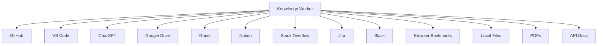
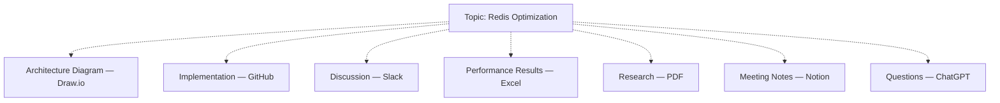
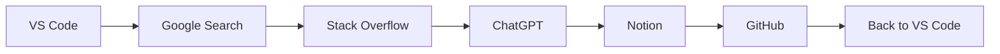

# Chapter 3 — Problem Analysis & Market Research

**Document:** NexusAI Workspace — Product Requirements Document (PRD)
**Chapter:** 3 of 8
**Status:** Expanded / Under Review
**Depends on:** Chapter 1 (D1–D5), Chapter 2 (D1 resolved, D6–D9)
**Source:** Original PRD v1.0, Chapter 3 (preserved in full, expanded below). A trailing positioning discussion ("AI Knowledge Operating Platform") included in the source material is treated separately below as a proposed decision, not silently adopted.

---

## Purpose

Chapters 1–2 defined what the product is and the philosophy behind it. Chapter 3 has to justify **why it should exist at all** — the problem, the evidence for the problem, the competitive landscape, and the gap being targeted. This is the chapter most likely to be challenged in an interview or investor setting ("how do you know this is a real problem?"), so it gets held to a slightly higher evidentiary bar in this expansion than the more philosophical Chapters 1–2.

## Scope

Covers: the knowledge-fragmentation problem, context-switching cost, current LLM limitations, five named pain points, competitive landscape (six products), market gap, target problem statement, opportunity (technology readiness), positioning, competitive differentiation, and success criteria.

Does not cover: a formal user-research methodology (interviews, surveys) — flagged below as a genuine gap, not filled in, since I have no data to substitute for actual research.

## Objectives of This Chapter

1. Establish the problem with enough specificity that a skeptical reader (interviewer, reviewer) can't dismiss it as generic AI hype.
2. Give competitive analysis real teeth — not a table where the subject product wins every row uncritically.
3. Resolve the positioning question raised in the source material (RAG app vs. "AI Knowledge Operating Platform") as an explicit, reasoned decision rather than an aside.

---

## 3.1 Introduction (Expanded)

The chapter's framing — features follow problems, not the other way around — is the right discipline, and it's worth holding the rest of this chapter to that standard rather than treating it as a preamble. Every pain point below is checked against: *is this a problem statement, or is it a feature description wearing a problem's clothing?* (A common failure mode in PRDs is writing "Pain Point: lack of semantic search" — that's a missing feature, not a user problem. The user's actual problem is "I know the information exists and I can't find it," which semantic search happens to solve.)

## 3.2 The Knowledge Explosion (Expanded)



Thirteen independent systems, each with its own storage model, search index, and access pattern, none aware of the others. This diagram is the clearest visual argument in the chapter for *why fragmentation is structural, not incidental* — it's not that any one tool is bad, it's that **no tool has an incentive to understand what's in the others.** That's the actual market gap (formalized in §3.9), and it's worth stating this explicitly here rather than only in the gap section, since it's the causal mechanism behind every pain point that follows.

## 3.3 The Modern Productivity Problem (Expanded)

The claim that "productivity is no longer limited by computing power" is defensible but broad — worth narrowing to what this specific product can actually move the needle on. Of the five listed constraints (information overload, context switching, knowledge fragmentation, repetitive tasks, difficulty retrieving previous work), NexusAI Workspace directly addresses **knowledge fragmentation** and **retrieval difficulty**; it addresses **context switching** and **information overload** only indirectly (by reducing how often the user needs to leave the workspace to find something); and it does **not** meaningfully address **repetitive tasks** in the general sense (e.g., repetitive manual data entry) — that would require the automation/agent capabilities flagged as post-v1 in Chapter 2 (D6). Recommend narrowing this section's claim so v1 isn't implicitly promising to solve all five.

## 3.4 Knowledge Fragmentation (Expanded)



This is the single best illustrative example in the whole PRD so far — one real topic, seven disconnected artifacts. Worth using this exact scenario as the canonical example throughout the SAD and BIS (e.g., as the worked example for the RAG retrieval chapter, and as a literal test case in the eventual eval framework from Chapter 1's D4). Recommend formally adopting "the Redis Optimization scenario" as a named reference example carried through all remaining chapters, rather than inventing a new example each time — this also gives you a consistent demo scenario for a portfolio walkthrough.

**Important scoping note, not present in the original text:** several of these sources (GitHub, Slack, Draw.io, Notion) are *external tools*, not files the user manually uploads. If NexusAI Workspace only ingests manually uploaded documents in v1 (which appears to be the case, given integrations are listed as post-v1 in Chapter 2 §2.12), then this exact scenario **cannot be fully solved in v1** — only the artifacts the user manually uploads (the PDF, maybe an exported Slack thread) would be indexed. Recommend the chapter be explicit that this example illustrates the *long-term* vision, and separately state a v1-scoped version of the same example (e.g., limited to uploaded PDFs, notes, and in-app conversations) so the reader doesn't infer integration capability that Chapter 2 already deferred.

## 3.5 Context Switching (Expanded)



The claim that "studies consistently show" context switching disrupts focus is directionally correct and well-established in productivity/cognitive-psychology literature generally, but as written it's an uncited assertion. For a document meant to demonstrate rigor (per the master prompt's stated goal of interview-caliber documentation), recommend either citing a specific, credible source, or softening the phrasing to something like "it is widely understood that..." to avoid an unsupported empirical claim sitting next to the product's actual engineering content.

## 3.6 AI Has Improved, But Context Hasn't (Expanded)

This section makes the strongest, most technically precise argument in the chapter: the "Review my authentication module" example correctly identifies that **LLM capability and LLM context are separate axes**, and that most products conflate them (assuming a smarter model alone solves the context problem). This is worth promoting — recommend this framing ("AI has improved, context hasn't") become a one-line pitch/tagline candidate, since it's more specific and more defensible than "AI-native workspace" alone.

| Query | Without Project Context | With Indexed Project Knowledge |
|---|---|---|
| "Review my authentication module" | Generic security best-practices advice | Specific feedback referencing the user's actual auth flow, prior decisions, and conventions |
| "Why did we choose JWT over sessions?" | Cannot answer — no memory of the decision | Retrieves the original discussion/decision record |

## 3.7 Current Pain Points (Expanded)

| Pain Point | Root Cause | Is This Solvable in v1? |
|---|---|---|
| 1. Repeating context | No persistent memory across sessions | Yes — core to Chapter 1's memory pillar |
| 2. Poor personal knowledge search | Keyword-only search, no semantic layer | Yes — core RAG |
| 3. Re-uploading documents | No persistent ingestion; AI tools are stateless per session | Yes — ingest once, index persistently |
| 4. Information overload | Volume outpaces manual organization | Partially — retrieval helps; the underlying volume problem is not "solved," just made navigable |
| 5. Static storage (folders answer "where," not "what") | Storage systems index location, not meaning | Yes — this is the semantic retrieval pillar restated |

All five map cleanly onto capabilities already scoped in Chapter 1, which is a good consistency signal — none of these pain points require inventing new v1 scope. The one caveat is Pain Point 4: "information overload" is a volume problem that better retrieval *mitigates* but doesn't eliminate — worth phrasing the product's claim as "makes overload navigable," not "solves overload," to avoid overpromising.

## 3.8 Existing Solutions (Expanded)

The original strengths/limitations lists per competitor are accurate at a high level but read as un-sourced and slightly dated in places (e.g., ChatGPT's "Projects" and memory features have been narrowing this exact gap over time — worth a brief note that this competitive analysis is a point-in-time snapshot and should be revisited before any external presentation of this document, not treated as permanently accurate).

| Product | Core Strength | Core Limitation (relative to NexusAI's stated goals) | Trend Risk |
|---|---|---|---|
| ChatGPT | Reasoning, general conversation | Limited persistent, structured project context | **Highest** — actively adding memory/projects features |
| Google Drive | Storage reliability, sharing | No semantic understanding | Low — not AI-first by design intent |
| Notion AI | Note editing + light AI | Not a dedicated RAG/retrieval system | Medium — could deepen AI investment |
| GitHub Copilot | Code-specific assistance | Narrow to code, not broader knowledge | Low — intentionally scoped to code |
| Obsidian | Local-first knowledge graphs, plugins | AI is plugin-dependent, more manual setup | Medium — plugin ecosystem could close gap |
| Perplexity | Web search + citations | Public information focus, not personal corpus | Low — different problem space by design |

The added "Trend Risk" column is not in the original — it's included because a competitive analysis that doesn't acknowledge which competitors are actively closing the gap (ChatGPT especially) is incomplete, and a reviewer with market awareness will notice the omission.

## 3.9 Market Gap (Expanded)

Restated more precisely than the original: existing products each optimize one node in the fragmentation diagram (§3.2/§3.4) — none optimize the *connections between nodes*. NexusAI Workspace's gap claim is really a claim about **owning the connective layer**, not about doing any single capability (storage, chat, search) better in isolation. This is a more defensible and more specific claim than "combines several things nobody else combines," and worth using as the precise wording in any external-facing summary of this document.

## 3.10 Target Problem (Expanded)

> Users possess valuable knowledge but lack an efficient way to retrieve and reuse it through AI.

Good, concise problem statement. One addition worth making explicit: this is fundamentally an **information retrieval** problem framed in product language. Naming it this way matters because it sets the correct engineering bar — success is measured by IR metrics (precision, recall, relevance ranking quality) that have decades of established methodology behind them, not by vaguer notions of "AI helpfulness." This connects directly to Chapter 1's D4 (need for a measurable eval framework) — recommend that eval framework explicitly borrow standard IR evaluation methodology rather than inventing bespoke metrics.

## 3.11 Opportunity (Expanded)

The technology-readiness argument (LLMs, embeddings, vector DBs, RAG, async processing now practical) is accurate and appropriately modest — it doesn't overclaim novelty of the underlying components, which is honest and actually strengthens credibility (the innovation claim is in the *combination and product framing*, not in inventing new AI techniques, which matches the "AI Knowledge Operating Platform" positioning discussed below).

## 3.12 Product Positioning — Including the Proposed Refinement (Expanded)

The source material includes a positioning discussion proposing **"AI Knowledge Operating Platform"** instead of positioning this as "another RAG application." This needs to be evaluated on its merits rather than adopted automatically, since it's a meaningful framing change:

**What the proposal actually asks for:** that even the MVP treats every document, chat, and workspace interaction as contributing to a structured, persistent knowledge layer — not just serving a single Q&A session — so that later agent workflows, integrations, and automation build on that same foundation rather than being bolted on.

**Assessment:** this is good positioning advice, but it is **not new scope** — it's already substantively present in this PRD:
- Chapter 2, §2.4 ("Core Belief"): *"Knowledge is significantly more valuable than files... AI should understand relationships, context, dependencies... rather than simply indexing documents."*
- Chapter 2, §2.5, Principle 2 ("Knowledge First"): *"The system stores knowledge rather than documents."*

So the proposal is really asking to **elevate existing content into the positioning statement**, not add a new belief. Recommend adopting the term as a refinement to Chapter 1 §1.5 (Product Category) and this section (§3.12), worded as:

> NexusAI Workspace is positioned as an **AI Knowledge Operating Platform**: an AI-native workspace where every document, conversation, and project interaction contributes to a persistent, structured knowledge layer — not merely a RAG-over-documents chatbot. The MVP validates this layer; later products (Chapter 1's future-product roadmap) build automation and agents on top of it.

**One caution worth stating plainly:** "AI Knowledge Operating Platform" is a stronger, more architecturally-loaded claim than "AI-native knowledge workspace." It raises the bar for what the SAD's data model needs to demonstrate — specifically, it strengthens the case (already raised in Chapter 2's review) that **temporal/relationship modeling, not just flat vector storage, needs to be real in the architecture**, not just implied by terminology. If the SAD ships a flat vector-store-only design, the "Operating Platform" framing would be aspirational marketing language rather than an accurate description — the same failure mode already flagged for Chapter 1's original success criteria. Recommend treating this positioning choice as binding on the SAD, not just a naming preference.

## 3.13 Competitive Differentiators (Expanded — reframed for credibility)

The original table checks "✓" for NexusAI Workspace on every single row against every competitor. That pattern is a **credibility risk**, not a strength — a table where the subject always wins reads as marketing copy, and any technically literate reviewer (exactly the audience this project is meant to impress, per the master prompt) will discount it accordingly. Reframed honestly:

```mermaid
quadrantChart
    title Competitive Positioning — AI-Nativeness vs. Knowledge Breadth
    x-axis Low AI-Nativeness --> High AI-Nativeness
    y-axis Narrow Knowledge Scope --> Broad Knowledge Scope
    quadrant-1 Target Zone
    quadrant-2 Broad but not AI-native
    quadrant-3 Narrow and not AI-native
    quadrant-4 AI-native but narrow
    ChatGPT: [0.75, 0.30]
    Google Drive: [0.15, 0.80]
    Notion AI: [0.45, 0.55]
    GitHub Copilot: [0.65, 0.20]
    Obsidian: [0.30, 0.60]
    Perplexity: [0.70, 0.25]
    NexusAI Workspace (target): [0.80, 0.80]
```

This makes the honest version of the claim: **no existing product currently occupies the top-right quadrant** (broad personal-knowledge scope + high AI-nativeness) — that's the gap, not "we beat everyone at everything." Recommend this chart, or the underlying honest framing, replace the all-checkmarks table in the canonical PRD. The original table's rows for "Document Storage" and "AI Chat" checking ✓ for NexusAI against ✓ for typical tools is also simply not a differentiator (both have it) — a differentiator table should only list rows where a real gap exists, which is closer to 4–5 rows (semantic search depth, persistent memory, background indexing, provider independence, modular AI architecture) than the original 10.

## 3.14 Success Criteria (Expanded — de-duplicated against Chapter 1)

This section restates Chapter 1 §1.12 almost verbatim, with the same unfalsifiability problem already resolved there (Chapter 1's D4: measurable reframing + eval framework). Rather than re-deriving, this section should **cross-reference** Chapter 1 §1.12 rather than duplicate it, to avoid the two success-criteria statements drifting out of sync as the PRD evolves. The one genuinely new framing here — *"success is measured not only by response quality but by reduced effort in finding and reusing information"* — is a good addition worth merging into Chapter 1's eval framework as an explicit metric category (e.g., "time-to-answer" or "clicks/queries-to-resolution" as a measured proxy for effort), rather than living as a separate, disconnected success statement in this chapter.

---

## Design Decisions & Trade-offs Log (Chapter 3 additions)

| # | Decision Needed | Recommendation | Status |
|---|---|---|---|
| D10 | Adopt "AI Knowledge Operating Platform" positioning? | Yes — as a refinement to existing content (Ch.1 §1.5, Ch.2 §2.4/§2.5), not new scope. Binding on SAD's data model (relationship/temporal modeling must be real, not just terminology). | **Recommended — confirm** |
| D11 | Competitive differentiator table (§3.13) reads as unfalsifiable | Replace all-checkmarks table with honest quadrant/gap framing (done above) | **Recommended — confirm replacement in canonical PRD** |
| D12 | Success criteria duplicated between Ch.1 §1.12 and Ch.3 §3.14 | De-duplicate; Ch.3 should cross-reference Ch.1's eval framework, contributing "reduced effort" as a new metric category | **Recommended** |
| D13 | §3.4's Redis Optimization scenario implies integration capability (GitHub, Slack, Draw.io) not scoped until post-v1 | State explicitly that this is the long-term example; add a v1-scoped version limited to uploaded artifacts | **Open — needs your confirmation of the v1-scoped example** |
| D14 | No cited source for the "context switching" research claim (§3.5) | Cite a specific source or soften the claim's phrasing | **Open — minor, but worth 5 minutes before external use** |

## Security Considerations

- No new security surface introduced in this chapter (it's a market/problem chapter), but §3.4's fragmentation example implies future ingestion from third-party tools (GitHub, Slack, Notion) — each of those is a distinct OAuth/permission-scoping problem for the SAD to eventually address (post-v1, per Chapter 2). Worth a forward-pointer here so it's not forgotten when that roadmap item is picked up.

## Scalability Considerations

- Pain Point 4 (information overload — "hundreds of PDFs, thousands of notes") is effectively a scale requirement disguised as a user pain point. Recommend the SAD/BIS treat "hundreds to low-thousands of documents per single-user workspace" as a concrete v1 scale target derived directly from this section, rather than an unspecified "should scale" statement.

## Performance Considerations

- None specific to this chapter beyond what's already logged in Chapters 1–2 (RAG latency budget, event-driven ingestion).

## Best Practices Applied in This Expansion

- Treated the source material's trailing positioning discussion as a decision to evaluate (D10), not content to silently merge in — consistent with the master prompt's instruction to challenge design decisions rather than blindly agree.
- Replaced an unfalsifiable, self-serving competitive table with an honest quadrant framing that makes the actual gap claim clearer and more defensible.
- Flagged an uncited empirical claim (§3.5) rather than either removing it or leaving it uncritically in a document meant to demonstrate rigor.
- De-duplicated success criteria across chapters rather than letting two versions of "success" drift independently.

## Implementation Notes for Later Chapters

- The Redis Optimization scenario (§3.4) should become the canonical worked example for the SAD's RAG chapter and the eventual eval framework (Chapter 1 D4) — one consistent scenario carried through the whole documentation set.
- The SAD's data model must substantiate the "Operating Platform" positioning (D10) with real relationship/temporal structure — this is now a binding requirement, not a nice-to-have, if D10 is confirmed.

## Future Enhancements (Chapter-Level)

- A real user-research pass (interviews or a survey) would strengthen §3.3's productivity claims beyond "widely understood" — flagged as a genuine gap, not fabricated to fill it.
- Revisit §3.8's competitive snapshot before any external presentation of this PRD, since competitor capabilities (especially ChatGPT's memory/projects features) are moving targets.

---

## Senior Engineering Review

**Overall assessment:** Chapter 3 makes the strongest evidentiary case in the PRD so far, particularly §3.4 (fragmentation example) and §3.6 (the "AI improved, context hasn't" framing) — both are specific and technically precise rather than generic AI-hype language. The chapter's main weaknesses are self-inflicted credibility risks (the all-checkmarks table, the uncited research claim), which are cheap to fix and meaningfully improve how the document reads to a technically skeptical audience.

**Do not simply approve:**
1. The competitive differentiator table (§3.13) as originally written would hurt credibility with exactly the audience (technical interviewers, senior engineers) this project is meant to impress. Replaced above — recommend the replacement be treated as final, not optional polish.
2. The positioning refinement ("AI Knowledge Operating Platform") is good advice but was presented as a late add-on in the source material rather than integrated — it's now reconciled against Chapters 1–2 and shown to be additive, not contradictory, which is the right outcome, but it needed to be checked rather than assumed compatible.
3. §3.4's flagship example (Redis Optimization) currently implies integration capabilities the PRD has already scoped as post-v1 (Chapter 2, §2.12) — this is the same class of inconsistency as Chapter 2's D6 (promising v1 capability the roadmap defers). Recommend resolving D13 with the same care D6 is getting.

## Summary

Chapter 3 justifies the product's existence: fragmentation is structural (not one bad tool, but no tool understanding the others), existing solutions each own one node of the problem rather than the connective layer, and the technology to build the connective layer is now practical. The proposed "AI Knowledge Operating Platform" positioning is adopted as a refinement (D10) — shown to be consistent with, not additive scope beyond, Chapters 1–2 — but it raises the bar on what the SAD's data model must actually deliver. Two credibility-risk items (the differentiator table, an uncited claim) are addressed directly rather than passed through.

**Next step:** confirm D10 (positioning) and D13 (v1-scoped fragmentation example) — both affect how later chapters and the SAD should be framed. Send Chapter 4 whenever ready.
