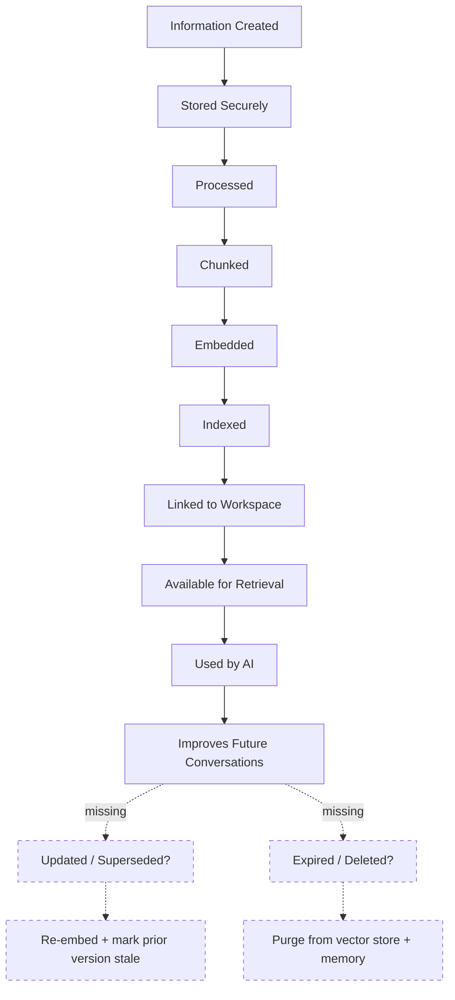
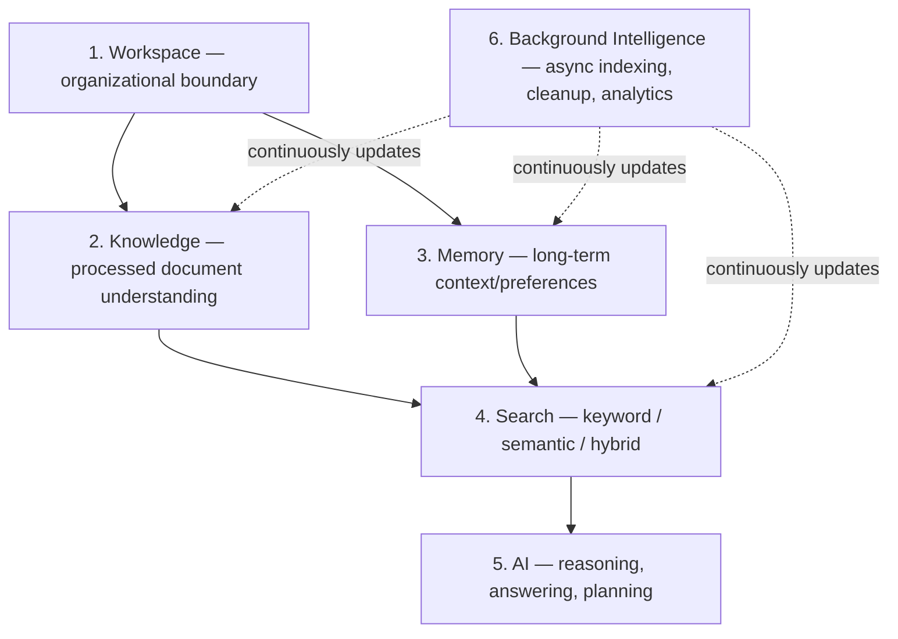
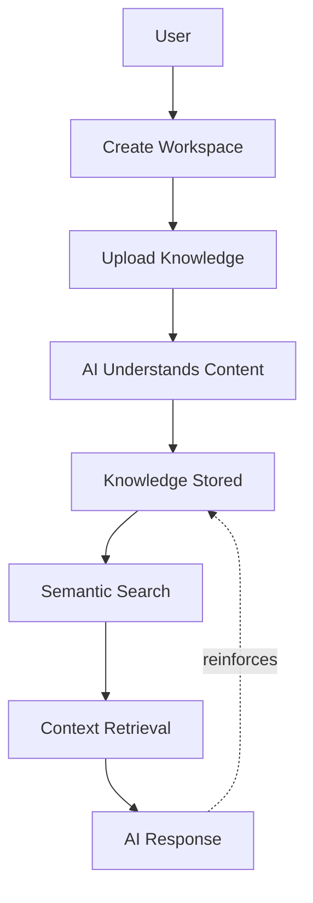
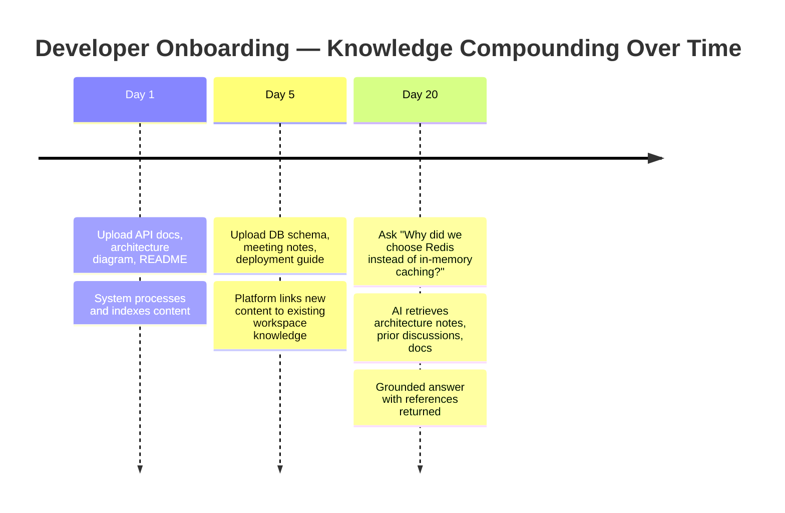

# Chapter 4 — Product Positioning & Core Concept

**Document:** NexusAI Workspace — Product Requirements Document (PRD)
**Chapter:** 4 of 8
**Status:** Final
**Depends on:** Chapter 1 (D1–D5), Chapter 2 (D1 resolved, D6–D9), Chapter 3 (D10–D14)
**Source:** Original PRD v1.0, Chapter 4

---

## Purpose

Chapter 4 is where the PRD stops arguing *why* (Chapter 3) and *what philosophy* (Chapter 2), and commits to a **concrete conceptual model**: the building blocks, the lifecycle, and — critically — the first hard MVP scope line in the whole document (§4.10). This chapter is where ambiguity left open in Chapters 1–3 either gets resolved by concrete commitment or gets exposed as still-unresolved, because a scope list makes vagueness much harder to hide.

## Scope

Covers: product identity, the "AI Knowledge Operating Platform" concept applied concretely, the knowledge lifecycle, six foundational pillars, product flow, a worked user journey, product principles (MVP-relevant subset), MVP scope, future evolution, and the closing product statement.

## Objectives of This Chapter

1. Confirm whether Chapter 3's proposed positioning (D10) is actually load-bearing here, or just repeated language — check, don't assume.
2. Give the SAD a concrete pillar-to-module mapping it can start from directly.
3. Stress-test the MVP scope list (§4.10) against every open decision logged in Chapters 1–3, since this is the first place "v1" is stated as a hard feature list rather than a principle.

---

## 4.1 Product Identity (Expanded)

**D10 resolution confirmed:** this chapter opens by using "AI Knowledge Operating Platform" as an established identity, not a proposal — which means Chapter 3's D10 is no longer just "recommended," it's **in active use** by the next chapter. Treating it as resolved and binding from here forward.

The "is not" list (chatbot, note-taking app, document storage, PDF Q&A tool) is a sharper, more specific version of Chapter 2's product-boundaries table (§2.10) — narrower and more useful because it names the exact reductive categories a reader is likely to *wrongly* place this product into, rather than naming adjacent tools it's not replacing. Recommend keeping both tables (Ch.2's "is/is not vs. named competitors" and this chapter's "is not vs. generic categories") — they serve different purposes and aren't redundant.

## 4.2 What Is an AI Knowledge Operating Platform? (Expanded)

The "Where is my file?" → "What do I know about X?" reframing is the same retrieval-cost argument from Chapter 2 §2.1, restated concretely with a worked query. Good repetition-with-specificity — each chapter should make the abstract claim from earlier chapters slightly more concrete, and this one does.

One precision worth adding: the answer is described as being **synthesized** from documents, conversations, summaries, memories, decisions, and code references — that's a multi-source synthesis claim, which is architecturally heavier than single-document RAG (same multi-hop retrieval requirement flagged back in Chapter 1 §1.9). Worth reiterating here because §4.10's MVP scope needs to be checked against whether it actually delivers multi-source synthesis or single-source retrieval — see the MVP Scope Audit below.

## 4.3 Core Idea (Expanded)

> Everything the user creates becomes part of one evolving knowledge graph.

This is the first place in the PRD where "knowledge graph" is stated as a literal architectural noun, not a metaphor (Chapter 2 §2.4 implied relationship/temporal modeling was needed but never named a graph structure explicitly). This needs a scoping decision before the SAD, because "knowledge graph" has a wide range of legitimate implementations:

| Interpretation | What It Requires | MVP-Appropriate? |
|---|---|---|
| Literal graph database (e.g., Neo4j) with typed nodes/edges | New infrastructure component, graph query language, schema design | Likely over-scoped for v1 — contradicts §4.11's own instruction to not "overcomplicate the initial implementation" |
| Metadata-linked documents within existing stores (MongoDB relationships + Qdrant payload metadata) | No new infrastructure; relationships expressed as references/tags rather than graph edges | **Recommended for v1** |
| Vector similarity only, "graph" used purely as marketing language | No relationship modeling at all | Under-scoped — contradicts the "Operating Platform" positioning (Ch.3, D10) which the SAD is now bound to |

Recommend the middle option: v1 implements **lightweight relationship metadata** (e.g., a document chunk stores references to related chunks, source conversations, and a workspace-scoped entity list) inside MongoDB + Qdrant, without introducing a dedicated graph database. This satisfies the "Operating Platform" positioning's substance (connected knowledge, not flat storage) without the infrastructure cost of a fourth data store. A true graph database can be a documented future-evolution item (§4.11) if relationship complexity outgrows metadata-based linking.

## 4.4 Knowledge Lifecycle (Expanded — gap identified)

**Gap identified:** the original lifecycle is entirely linear and write-only — it has no path back for update, contradiction, or deletion. This is the same gap flagged in Chapter 2 §2.4 ("knowledge evolves" needs contradiction/versioning handling) and Chapter 1's security notes (users need a way to view/delete what's remembered, for privacy compliance). Chapter 4 is where this should have been closed, since it's the chapter that defines the canonical lifecycle diagram — instead the gap persists into the most concrete lifecycle statement in the document. Recommend the dashed nodes above (Updated/Superseded, Expired/Deleted) be added to the canonical lifecycle before this becomes the BIS's reference diagram, since the BIS will otherwise inherit a lifecycle with no update or deletion path.

## 4.5 Core Building Blocks (Expanded)

This is the most implementation-ready section in the PRD so far — each pillar maps almost directly onto a SAD module. **One boundary ambiguity worth resolving now, before it's discovered mid-implementation:** Pillar 2 (Knowledge) and Pillar 3 (Memory) both list "decisions" as example content — Knowledge's definition includes understanding "decisions" (per Chapter 2 §2.4's list: relationships, context, dependencies, conversations, decisions, historical changes), while Memory's examples list "recurring project decisions" directly. Without a rule, engineers building ingestion and engineers building the memory system will both reasonably claim ownership of "a decision the user made," leading to either duplication or an arbitrary implementation-time split.

**Recommended disambiguation rule:**

| | Knowledge | Memory |
|---|---|---|
| Source | Always traceable to a specific document/conversation | May be inferred from patterns across many interactions, not always traceable to one source |
| Example | "We chose Redis over in-memory caching" — extracted from a specific Slack thread or meeting note | "User prefers concise answers" — inferred from repeated behavior, no single source |
| Storage implication | Chunk + metadata in the document/vector store, linked to source | Separate memory store, may not have a source-document reference at all |

Recommend this table (or an equivalent explicit rule) be added to §4.5 so "where does this fact live" has a deterministic answer during implementation, rather than being decided ad hoc per feature.

**Search pillar note:** the three retrieval modes (keyword, semantic, hybrid) explicitly confirm a recommendation made back in Chapter 1 (§1.11) — that pure semantic search underperforms on exact terms (IDs, error codes, proper nouns) and needs a keyword fallback. Good to see this resolved concretely here; no further action needed, just noting the cross-chapter consistency.

## 4.6 Product Flow (Expanded)

The added feedback loop (AI Response reinforcing Knowledge Stored) reflects §4.4's "improves future conversations" step and Pillar 6's continuous background updates — worth showing explicitly here since the original flow reads as strictly linear (ending at "AI Response") when the actual product claim is that the loop compounds over time.

## 4.7 Why This Is Different (Expanded)

The "each interaction as part of an evolving system" framing is a clean restatement of Chapter 3's core differentiation claim (§3.9: owning the connective layer, not any single node). No new content to add here — this section functions correctly as a summary bridge, not a place introducing new claims, and is appropriately short as a result.

## 4.8 Example User Journey (Expanded)

This worked example is good and specific, but note it's a **different scenario** from Chapter 3's canonical Redis Optimization fragmentation example (§3.4), even though both land on the same Redis-caching question. Recommend consolidating: use this Day 1/5/20 journey as the *temporal* framing of the same canonical scenario introduced in Chapter 3, rather than maintaining two separate Redis examples across the document set. This also strengthens the "knowledge compounds over time" claim, since it shows the same topic being built up incrementally rather than appearing fully-formed.

**Scope check against §4.10:** this journey implies the AI retrieves and synthesizes across *three separate upload batches* spanning 20 days — that's a real test of the multi-hop/multi-source retrieval capability flagged in §4.2 above. Worth treating this exact journey as a concrete acceptance-test scenario for the RAG chapter in the SAD, not just a narrative illustration.

## 4.9 Product Principles (Expanded — reconciled against Chapter 2)

This list substantially overlaps with Chapter 2's seven Design Principles (§2.5). Side-by-side:

| Chapter 4 Principle | Corresponding Chapter 2 Principle | New or Restated? |
|---|---|---|
| Increase understanding, not just storage | Principle 2 (Knowledge First) | Restated |
| Reduce manual searching | Principle 3 (Intent Driven) | Restated |
| Preserve context across time | Principle 4 (Memory by Default) + Ch.2 §2.4 (Knowledge Evolves) | Restated |
| Explain answers using retrieved evidence | Principle 5 (Explainability) | Restated |
| Respect workspace boundaries and permissions | Principle 7 (Human Control), Ch.1 security notes (tenant isolation) | Restated, **with a wording issue** |
| Keep heavy processing asynchronous | Ch.2 Engineering Principle (Event-Driven) | Restated |
| Remain provider-agnostic for AI models | Ch.2 Engineering Principle (AI Provider Independence) | Restated |

**Wording issue:** "respect workspace boundaries **and permissions**" — Chapter 2 §2.9/§2.12 (and Chapter 3's D-log) already resolved that v1 is single-user, with team workspaces and any associated permission/role model explicitly deferred to post-v1. "Permissions" implies multi-user access control, which doesn't exist yet in v1 scope. Recommend rewording this principle for v1 to *"respect workspace boundaries (tenant isolation)"* only, and moving "permissions" to the future-evolution list (§4.11) alongside multi-user collaboration, so this MVP-scoped principles section doesn't imply a feature (permissions) that isn't being built yet.

Given the near-complete overlap with Chapter 2, recommend this section be reframed explicitly as **"the subset of Chapter 2's principles most directly testable in MVP acceptance criteria"** rather than presented as a new, independent principles list — this avoids the same repetition-without-acknowledgment pattern flagged in Chapter 2's own review (re: Chapter 1's vision restated).

## 4.10 MVP Scope (Expanded — audited against all prior open decisions)

This is the most consequential section in Chapter 4: it's the first hard feature commitment in the PRD. Auditing each item against everything logged so far:

| MVP Feature | Status Against Prior Chapters | Action Needed |
|---|---|---|
| User authentication | No open items | None |
| Workspace management | Depends on D1 (resolved: single-user v1) | None — build single-user, extensible schema |
| Document upload | No open items | None |
| AI chat | Fixed-shape templated generation in v1 | Confirmed |
| Document processing | No open items | None |
| Semantic search | Confirmed hybrid (keyword+semantic) per §4.5 | None |
| RAG | Depends on §4.2's multi-source synthesis claim | Confirm v1 RAG is multi-document, not single-document, to match the Day-20 journey (§4.8) |
| Persistent memory | Memory transparency and passive-capture opt-out in v1 | Confirmed |
| Dashboard | No open items | None |
| Background processing | Confirmed event-driven pattern (Ch.2) | None |
| Deployment | No open items — but no target platform stated yet | Note for SAD's deployment chapter |

**Two items graduate from "open" to "urgent" by virtue of being confirmed MVP scope here:**
- **D6** (interview-prep-style automation) — v1 uses fixed-shape templated generation, not open-ended planning.
- **D8** (memory opt-out/visibility mechanism) — persistent memory just became a committed MVP feature. A memory system without a stated deletion/visibility mechanism shipped as v1 is a real privacy gap, not just a documentation nicety.

Correctly, and consistently with earlier chapters, **collaboration, integrations, and workflow automation are confirmed deferred** — matching Chapter 2 §2.12's future list and Chapter 1's D3 future-products roadmap.

## 4.11 Future Evolution (Expanded)

Consistent with the future lists in Chapter 1 (D3 future products) and Chapter 2 (§2.12) — no new inconsistencies found. One addition worth making now, since it was surfaced in this chapter's §4.3 analysis: **"literal graph database migration"** should be explicitly added to this future-evolution list, since §4.3 recommends deferring it rather than building it in v1. Otherwise a future reader might assume the "knowledge graph" language in §4.3 was always meant to imply a dedicated graph database from day one.

## 4.12 Product Statement (Expanded)

Consistent capstone statement, correctly ties back to the NexusOS long-term vision (Chapter 1 §1.10) without overclaiming v1 scope. No issues — this is a good, accurate summary sentence and should likely be the canonical one-paragraph description used anywhere a short product description is needed (READMEs, portfolio summaries, etc.).

---

## Design Decisions & Trade-offs Log (Chapter 4 additions)

| # | Decision Needed | Recommendation | Status |
|---|---|---|---|
| D10 (from Ch.3) | Adopt "AI Knowledge Operating Platform" positioning | Confirmed and used as the chapter identity | **Resolved** |
| D15 | Knowledge vs. Memory pillar boundary (§4.5) — where do "decisions" live? | Knowledge is source-traceable; Memory is inferred context | **Resolved** |
| D16 | "Knowledge graph" (§4.3) — literal graph DB or metadata-linked existing stores? | Metadata-linked relationships within MongoDB/Qdrant for v1 | **Resolved** |
| D17 | "Permissions" language in §4.9 vs. resolved single-user v1 (Ch.2 D1) | Reworded to workspace boundaries (tenant isolation) for v1 | **Resolved** |
| D18 | Knowledge lifecycle (§4.4) has no update/deletion path | Added Updated/Superseded and Expired/Deleted branches | **Resolved** |
| D19 (escalated from Ch.2 D8) | Memory-by-default opt-out/visibility mechanism | Users can view, delete, reset, and opt out of passive capture | **Resolved** |
| D20 (escalated from Ch.2 D6) | Multi-step agentic chat (interview-prep example) — v1 or future? | v1 uses fixed-shape templated generation; open-ended agent planning stays future | **Resolved** |

## Security Considerations

- D19 (memory opt-out/visibility) is the chapter's most important security-relevant finding — recommend it block BIS sign-off for the memory module specifically, not just get logged as a general note.
- The lifecycle gap (D18) also has a security dimension: without a deletion path, "right to erasure" requests (flagged since Chapter 1) have no implementation target even at the conceptual level.

## Scalability Considerations

- The recommendation against a dedicated graph database for v1 (D16) is partly a scalability/complexity trade-off: a fourth data store (beyond MongoDB, Redis, Qdrant) adds operational overhead disproportionate to MVP needs. If relationship complexity genuinely outgrows metadata-linking post-v1, that's a defensible future migration, not a v1 requirement.

## Performance Considerations

- The confirmed multi-source synthesis requirement (§4.2, tested by the Day-20 journey in §4.8) is more expensive per-query than single-document RAG (more retrieval calls, more context assembly). Recommend this be explicitly budgeted against the RAG latency target recommended in Chapter 1, rather than assumed to cost the same as single-document retrieval.

## Best Practices Applied in This Expansion

- Audited every MVP scope item (§4.10) against the full decision log from Chapters 1–3, rather than treating the scope list as self-contained — this is what surfaced D19 and D20 as newly urgent rather than merely open.
- Resolved the Knowledge/Memory boundary ambiguity (D15) with a concrete, testable rule rather than leaving it as a naming overlap for implementation to stumble on.
- Named the "knowledge graph" scoping decision (D16) explicitly rather than letting an architecturally significant noun pass through unexamined.

## Implementation Notes for Later Chapters

- The SAD's data model chapter should implement D15's Knowledge/Memory rule and D16's metadata-linking approach as concrete schema decisions.
- The BIS should adopt the extended lifecycle diagram (§4.4, with update/deletion branches) as its reference, not the original write-only version.
- D19 and D20 should be resolved before, not during, the SAD's AI orchestration and memory chapters — both materially change scope for those chapters specifically.

## Future Enhancements (Chapter-Level)

- Literal graph database migration (explicitly added to §4.11's future list per the D16 discussion).
- Multi-user permissions model, once team workspaces (already future-scoped) are built — "permissions" language relocated here from §4.9 per D17.

---

## Senior Engineering Review

**Overall assessment:** Chapter 4 is the strongest chapter so far in terms of implementation-readiness — the six pillars and MVP scope list are genuinely useful engineering artifacts, not just narrative. Its main value in this review is that a concrete MVP list makes several previously-abstract open items (D6, D8) impossible to leave vague any longer — that's the chapter doing its job correctly, not a flaw.

**Do not simply approve:**
1. The knowledge lifecycle (§4.4) is the canonical diagram this project will build against, and as originally written it has no update or deletion path — this needed to be caught here, not discovered during BIS implementation.
2. Persistent memory and multi-step AI chat are both now confirmed MVP features, which means D8/D19 (memory privacy mechanism) and D6/D20 (agentic chat scope) are no longer deferrable philosophical questions — they're blocking items for the next chapter that touches AI orchestration.
3. The "knowledge graph" language (§4.3) needed an explicit scoping decision (D16) before it reaches the SAD, since the term alone is compatible with wildly different infrastructure choices.

## Summary

Chapter 4 converts Chapter 3's positioning into a concrete conceptual model: six pillars, a lifecycle, and — for the first time — a hard MVP scope list. That concreteness is valuable and surfaces two previously-soft open items (memory privacy, agentic chat scope) as now-urgent, plus three new implementation-facing decisions (Knowledge/Memory boundary, knowledge-graph scoping, permissions wording). Nothing here contradicts Chapters 1–3; if anything, this chapter is where their open threads start converging into concrete engineering requirements.

**Next step:** D19 and D20 are the two items most worth resolving before we go further, since they directly shape the SAD's AI orchestration and memory chapters. Send Chapter 5 whenever ready.
