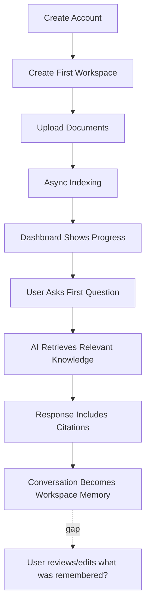
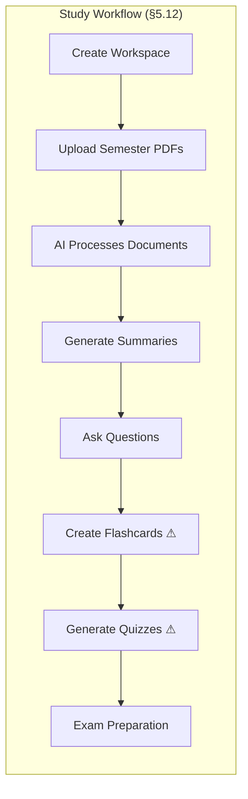
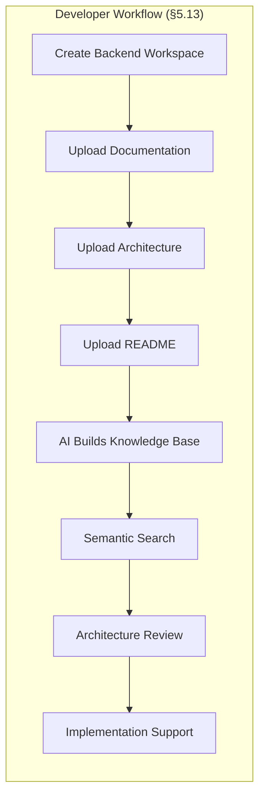
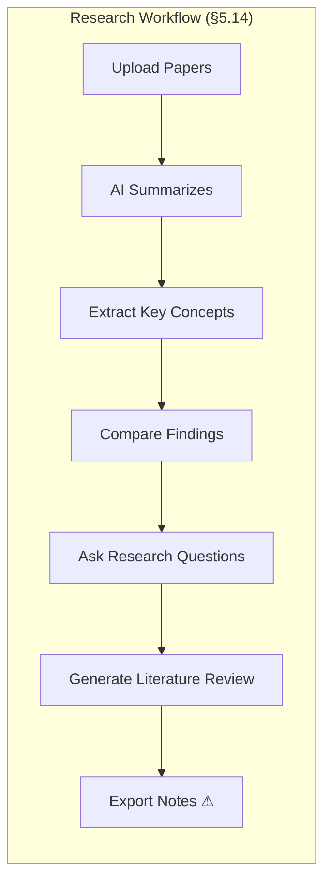

# Chapter 5 — Target Users, User Personas & User Journeys

**Document:** NexusAI Workspace — Product Requirements Document (PRD)
**Chapter:** 5 of 8
**Status:** Expanded / Under Review
**Depends on:** Chapter 1 (D1–D5), Chapter 2 (D6–D9), Chapter 3 (D10–D14), Chapter 4 (D15–D20)
**Source:** Original PRD v1.0, Chapter 5 (preserved in full, expanded below)

---

## Purpose

Chapter 4 committed to a hard MVP feature list. Chapter 5 has to prove that list actually serves real people, not just a coherent internal architecture. It's also the chapter most likely to surface **scope drift** — user journeys are where wishful features sneak in ("wouldn't it be nice if it also exported notes...") without anyone checking them against the MVP scope line drawn one chapter earlier. That check is the main added value of this expansion.

## Scope

Covers: target market, six primary user groups, five detailed personas, secondary (future) user groups, cross-persona needs summary, four user journeys (onboarding, study, developer, research), user stories, acceptance criteria, and the cross-persona lifecycle insight.

## Objectives of This Chapter

1. Verify every persona and journey traces back to a real, already-scoped MVP capability (Chapter 4, §4.10) — flag anything that doesn't.
2. Close a structural gap if one exists: the chapter names six primary user groups but may not define six personas.
3. Use the concrete journeys here to finally propose a resolution for D6/D20 (multi-step generation), since this chapter provides the clearest real examples of what that capability would actually need to do.

---

## 5.1 Introduction (Expanded)

The framing — RAG, vector databases, LLMs are "implementation details rather than the product itself" — is the correct discipline and worth holding the rest of the PRD accountable to. It's also a useful test for this chapter specifically: every persona/journey below should be readable and convincing to someone who has never heard of RAG. Where a journey only makes sense with AI-engineering vocabulary, that's a sign it's describing the mechanism instead of the outcome.

## 5.2 Target Market (Expanded)

The eight primary markets listed (higher education through enterprise knowledge management) are coherent as a horizontal productivity thesis, and the "common characteristic" test (generate/consume/revisit large volumes of information) is a genuinely useful filter — it explains why, e.g., "casual social media user" is correctly excluded without needing to say so explicitly. No structural issues here; this section sets up §5.3 correctly.

## 5.3 Primary User Groups (Expanded — gap identified)

**Structural gap:** this section names **six** primary user groups — Students, Software Engineers, AI/ML Engineers, Researchers, Startup Founders/PMs, and **Technical Professionals** (consultants, architects, analysts) — but §5.5–§5.9 define only **five** personas. Technical Professionals has no corresponding persona. This isn't a cosmetic gap: a group named as "primary" with no persona means no journey, no user stories, and no acceptance criteria trace back to it later in this chapter, which means it's effectively invisible to the rest of the PRD despite being called primary.

| Group | Persona Defined? |
|---|---|
| Students | Yes — §5.5 |
| Software Engineers | Yes — §5.6 |
| AI / ML Engineers | Yes — §5.7 |
| Researchers | Yes — §5.8 |
| Startup Founders / PMs | Yes — §5.9 |
| **Technical Professionals** | **No — missing** |

Two reasonable fixes, either is fine — this is a documentation-completeness call, not a product-scope one:
- **(a)** Add a sixth persona (Persona 6 — Technical Professional/Consultant), or
- **(b)** Note explicitly that Technical Professionals' needs are substantially covered by the Software Engineer and Startup Founder personas combined (multi-project isolation + organizational memory), and demote it from "primary" framing to an explicit note rather than a numbered group.

Recommend **(b)** for a leaner document, since the persona's distinguishing need ("multi-client project separation") is already implied by the Software Engineer persona's multi-workspace requirement (§5.6, and User Story in §5.15: *"As a developer, I want multiple workspaces so that different projects remain isolated"*) — a consultant is functionally the same pattern applied to clients instead of projects.

## 5.4 Secondary User Groups (Expanded)

Correctly and consistently deferred — every group here (enterprise teams, universities, research labs, OSS communities, corporate training, government research) requires "collaboration and role-based access," which Chapter 2 (§2.9/§2.12) and Chapter 1 (D1, resolved) already scoped as post-v1. No inconsistency found; this section is a clean, correct restatement of the v1/future boundary applied to market segments specifically.

## 5.5–5.9 — Personas (Expanded)

Rather than re-narrate each persona (the source material already does this well), the useful addition is checking every persona's **desired workflow / example question** against Chapter 4's confirmed MVP scope:

| Persona | Key Example Capability Requested | Confirmed in Ch.4 MVP Scope (§4.10)? |
|---|---|---|
| Student | Quizzes, flashcards, revision plans generated from notes | **Not explicitly** — depends on D20 resolution (see below) |
| Software Engineer | Grounded, cited answers to "why did we choose X" questions | Yes — core RAG |
| AI Engineer | Connects experiments to research; "suggests improvements," "tracks experiment evolution" | Partially — retrieval/linking is core RAG; "suggests improvements" leans toward proactive/agentic behavior not yet scoped |
| Researcher | Literature review generation, citation comparison | Partially — summarization is core; "build literature review" is a multi-document synthesis task, same family as D20 |
| Startup Founder | "What did we decide about authentication?" — organizational memory Q&A | Yes — core RAG + memory |

**This table is the clearest evidence yet that D20 (Chapter 2/4: is multi-step generation in v1?) needs an answer, not just a flag.** Three of five personas (Student, AI Engineer, Researcher) have their signature use case sitting at least partly outside confirmed MVP scope. A proposed resolution, offered here because the personas make the shape of the answer clear for the first time:

**Proposed resolution for D6/D20:** distinguish between two different things that have been getting conflated under "agentic":
1. **Fixed-shape generation** — a predefined pipeline (e.g., "generate flashcards from retrieved chunks," "summarize and compare N documents into a literature review outline") where the steps are hard-coded by the engineering team, not decided by the AI at runtime. This is templated prompting + RAG, not autonomous agent behavior — it does **not** require the LangGraph-based agent orchestration Chapter 2 §2.12 defers to post-v1.
2. **Open-ended autonomous planning** — the AI decides at runtime what steps to take, in what order, potentially taking actions beyond retrieval (Chapter 2's interview-prep example, if interpreted as the AI freely deciding the plan). This does require real agent orchestration and should stay post-v1, consistent with §2.12.

**Recommendation:** v1 includes a small, fixed set of **templated multi-step generation features** (flashcards, quiz generation, literature-review outline, revision plan) implemented as defined pipelines — not open-ended agent planning. This resolves D6/D20 in a way that's consistent with every persona's actual need in this chapter, without pulling full agent orchestration into v1 scope. This is a recommendation, not a unilateral decision — flagged clearly for confirmation before the SAD's AI orchestration chapter is written, since it changes that chapter's scope either way.

**Canonical example wording inconsistency (minor):** the Redis-caching question now appears with three slightly different phrasings across chapters — Chapter 3 ("Redis optimization discussion"), Chapter 4 ("Why did we choose Redis instead of in-memory caching?"), and here, Chapter 5 §5.6 ("Why did we introduce Redis caching?"). Recommend standardizing the exact question text once, and reusing it verbatim everywhere (including eventually as a literal demo/screenshot query), rather than three near-identical variants — small thing, but worth fixing before this becomes a public-facing document.

## 5.10 User Needs Summary (Expanded)

The eight shared needs (less searching, better organization, persistent context, faster understanding, reduced repetition, smarter retrieval, reliable summaries, easy knowledge reuse) map cleanly onto capabilities already scoped across Chapters 1, 2, and 4 — no new gaps found here; this section functions correctly as a synthesis checkpoint rather than introducing new requirements.

## 5.11 User Journey — First-Time Experience (Expanded)

**Gap identified, tied directly to Chapter 4's D19:** Step 9 commits the conversation to memory with no visible user checkpoint — no step shows the user seeing, confirming, or being able to remove what got remembered. This is the same open privacy/transparency mechanism flagged in Chapter 1 (security notes), Chapter 2 (Principle 4 vs. Privacy value tension), and escalated to urgent in Chapter 4 (D19). This onboarding journey is actually a good, concrete place to *implement* the resolution once D19 is answered — recommend adding a Step 10 here (shown dashed above) once that mechanism is designed, so the very first user session already demonstrates transparency rather than introducing it later as a settings-page afterthought.

## 5.12–5.14 — Study, Developer, and Research Workflows (Expanded, scope-audited)

Steps marked ⚠ are **not currently in Chapter 4's confirmed MVP scope list (§4.10)**:

| Journey Step | Issue | Resolution |
|---|---|---|
| Create Flashcards / Generate Quizzes (Study workflow) | Templated generation feature, not explicitly listed in §4.10 | Covered by the proposed D20 resolution above (fixed-shape generation, v1-appropriate) |
| Export Notes (Research workflow) | Not a retrieval/generation feature — implies a **download/export capability** not mentioned anywhere in Chapters 1–4 | **New gap — needs its own decision (D22 below)**, distinct from D20 |

The Developer Workflow, by contrast, maps cleanly onto confirmed MVP capabilities end-to-end with no gaps — worth noting as a positive signal that the Software Engineer persona is the most fully-scoped of the five so far, which is a reasonable place for MVP to be strongest given the project's own stated engineering-audience positioning (Chapter 1 §1.13).

**Export Notes is a genuinely new requirement**, not a rephrasing of something already scoped — none of Chapters 1–4 mention exporting/downloading AI-generated content. This needs an explicit decision: either (a) add a minimal export capability (e.g., "export a generated summary/answer as Markdown") to v1 scope, since it's a small, self-contained feature relative to the rest of the stack, or (b) mark it explicitly as future in this journey and note that v1's "knowledge stays in the workspace" by design. Recommend (a) — a lightweight Markdown export is low engineering cost relative to the rest of the system and closes a real gap (users need to get generated content back out of the platform sometimes, e.g., to submit a literature review), but this is a scope call worth your explicit confirmation rather than a default I should just add silently.

## 5.15 User Stories (Expanded)

The seven user stories are well-formed (standard "As a [role], I want [capability], so that [benefit]" structure) and each traces cleanly to an already-scoped capability. One addition worth making: **no user story exists for memory visibility/deletion**, despite persistent memory being confirmed MVP scope (Chapter 4, §4.10) and D19 being an urgent open item. Recommend adding:

> **Memory Transparency:** As a user, I want to view and delete what the AI has remembered about me or my workspace, so that I retain control over my persistent context and can correct or remove outdated information.

This user story should exist regardless of how D19's underlying mechanism is designed — having the story now means the acceptance criteria (§5.16) and later BIS work can be checked against it, rather than memory transparency being implemented as an implicit assumption.

## 5.16 Acceptance Criteria (Expanded)

The nine criteria are reasonable and map to §4.10's MVP scope, with one omission consistent with the gap just identified: **no acceptance criterion covers memory visibility or deletion.** Recommend adding a tenth criterion:

> View, correct, or delete information the system has remembered, ensuring users retain control over persistent AI context.

"Manage uploaded knowledge" (existing criterion) is close but ambiguous — as written it could mean document management only, not memory management specifically. Recommend either broadening its definition explicitly to cover both, or adding the separate criterion above so it isn't left to interpretation during BIS implementation.

## 5.17 Key Insight (Expanded)

The added feedback loop (Create New Knowledge feeding back into Acquire Information) makes explicit what the original five-stage list implies but doesn't state: this is a cycle, not a pipeline — newly created knowledge (a generated flashcard set, a literature review) becomes future input, which is the same compounding-over-time claim made in Chapter 4 (§4.6, §4.7). Worth showing the loop explicitly here since this section is presented as the chapter's single most important takeaway.

---

## Design Decisions & Trade-offs Log (Chapter 5 additions)

| # | Decision Needed | Recommendation | Status |
|---|---|---|---|
| D6 / D20 (escalated) | Multi-step generation (flashcards, quizzes, literature reviews) — agentic or templated? | **Proposed resolution**: fixed-shape templated generation is v1-appropriate; open-ended autonomous planning stays post-v1 | **Recommended — needs your confirmation before SAD's AI orchestration chapter** |
| D19 (escalated again) | Memory visibility/deletion mechanism | Now has a concrete missing user story (§5.15) and missing acceptance criterion (§5.16) attached to it | **Open — highest-priority open item across all 5 chapters so far** |
| D21 | Technical Professionals named as a primary group (§5.3) with no persona defined | Recommend folding into Software Engineer + Startup Founder personas rather than adding a 6th persona | **Recommended — confirm** |
| D22 | "Export Notes" (§5.14) — new requirement not previously scoped anywhere | Recommend adding a lightweight Markdown export to v1 scope | **Open — needs your decision, this is new scope, not a restatement** |
| D23 | No user story/acceptance criterion for memory transparency | Added both above; should be treated as mandatory once D19 is resolved | **Recommended — confirm** |

## Security Considerations

- D19 is now attached to concrete artifacts (a user story, an acceptance criterion, an onboarding-journey gap) across three chapters — recommend this formally block sign-off on the memory module in the SAD/BIS rather than remaining a running note.

## Scalability Considerations

- No new scalability concerns from this chapter; personas and journeys are consistent with the single-user, hundreds-to-thousands-of-documents scale already established (Chapter 3, D-log).

## Performance Considerations

- The Research Workflow's "Generate Literature Review" step (multi-document synthesis across potentially "hundreds of PDFs," per Chapter 3 §3.7) is one of the more expensive query patterns implied anywhere in the PRD so far — worth flagging as a specific case to benchmark against the RAG latency target (Chapter 1), since it's structurally different (many-document synthesis) from the single-question RAG that most other journeys exercise.

## Best Practices Applied in This Expansion

- Cross-checked every persona's signature use case against Chapter 4's confirmed MVP list rather than assuming persona narratives automatically fit already-agreed scope.
- Used the concrete evidence from this chapter (three personas needing generation features) to move D6/D20 from "open question" to "proposed, specific resolution" — turning an abstract philosophical tension into an answerable engineering scope decision.
- Caught a genuinely new requirement (export) rather than misclassifying it as a restatement of something already scoped.

## Implementation Notes for Later Chapters

- If D20's proposed resolution is confirmed, the SAD's AI orchestration chapter should scope a small, fixed set of generation templates (flashcards, quiz, literature-review outline, revision plan) as first-class RAG output types, distinct from open-ended chat.
- The BIS should implement the memory transparency user story (§5.15) and acceptance criterion (§5.16) as core requirements of the memory module, not optional polish.
- If D22 (export) is confirmed, scope it as a lightweight, format-limited feature (Markdown export of a single generated artifact) rather than a general export/backup system, to avoid quietly expanding MVP scope further.

## Future Enhancements (Chapter-Level)

- Broader export formats (PDF, DOCX) and bulk export/backup, if D22's lightweight version proves insufficient post-launch.
- A dedicated Technical Professional / Consultant persona, if usage data post-launch shows the group's needs genuinely diverge from Software Engineer / Startup Founder patterns (revisiting D21's "fold in" decision with real evidence).

---

## Senior Engineering Review

**Overall assessment:** Chapter 5 is where the PRD's cumulative open items (D6/D20 especially) finally get concrete enough to actually resolve, rather than remain philosophical. That's the chapter doing exactly what it should — personas and journeys are the right lens for turning "is multi-step generation in scope?" from an abstract debate into "these three personas need it, here's the minimal version that fits."

**Do not simply approve:**
1. A structural gap (six named groups, five personas) is a small thing individually but is exactly the kind of inconsistency that erodes confidence in a document being reviewed at the rigor level this chapter's own opening claims to target (Microsoft/Notion/Atlassian-level review). Resolved above (D21) rather than left as-is.
2. "Export Notes" is new scope introduced through a journey diagram, not through an explicit requirements discussion — that's a scope-creep pattern worth naming explicitly (D22) so it doesn't happen unnoticed elsewhere.
3. D19 (memory transparency) has now touched five consecutive chapters without a resolution. At this point it's the single highest-priority open item in the entire document set and should probably be resolved before Chapter 6 (Functional Requirements) formalizes memory-related requirements around a mechanism that doesn't exist yet.

## Summary

Chapter 5 grounds the PRD in real personas and journeys, and in doing so does something valuable: it turns two of the document's longest-running abstract tensions (D6/D20's "how agentic is v1," and D19's memory privacy question) into concrete, evidence-backed engineering decisions. It also catches one structural gap (D21) and one genuinely new scope item (D22) that hadn't appeared anywhere in Chapters 1–4. Nothing here contradicts prior chapters; the personas and journeys are consistent with everything scoped so far, which is a good sign heading into Chapter 6.

**Next step:** D19 (memory transparency) is overdue for a decision — recommend settling it before Chapter 6 formalizes functional requirements around the memory module. D20's proposed resolution and D22 (export) also need your confirmation. Send Chapter 6 whenever ready.
