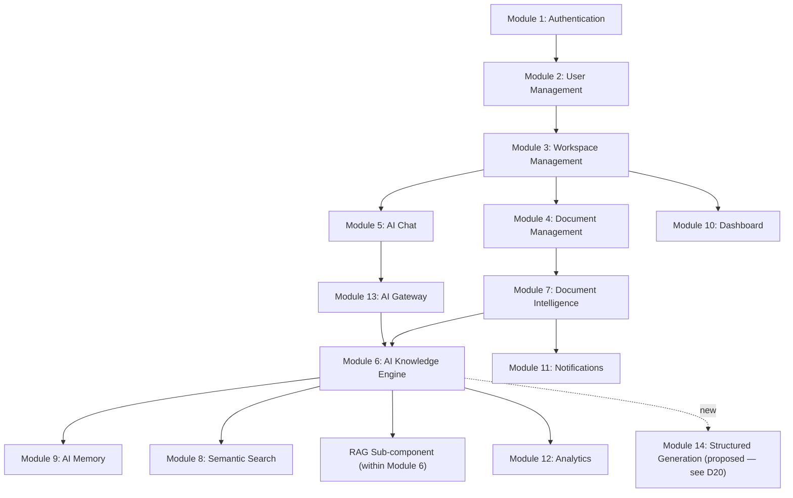

# Chapter 6 — Functional Requirements

**Document:** NexusAI Workspace — Product Requirements Document (PRD)
**Chapter:** 6 of 8
**Status:** Expanded / Under Review
**Depends on:** Chapters 1–5 (full decision log, D1–D25)
**Source:** Original PRD v1.0, Chapter 6 (preserved in full, expanded below)

---

## Purpose

Chapter 6 is where every open decision from Chapters 1–5 either gets **implemented as a concrete functional requirement** or gets exposed as still missing. This is the chapter where D19 (memory transparency) either finally becomes real FRs or the gap becomes undeniable. It's also the first chapter with enough structural detail (module boundaries, ID schemes) to audit for *internal* consistency, not just cross-chapter consistency.

## Scope

Covers: the twelve-module functional architecture, per-module functional requirements, cross-cutting AI/search/background-processing/security/error-handling/integration requirements, and the MVP functional scope summary.

## Objectives of This Chapter

1. Check whether D19 (memory transparency) — flagged urgent across five chapters — finally has functional requirements. If not, add them here rather than let it slip into Chapter 7 unresolved.
2. Check whether D20's proposed resolution (templated structured generation) has corresponding functional requirements. If not, this is the chapter where that gap becomes concrete and decidable.
3. Enforce the traceability promise made in §6.1 itself (every requirement gets an FR-x.y ID) — audit whether that promise is actually kept module-by-module.

---

## 6.1 Introduction (Expanded)

**Traceability audit:** §6.1 states *"each requirement in this chapter is assigned a unique identifier (FR-x.y) for traceability."* In the original text, this is only actually true for **Module 1 (Authentication, FR-1.1–1.7)** and **Module 3 (Workspace Management, FR-3.1–3.6)**. Every other module (2, 4, 5, 6, 7, 8, 9, 10, 11, 12) lists requirements as plain prose bullets with no ID. This directly contradicts the chapter's own stated traceability standard — and traceability is exactly the property later chapters (SAD, BIS, and eventually test plans) depend on to reference "the requirement" precisely rather than a paraphrase.

**This expansion assigns a complete, consistent FR-x.y numbering scheme across all twelve modules** (plus two new modules identified below) so the traceability promise is actually kept. This is a structural fix applied throughout the rest of this chapter, not just a note.

## 6.2 Functional Architecture Overview (Expanded — reconciled)

**Inconsistency found:** the original text states the MVP is composed of *"twelve core functional modules,"* but the accompanying diagram draws **thirteen** distinct boxes (Authentication, User Management, Workspace Management, Chat, Documents, Dashboard, **AI Gateway**, Knowledge Engine, Memory, Search, **RAG Engine**, Notifications, Analytics). Two of those boxes — **AI Gateway** and **RAG Engine** — don't correspond to any of the twelve numbered module sections (6.3–6.14) that follow. This matters beyond arithmetic: AI Gateway is the provider-abstraction layer Chapter 2 named as a core engineering principle (§2.7, AI Provider Independence) and Chapter 1 flagged as needing to cover embedding models too (Ch.2 review, D7) — yet as drawn, it has zero functional requirements anywhere in this chapter. Reconciled mapping:

| Diagram Node | Maps To | Status |
|---|---|---|
| Authentication | Module 1 | ✅ Numbered |
| User Management | Module 2 | ⚠️ Not numbered in original — fixed below |
| Workspace Management | Module 3 | ✅ Numbered |
| Chat | Module 5 (AI Chat) | ⚠️ Not numbered in original — fixed below |
| Documents | Module 4 (Document Management) | ⚠️ Not numbered in original — fixed below |
| Dashboard | Module 10 | ⚠️ Not numbered in original — fixed below |
| **AI Gateway** | **No corresponding module — gap** | **Recommend formalizing as Module 13** |
| Knowledge Engine | Module 6 | ⚠️ Not numbered in original — fixed below |
| Memory | Module 9 | ⚠️ Not numbered in original — fixed below |
| Search | Module 8 | ⚠️ Not numbered in original — fixed below |
| **RAG Engine** | **Conceptually inside Module 6, not separately specified** | **Recommend explicit sub-section in Module 6** |
| Notifications | Module 11 | ⚠️ Not numbered in original — fixed below |
| Analytics | Module 12 | ⚠️ Not numbered in original — fixed below |

Reconciled architecture diagram, with AI Gateway formalized as Module 13 and RAG Engine shown explicitly as part of Module 6:

## 6.3 Module 1 — Authentication (Expanded)

FR-1.1 through FR-1.7 are complete and well-scoped for v1. One addition worth flagging: none of the seven cover **rate limiting / account lockout** for failed login attempts — a standard security control (Chapter 6.18 later says "the system shall log security-relevant events" but doesn't require *preventing* brute-force attempts). Recommend adding:

> **FR-1.8:** The system shall rate-limit authentication attempts and temporarily lock accounts after repeated failed login attempts.

## 6.4 Module 2 — User Management (Expanded, renumbered)

| ID | Requirement |
|---|---|
| FR-2.1 | The system shall allow users to create and update a profile |
| FR-2.2 | The system shall allow users to upload an avatar |
| FR-2.3 | The system shall allow users to manage preferences (theme, notifications, workspace defaults) |
| FR-2.4 | The system shall allow users to configure AI settings (default model/provider, response length) |
| FR-2.5 | The system shall allow users to delete their account |

**Gap tied to D18 (Chapter 4):** FR-2.5 (delete account) has no stated cascade behavior. Account deletion implicitly should purge all associated workspaces, documents, vectors, and memory — but as written, this could be implemented as a soft "mark inactive" with all underlying data retained indefinitely, which would violate the privacy expectations set in Chapter 1's security notes. Recommend:

> **FR-2.6:** Account deletion shall cascade to permanently remove all associated workspaces, documents, embeddings, and memory records within a defined retention window, consistent with the workspace deletion cascade (FR-3.7, below).

## 6.5 Module 3 — Workspace Management (Expanded)

FR-3.1–3.6 are complete for v1 CRUD/archive operations. The same cascade gap applies here: **Delete Workspace (FR-3.3) doesn't specify what happens to the workspace's vectors in Qdrant, cached data in Redis, or files in storage.** This is the concrete mechanism that closes Chapter 4's D18 (knowledge lifecycle had no deletion path) — recommend making it explicit rather than assumed:

> **FR-3.7:** Deleting a workspace shall cascade to permanently remove all associated documents, embeddings (Qdrant), cached data (Redis), and memory records for that workspace, within a defined retention/grace window.

This single requirement, once added, is what actually resolves D18 at the functional-requirements level — the lifecycle diagram's "Expired / Deleted" branch (Chapter 4) needs exactly this cascade behavior to be real rather than conceptual.

## 6.6 Module 4 — Document Management (Expanded, renumbered)

| ID | Requirement |
|---|---|
| FR-4.1 | Upload documents (PDF, DOCX, TXT, Markdown, CSV, ZIP; images/OCR and repositories future) |
| FR-4.2 | Delete documents |
| FR-4.3 | Rename documents |
| FR-4.4 | Download original documents |
| FR-4.5 | Preview documents |
| FR-4.6 | Tag and categorize documents |
| FR-4.7 | Track document version metadata |
| FR-4.8 | Track document processing status |

**FR-4.7 (version metadata) is currently underspecified**, and it's actually the natural home for closing part of Chapter 2's "knowledge evolves" requirement (§2.4) and Chapter 4's D18 (lifecycle needs an Updated/Superseded path). Recommend defining its behavior explicitly rather than leaving "version metadata" as an ambiguous label:

> **FR-4.7 (expanded):** Re-uploading a document with the same identity shall create a new version, trigger re-processing and re-embedding, and mark prior chunks as superseded (retained for history/traceability, deprioritized in retrieval ranking) rather than silently overwritten or duplicated.

**ZIP support (FR-4.1) has a pipeline implication** not addressed in Module 7: a ZIP archive needs an unpack/enumerate step before text extraction can run per-file. Flagged for Module 7 below rather than fixed here, since it's a processing-pipeline concern.

**Note on Download vs. Export:** FR-4.4 (download original documents) is distinct from Chapter 5's D22 ("Export Notes" — exporting AI-*generated* content like a literature review or flashcard set). Downloading what you uploaded is not the same capability as exporting what the AI produced. This disambiguation matters because it would be easy to mistakenly consider D22 "already covered" by FR-4.4 — it isn't. D22 is addressed separately below (Module 14).

## 6.7 Module 5 — AI Chat (Expanded, renumbered)

| ID | Requirement |
|---|---|
| FR-5.1 | Streaming responses |
| FR-5.2 | Markdown rendering |
| FR-5.3 | Syntax highlighting |
| FR-5.4 | Conversation history |
| FR-5.5 | Pinned chats and folders |
| FR-5.6 | Search within conversations |
| FR-5.7 | Regenerate response |
| FR-5.8 | Edit prompt |
| FR-5.9 | Copy response |
| FR-5.10 | Export conversation |
| FR-5.11 | Display citations for grounded responses |

**FR-5.10 (export conversation) partially addresses D22**, but only for raw chat transcripts — it does not cover exporting a *generated artifact* (a flashcard set, a literature-review outline) as a standalone document, which is the scenario Chapter 5's Research Workflow actually needed. That capability is proposed as part of Module 14 below.

## 6.8 Module 6 — AI Knowledge Engine (Expanded)

The original text describes this module's responsibilities in prose without FR IDs. Formalized:

| ID | Requirement |
|---|---|
| FR-6.1 | The system shall coordinate document indexing, semantic retrieval, memory lookup, and prompt construction into a single orchestrated query pipeline |
| FR-6.2 | The system shall route a query through the knowledge graph/relationship metadata (per Chapter 4, D16) when constructing retrieval context, not vector similarity alone |
| FR-6.3 | The system shall support multi-document synthesis (retrieval and reasoning across more than one source document per query), per the multi-source synthesis requirement established in Chapter 4 §4.2 and tested by the Day-20 journey in §4.8 |

FR-6.3 is new and worth calling out specifically: it's the functional requirement that makes Chapter 4's multi-source synthesis claim testable rather than aspirational — without it, "the AI Knowledge Engine coordinates retrieval" could be satisfied by single-document RAG alone, which would under-deliver on what Chapters 3–5 promised.

## 6.9 Module 7 — Document Intelligence (Expanded, renumbered, gap closed)

| ID | Requirement |
|---|---|
| FR-7.1 | Extract text from uploaded documents |
| FR-7.2 | Clean extracted text (remove noise, normalize formatting) |
| FR-7.3 | Chunk cleaned text using a defined chunking strategy |
| FR-7.4 | Generate embeddings for each chunk |
| FR-7.5 | Store chunk metadata (source document, position, tags) |
| FR-7.6 | Store vectors in Qdrant |
| FR-7.7 | Mark documents ready for retrieval upon pipeline completion |
| FR-7.8 | Process all documents asynchronously via background job queue (BullMQ), never blocking the user-facing upload response |

**New requirement needed for ZIP support (flagged under Module 4):**

> **FR-7.9:** ZIP archive uploads shall be unpacked and each contained supported file processed individually through FR-7.1–FR-7.7, with archive-level metadata preserved to indicate common origin.

## 6.10 Module 8 — Semantic Search (Expanded, renumbered)

| ID | Requirement |
|---|---|
| FR-8.1 | Keyword (lexical) search |
| FR-8.2 | Semantic (embedding-based) search |
| FR-8.3 | Hybrid search combining lexical and semantic ranking |
| FR-8.4 | Filter results by workspace, date, document type, tags, author |

This module was already functionally complete and consistent with the hybrid-search recommendation made back in Chapter 1 §1.11 — no gaps found beyond the numbering fix.

## 6.11 Module 9 — AI Memory (Expanded — D19 resolution proposed here)

Original requirements, renumbered:

| ID | Requirement |
|---|---|
| FR-9.1 | Maintain short-term memory (current conversation context) |
| FR-9.2 | Maintain long-term memory: workspace knowledge, user preferences, important facts, project decisions, frequently referenced information |
| FR-9.3 | Scope all memory strictly to its originating workspace (no cross-workspace leakage) |

**This is the module where D19 — flagged urgent across five consecutive chapters — should have functional requirements and currently has none.** Proposed additions, directly resolving D19 at the functional-requirements level:

| ID | Requirement |
|---|---|
| **FR-9.4** | The system shall allow users to view all long-term memory records associated with a workspace |
| **FR-9.5** | The system shall allow users to delete individual memory records |
| **FR-9.6** | The system shall allow users to reset (clear) all memory for a workspace |
| **FR-9.7** | The system shall allow users to opt out of passive/inferred memory capture (Chapter 2, Principle 4), while retaining explicit, user-confirmed memory |
| **FR-9.8** | Memory writes derived from a conversation shall be traceable to their source conversation (per Chapter 4's D15 Knowledge/Memory boundary rule, where applicable) |

These five requirements are the concrete functional answer to the memory-transparency user story and acceptance criterion added in Chapter 5 (§5.15, §5.16). Recommend treating FR-9.4–FR-9.8 as **non-negotiable MVP requirements**, not optional additions — persistent memory (Chapter 4 §4.10) should not ship without them, consistent with the review position taken in every chapter since Chapter 2.

## 6.12 Module 10 — Dashboard (Expanded, renumbered)

| ID | Requirement |
|---|---|
| FR-10.1 | Display recent chats |
| FR-10.2 | Display recent documents |
| FR-10.3 | Display storage usage |
| FR-10.4 | Display workspace statistics |
| FR-10.5 | Display AI usage |
| FR-10.6 | Display document processing queue status |
| FR-10.7 | Display notifications |
| FR-10.8 | Display activity timeline |

No gaps found; one addition worth considering once FR-9.4 exists: the dashboard is a natural surface for memory visibility (FR-9.4), not just a separate settings page. Recommend a forward-pointer rather than a new requirement here: **the SAD/BIS should consider surfacing memory records in the dashboard**, satisfying FR-9.4 in a discoverable location rather than a buried settings screen.

## 6.13 Module 11 — Notifications (Expanded, renumbered)

| ID | Requirement |
|---|---|
| FR-11.1 | Notify on document processing completion |
| FR-11.2 | Notify on AI job failure |
| FR-11.3 | Notify on scheduled reminder triggers |
| FR-11.4 | Notify on background task completion |

No gaps found; correctly scoped, future channels (email/push/Slack) appropriately deferred.

## 6.14 Module 12 — Analytics (Expanded, renumbered)

| ID | Requirement |
|---|---|
| FR-12.1 | Track workspace count |
| FR-12.2 | Track document count |
| FR-12.3 | Track document processing time |
| FR-12.4 | Track average AI response time |
| FR-12.5 | Track search usage |
| FR-12.6 | Track storage consumption |
| FR-12.7 | Track background job status/throughput |

No gaps found.

## Module 13 — AI Gateway (New — formalizing the diagram gap identified in §6.2)

| ID | Requirement |
|---|---|
| FR-13.1 | The system shall abstract all LLM provider calls behind a common interface (Provider Adapter pattern, per Chapter 2 §2.7) |
| FR-13.2 | The system shall support configuring a default AI provider/model per workspace or user (per FR-2.4) |
| FR-13.3 | The system shall abstract embedding-model calls behind a similar interface, independent of the LLM provider abstraction (per Chapter 2 review, D7) |
| FR-13.4 | The system shall support fallback to an alternate provider if the primary provider is unavailable |

This module didn't exist as a numbered section anywhere in the original chapter despite being drawn in the architecture diagram and named as a core engineering principle since Chapter 2 — recommend it be added formally rather than left implicit inside Module 6's description.

## Module 14 — Structured Generation (New — proposed resolution for D20, and home for D22)

Chapter 5 proposed resolving D6/D20 (multi-step generation: flashcards, quizzes, literature review outlines, revision plans) as a small set of **fixed-shape templated pipelines**, distinct from open-ended agent planning. Chapter 6, as originally written, has **no corresponding module or FR** — this is the most consequential gap in this chapter, since three of five personas (Chapter 5) have their signature use case depending on it. Proposed, pending your confirmation:

| ID | Requirement |
|---|---|
| **FR-14.1** | The system shall generate flashcards from retrieved workspace content via a fixed-shape templated pipeline (not open-ended agent planning) |
| **FR-14.2** | The system shall generate quiz questions from retrieved workspace content via a fixed-shape templated pipeline |
| **FR-14.3** | The system shall generate a literature-review outline synthesizing multiple retrieved documents |
| **FR-14.4** | The system shall generate a revision/study plan from retrieved workspace content |
| **FR-14.5** | The system shall allow exporting any generated artifact (FR-14.1–14.4) as a standalone Markdown file — **this is the concrete resolution of Chapter 5's D22**, distinct from FR-5.10 (raw conversation export) |

**This entire module is proposed, not confirmed** — if it's rejected, three personas' signature use cases (Student, Researcher, and partially AI Engineer, from Chapter 5) go unmet in v1, which should be a conscious scope decision, not a silent gap. If confirmed, this becomes the concrete engineering answer to D6/D20/D22 simultaneously.

## 6.15 AI Functional Requirements (Expanded)

The cross-cutting AI requirements list is accurate but should now explicitly reference Module 14 if confirmed:

> The AI subsystem shall answer questions, generate summaries, explain concepts, compare documents, produce study material (**via Module 14 if confirmed**), review technical documentation, provide grounded citations, and respect workspace isolation (per FR-9.3).

No other changes needed; provider-agnosticism is correctly restated and consistent with Module 13.

## 6.16 Search Functional Requirements (Expanded)

Consistent with Module 8 (§6.10); no gaps. One addition: "index conversation history" (already stated) should explicitly note it's subject to the same workspace-scoping requirement as memory (FR-9.3), to avoid conversation search accidentally leaking across workspace boundaries — a plausible implementation bug class given how central workspace isolation is to the whole product's trust model.

## 6.17 Background Processing Requirements (Expanded)

Correctly consistent with Chapter 2's Event-Driven engineering principle (§2.7) and the ingestion sequence diagram established there. No gaps; this section is accurate as written.

## 6.18 Security Functional Requirements (Expanded — wording issue found, echoes Chapter 4's D17)

> "The system shall... authorize access **based on ownership or role**."

**Same wording issue flagged in Chapter 4 (D17)** recurs here: "role" implies a role-based access model, but Chapter 2 (§2.9/§2.12) and Chapter 1 (D1, resolved) establish v1 as single-user with no roles until team workspaces ship post-v1. Recommend, consistent with D17's earlier resolution:

> **FR-15.x (revised):** The system shall authorize access based on **ownership and workspace boundary** for v1; role-based authorization is deferred to post-v1 team-workspace support.

This is the second time this exact terminology slip has appeared (first in Chapter 4 §4.9, now here) — worth a global find-and-replace pass across the full PRD once all 8 chapters are drafted, rather than fixing it chapter-by-chapter reactively.

## 6.19 Error Handling Requirements (Expanded)

Complete and reasonable as written; consistent with standard production API practices. No gaps found.

## 6.20 Integration Requirements (Expanded)

Correctly lists the confirmed stack (Frontend, Backend API, MongoDB, Redis, BullMQ, Python AI Service, Qdrant) matching Chapter 1's D2 resolution. **One open item still not addressed here**, even though this is the most natural place for it: **Chapter 1's D5 (the Node↔Python inter-service contract — REST vs. gRPC vs. queue) is still unresolved**, and this section describes *that an* integration exists without specifying *how* the two runtimes communicate. Recommend this section name the contract explicitly (the event-driven ingestion sequence diagram from Chapter 2 already implies queue-based communication for ingestion specifically — recommend confirming whether query-time AI calls use synchronous REST/gRPC between Node and Python, since that's a different contract than the async ingestion path).

Embedding provider (Hugging Face) is also not explicitly named in this integration list, though it's part of the confirmed stack (Chapter 1, D2) — minor completeness gap, worth adding for consistency with Module 13's embedding-abstraction requirement (FR-13.3).

## 6.21 Functional Scope Summary (Expanded)

Updated to reflect this chapter's additions (pending confirmation of Module 14):

> The MVP provides: secure authentication, workspace organization, AI-powered chat, document management, semantic search, persistent workspace memory **with user-facing transparency and deletion controls (FR-9.4–9.8)**, background document processing, dashboard, notifications, analytics, a provider-agnostic AI gateway (Module 13), **and — pending confirmation — templated structured generation with export (Module 14)**.

---

## Design Decisions & Trade-offs Log (Chapter 6 additions)

| # | Decision Needed | Recommendation | Status |
|---|---|---|---|
| D19 (escalated across 5 chapters) | Memory transparency mechanism | **Proposed resolution: FR-9.4–FR-9.8**, added directly to Module 9 | **Recommended — confirm; recommend treating as mandatory MVP, not optional** |
| D20 / D6 | Templated structured generation (flashcards, quizzes, literature review) | **Proposed resolution: new Module 14 (FR-14.1–14.5)** | **Recommended — confirm; if rejected, 3 personas' signature use cases go unmet in v1** |
| D22 | Export of AI-generated artifacts | **Resolved via FR-14.5**, distinct from FR-5.10 (conversation export) and FR-4.4 (document download) | **Recommended — confirm alongside D20/Module 14** |
| D18 (Ch.4) | Knowledge lifecycle deletion path | **Resolved via FR-3.7 (workspace cascade) and FR-2.6 (account cascade)** | **Recommended — confirm** |
| D26 | Module count/diagram mismatch (12 stated vs. 13 drawn; AI Gateway and RAG Engine unmapped) | Reconciled — AI Gateway formalized as Module 13; RAG Engine specified as FR-6.1–6.3 within Module 6 | **Recommended — confirm as canonical structure** |
| D27 | FR-x.y numbering inconsistent across modules (only 2 of 12 modules originally numbered) | Fixed throughout this chapter — full consistent numbering now applied | **Applied — recommend adopting as canonical** |
| D28 | Document version metadata (FR-4.7) behavior unspecified | Defined explicitly: re-upload creates new version, triggers re-embedding, supersedes prior chunks without deleting them | **Recommended — confirm** |
| D30 (echoes D17) | "Ownership or role" wording recurs in §6.18, same issue as Chapter 4's D17 | Reword to ownership + workspace boundary for v1; flag for a global terminology pass across all chapters | **Recommended — confirm, and schedule the global pass** |
| D5 (from Ch.1, still open) | Node↔Python inter-service contract | Still not resolved even in the Integration Requirements section — needs explicit answer before SAD | **Open — please resolve before SAD** |

## Security Considerations

- FR-9.4–FR-9.8 (memory transparency) and FR-3.7/FR-2.6 (cascading deletion) together are this chapter's most important security/privacy contribution — recommend both sets be treated as launch-blocking for their respective modules, not nice-to-haves.
- Rate limiting/lockout (FR-1.8) closes a standard authentication gap that the original chapter's security section (§6.18) implied ("log security-relevant events") but didn't actually require preventing.

## Scalability Considerations

- FR-6.3 (multi-document synthesis) and FR-14.x (structured generation, if confirmed) are the two most expensive query patterns introduced in this chapter — both should be benchmarked separately from single-document RAG against the latency target recommended in Chapter 1, since they involve materially more retrieval and generation work per request.

## Performance Considerations

- FR-7.9 (ZIP unpacking) introduces variable-length processing jobs (a ZIP could contain 1 or 100 files) — recommend the background job design (BullMQ) account for job-size variance here specifically, e.g., splitting a ZIP into per-file sub-jobs rather than one monolithic job, so processing-status tracking (FR-4.8) stays accurate per file rather than per archive.

## Best Practices Applied in This Expansion

- Enforced the chapter's own stated traceability standard (FR-x.y for every requirement) rather than leaving it inconsistently applied.
- Turned D19 — the most escalated open item across the entire document set — into concrete, numbered functional requirements rather than flagging it a sixth time.
- Distinguished between genuinely different capabilities that could be mistaken for each other (Download vs. Export vs. Export-Generated-Artifact; Knowledge Engine vs. RAG Engine vs. AI Gateway) rather than letting overlapping terminology stand.

## Implementation Notes for Later Chapters

- The SAD should treat Module 13 (AI Gateway) and Module 14 (Structured Generation, if confirmed) as first-class architectural components, not implementation details buried inside the Knowledge Engine.
- The BIS should implement FR-9.4–FR-9.8 as part of the initial memory module build, not as a follow-up release.
- D5 (Node↔Python contract) should be the very first decision recorded in the SAD, since Module 13, Module 6, and Module 7 all depend on knowing whether that boundary is synchronous (REST/gRPC) or async (queue) for query-time calls specifically.

## Future Enhancements (Chapter-Level)

- A global terminology consistency pass across all 8 PRD chapters once complete (D30), given the "ownership or role" wording has now recurred twice.
- Voice and multimodal chat (already correctly deferred in the original §6.7).
- Role-based access control, once team workspaces ship post-v1 (consistent with every prior chapter's deferral).

---

## Senior Engineering Review

**Overall assessment:** Chapter 6 is where the cumulative weight of five chapters' open items either gets resolved or becomes impossible to ignore. The most important outcome of this expansion is that **D19 finally has real functional requirements** (FR-9.4–9.8) rather than another flag — that's the single most valuable thing this chapter needed to produce, and it's now done, pending your confirmation.

**Do not simply approve:**
1. The original chapter's traceability claim (§6.1) was not actually true for 10 of 12 modules — fixed throughout, but worth noting this is exactly the kind of internal inconsistency a rigorous external review (the kind this chapter's own opening claims to invite — "Microsoft, Google, Atlassian, OpenAI reviewing it") would catch immediately.
2. Module 14 (Structured Generation) is proposed, not confirmed — if it's rejected, three personas from Chapter 5 lose their signature use case in v1, and that should be a conscious, stated trade-off, not a silent scope gap discovered later.
3. D5 (Node↔Python contract) has now gone unresolved through the one chapter (Integration Requirements, §6.20) that most naturally should have settled it. This needs an answer before the SAD, not after.

## Summary

Chapter 6 translates five chapters of philosophy, positioning, and personas into numbered, traceable functional requirements — and in doing so, either resolves or concretely proposes resolutions for nearly every open item carried forward: D18 and D19 get real functional requirements, D20/D22 get a proposed module with FR IDs, D26/D27 fix structural inconsistencies in the chapter itself, and D28/D30 close smaller specification gaps. The one item still genuinely open is D5, the Node↔Python contract — worth resolving before the SAD, since Modules 6, 7, and 13 all depend on knowing that answer.

**Next step:** confirm Module 14 (Structured Generation) and the memory transparency FRs (9.4–9.8) — both are consequential enough to warrant an explicit yes before Chapter 7. Send Chapter 7 whenever ready.
