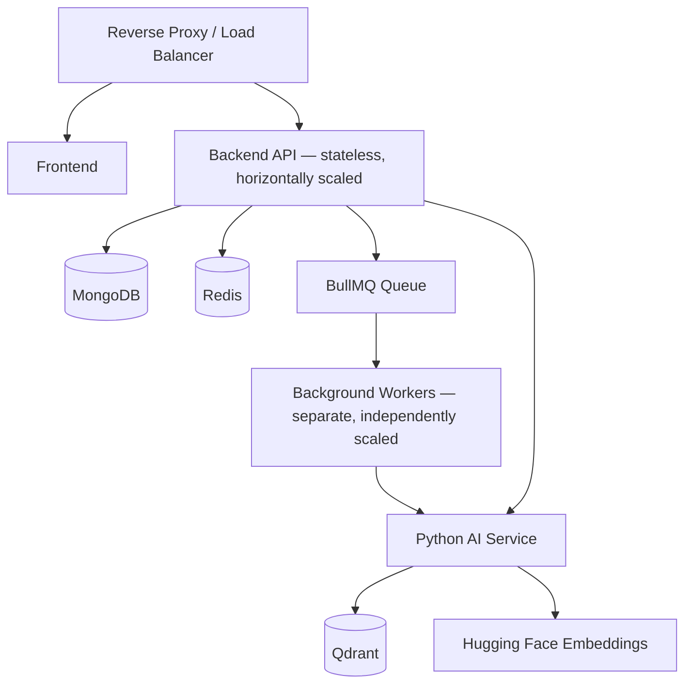

# Chapter 7 — Non-Functional Requirements (NFR)

**Document:** NexusAI Workspace — Product Requirements Document (PRD)
**Chapter:** 7 of 8
**Status:** Final
**Depends on:** Chapters 1–6 (full decision log, D1–D30)
**Source:** Original PRD v1.0, Chapter 7

---

## Purpose

Chapter 6 defined *what* the system does. Chapter 7 defines *how well*, and — just as importantly for a document this size — it's the first chapter with enough quantified detail to actually **check earlier chapters' claims against numbers**. Several things flagged as vague across Chapters 1–6 (the unqualified "100 → 1M users" scalability claim, the undefined RAG latency budget) either get resolved here or are exposed as still unresolved despite this being exactly the right chapter to resolve them.

## Scope

Covers: performance, scalability, availability, reliability, security, privacy, maintainability, extensibility, observability, fault tolerance, background processing, deployment, portability, accessibility, compatibility, data integrity, AI quality, disaster recovery, success metrics, and a production-readiness checklist.

## Objectives of This Chapter

1. Verify this chapter actually closes the quantitative gaps flagged since Chapter 1 (RAG latency target, per-layer scalability bottleneck).
2. Catch any direct contradictions with Chapter 6's functional requirements — NFRs and FRs describing the same feature differently is a serious consistency failure, not a style issue.
3. Evaluate the trailing "Engines" reframing proposal on its merits, consistent with how Chapter 3's positioning proposal was handled.

---

## 7.1 Introduction (Expanded)

The functional/non-functional distinction is stated correctly and concisely. Worth adding one framing note: NFRs are where this project's claim to be more than "another RAG application" (Chapter 3, D10) actually gets tested. Any AI project can claim to answer questions from documents; whether it does so within a stated latency budget, survives a provider outage, and isolates tenants correctly is what separates a demo from the "production-ready" framing the master prompt and Chapter 1 both explicitly target.

## 7.2 Performance Requirements (Expanded — closes an open item, but incompletely)

**This section resolves part of a recommendation open since Chapter 1** ("Chapter 1 should set a rough RAG latency target... so later chapters have a number to design against"). NFR-2's targets (retrieval within 1s, first token in 2–4s) are exactly that target, finally quantified. Good — recommend explicitly marking this as the answer to that long-open Chapter 1 recommendation.

**Incomplete, though:** NFR-2 gives a single latency profile, but Chapters 4 and 6 established that not all AI operations are the same cost. Specifically:
- Single-document RAG Q&A (baseline — what NFR-2 describes)
- Multi-document synthesis (Chapter 4 §4.2, formalized as FR-6.3 in Chapter 6) — retrieves and reasons across multiple sources, structurally more expensive
- Structured generation (Chapter 6's proposed Module 14 — flashcards, quizzes, literature-review outlines) — potentially multi-step template pipelines, likely the most expensive category

Applying NFR-2's "first token in 2–4s" target uniformly to a literature-review-outline generation (which might reasonably synthesize 10+ documents) is unrealistic and would set the SAD up to either violate its own NFR or under-scope the feature. Recommend a tiered target:

| Operation Class | Retrieval Start | First Token / Initial Output | Total Completion (soft target) |
|---|---|---|---|
| Single-document Q&A (baseline, NFR-2 as written) | < 1s | 2–4s | Streaming until done, no hard cap |
| Multi-document synthesis (FR-6.3) | < 1.5s | 3–6s | < 15s p95 |
| Structured generation (Module 14, if confirmed) | < 2s | 4–8s (may show progressive sections rather than token-by-token) | < 30s p95, with progress indication |

This tiering should be treated as a starting proposal for the SAD to refine with real benchmarking, not a final number — but a tiered structure is materially more honest than one blanket target across operations that Chapter 6 itself already flagged as having very different cost profiles.

## 7.3 Scalability Requirements (Expanded — bottleneck named)

**This is the third chapter to state the 100 → 1M user growth target (Chapters 1, 2, and here) without naming which layer is actually expected to be the bottleneck** — flagged as an open recommendation in both prior reviews. This is the natural chapter to close it, so here's a concrete proposal rather than a fourth repetition of the flag:

> **Proposed scalability position:** the Node/Express API layer and MongoDB scale conventionally via stateless horizontal replication (already listed as a lever in this section) and are **not** expected to be the primary bottleneck. The actual constraints at scale are **LLM inference cost/throughput** (external provider rate limits and per-token cost, mitigated by Module 13's provider abstraction and fallback) and **vector search latency/cost at large corpus sizes** (Qdrant query performance as embedding count grows into the millions). Scalability work in the SAD should prioritize these two areas — provider-tier management and vector index sharding/optimization — over further optimizing the CRUD layer.

Recommend this position be adopted explicitly in the canonical PRD rather than left as an unqualified uniform target — it gives the SAD a concrete place to focus scalability engineering effort instead of treating all layers as equally at risk.

## 7.4 Availability (Expanded)

99.5% is a reasonable, appropriately modest target for a project at this stage (not overclaiming enterprise-grade 99.99% SLAs that would be dishonest for an MVP). The AI-provider-failure handling requirement (graceful degradation, not full outage) is **directly consistent with Module 13's FR-13.4 (provider fallback)** from Chapter 6 — good cross-chapter alignment, no changes needed, just noting the two chapters reinforce each other correctly.

## 7.5 Reliability (Expanded)

"Avoid duplicate background processing" is stated as a goal but not as a mechanism. Recommend making it concrete, since retry logic (mentioned later in §7.11) without idempotency guarantees is a classic source of duplicate-processing bugs:

> **Implementation note:** background jobs (BullMQ) should use idempotency keys (e.g., a hash of document ID + version, per Chapter 6's FR-4.7 versioning behavior) so that a retried or re-queued job does not create duplicate embeddings or duplicate memory records.

## 7.6 Security (Expanded — recurring wording issue, third occurrence)

**"Every protected resource must verify ownership or role before granting access"** — this is the **third occurrence** of the same terminology slip first caught in Chapter 4 (D17) and repeated in Chapter 6 (D30): "role" implies role-based access control, which Chapter 1 (D1, resolved) explicitly defers to post-v1 team workspaces. Fixing directly here rather than flagging a fourth time:

> **Revised:** every protected resource must verify **ownership and workspace boundary** before granting access, for v1. Role-based authorization is deferred to post-v1 team-workspace support (consistent with Chapters 1, 4, and 6).

Given this exact phrase has now appeared three times across three chapters, it's worth treating as confirmation that a **global find-and-replace pass across all prior chapters** is warranted once Chapter 8 is complete, rather than continuing to catch it reactively per chapter.

**Rate limiting on AI endpoints** is a good security control, but it's worth noting it only partially addresses a cost-control concern flagged back in Chapter 2 (§2.6, the Accuracy/Performance/Cost tension under Principle 1, AI Native). Rate limiting prevents abuse; it doesn't prevent a legitimate but expensive usage pattern (e.g., a user repeatedly triggering multi-document synthesis or literature-review generation) from driving up inference cost. Recommend the SAD also define **usage budgets** (e.g., generation-credits per workspace per period) as a complementary mechanism to rate limiting, not a replacement for it.

## 7.7 Privacy (Expanded — direct contradiction with Chapter 6 found)

Account deletion (FR-2.5/FR-2.6), conversation export (FR-5.10), and structured-artifact export (FR-14.5) are v1 requirements already specified in Chapter 6.

## 7.8 Maintainability (Expanded)

Standard, well-scoped, no issues. One addition worth naming given how much module/naming reconciliation has happened across Chapters 4–7 (D15, D16, D26, D27, and the pending D31 below): recommend a lightweight **architecture decision record (ADR)** practice be adopted for the SAD, so future naming/boundary decisions are documented at the time they're made rather than needing to be reconstructed and reconciled retroactively, as has been necessary repeatedly in this review process.

## 7.9 Extensibility (Expanded)

Fully consistent with the future-roadmap items established in Chapters 1 (D3), 2 (§2.12), and 4 (§4.11) — no new inconsistencies. "LangGraph agent workflows" are listed here as future, not MVP, which aligns with the fixed-shape generation resolution in Chapters 5 and 6.

## 7.10 Observability (Expanded)

Comprehensive and correctly scoped (logging, metrics, health checks). One addition: given Module 9's new memory-transparency requirements (FR-9.4–9.8, Chapter 6) and the proposed Module 14 (structured generation), recommend explicitly tracking **memory operation volume** (views/deletions/opt-outs) and **generation job volume/success rate** as metrics — both are new enough capabilities that they should be observable from day one rather than added to monitoring after the fact.

## 7.11 Fault Tolerance (Expanded)

Consistent with §7.4 and §7.5; no issues. Correctly names the specific failure modes (Redis outages, AI provider failures, worker crashes, network interruptions, DB errors) rather than a generic "the system should be resilient" statement — this specificity is good practice and should be the model for how fault tolerance is stated in the SAD as well.

## 7.12 Background Processing (Expanded)

Consistent with Chapter 2's event-driven principle and Chapter 6's async requirements (FR-7.8). No issues.

## 7.13 Deployment (Expanded — worker separation recommended)

The container list (Frontend, Backend API, Python AI Service, MongoDB, Redis, Qdrant, Reverse proxy) matches Chapter 6's integration list (§6.20). One gap: **there's no separate container/process listed for BullMQ workers** — as written, it's ambiguous whether background job processing runs inside the same process as the Backend API or as an independently deployable worker. Given §7.3's scalability goal explicitly lists "stateless API servers" as a scaling lever, recommend making workers a distinct deployable unit:

> **Recommended:** deploy BullMQ workers as a separate container/service from the Backend API, sharing Redis as the queue broker. This allows the API (request/response path) and the worker pool (background processing) to scale independently — a heavy ingestion or generation workload shouldn't be able to degrade API response times for unrelated requests, and vice versa.

## 7.14 Portability (Expanded)

Standard and correctly scoped; consistent with the containerized, cloud-agnostic deployment approach. No issues.

## 7.15 Accessibility (Expanded)

Appropriately aspirational for an MVP ("should strive to follow") without overcommitting to a specific WCAG conformance level this early — reasonable given the project's primary stated goal (Chapter 1 §1.13) is demonstrating engineering capability, not shipping a fully accessibility-audited product on day one. No changes recommended.

## 7.16 Compatibility (Expanded)

Standard, reasonable, consistent with a desktop-first MVP and mobile as future — matches the "don't overcomplicate MVP" theme established since Chapter 4. No issues.

## 7.17 Data Integrity (Expanded — reinforces an earlier recommendation)

*"Deleted workspaces remove associated indexes"* — **this NFR directly reinforces FR-3.7**, the cascading-deletion requirement added during Chapter 6's expansion to close Chapter 4's D18 (lifecycle deletion gap). It's a good sign that this NFR, written independently of that FR-level fix, describes the same required behavior — the two chapters converge on the same conclusion from different angles, which increases confidence that FR-3.7 is the right requirement rather than a review-invented addition.

*"Background jobs do not create duplicate entries"* ties directly to the idempotency-key recommendation made in §7.5 above — same underlying mechanism, worth cross-referencing rather than treating as two separate requirements.

## 7.18 AI Quality (Expanded)

The anti-hallucination requirement — *"avoid presenting unsupported information as if it were retrieved from the user's workspace"* — is one of the most important NFRs in the entire document, since it's the trust foundation the Explainability/Transparency principles (Chapter 2, Principles 5–6) depend on. Recommend this be explicitly connected to Chapter 1's D4 (measurable eval framework): "AI Quality" as stated here is currently unmeasurable prose. A concrete metric — e.g., a **groundedness/faithfulness score** measured against the eval framework's labeled query set — would make this NFR testable rather than aspirational, consistent with the same fix applied to Chapter 1's original success criteria.

## 7.19 Disaster Recovery (Expanded)

Correctly and honestly scoped as future/production-planning rather than MVP-mandatory. No issues — this is appropriately modest rather than overclaiming DR capability the MVP won't actually have.

## 7.20 Success Metrics (Expanded — partially closes Chapter 1's D4)

**This section is the operational half of Chapter 1's long-open D4 (build a measurable eval framework).** The technical metrics (latency, queue time, uptime) and product metrics (active users, workspaces, documents, searches, conversations, retention) are a solid operational monitoring foundation. **What's still missing, and what D4 originally also asked for**, is an **information-retrieval-specific quality benchmark** — precision/recall/relevance scored against a labeled query set (the "eval corpus" flagged since Chapter 1, and connected to Chapter 3's framing of this as fundamentally an IR problem, §3.10). Operational metrics tell you the system is *running*; they don't tell you retrieval is *good*. Recommend D4 be marked **partially resolved** — operational metrics are now specified — with the IR-quality benchmark still an open deliverable, likely owned by whichever SAD chapter covers the RAG/retrieval pipeline.

One more concrete gap: *"successful searches"* is listed as a product metric with no definition of "success." Recommend defining it operationally (e.g., a search that returns results the user doesn't immediately re-query for, or an explicit relevance signal) before the SAD's analytics chapter tries to implement it, since an undefined metric can't be built.

## 7.21 Production Readiness Checklist (Expanded)

Good, practical, and appropriately scoped for MVP ("basic testing," not exhaustive coverage). No issues — this is a solid closing checklist and should likely be lifted directly into the BIS as an actual pre-launch gate, not just documentation.

---

## Evaluating the "Engines" Reframing Proposal

The source material proposes describing the platform's modules as **Engines** (Authentication, Workspace, Knowledge, Retrieval, Memory, AI Orchestration, Document Intelligence, Background Processing, Search, Analytics) rather than a flat feature list. Evaluated on its merits, not adopted automatically:

**Assessment: good, and consistent with existing positioning — but two names overlap ambiguously with Chapter 6's already-established module structure and need reconciling.**

| Proposed Engine | Maps to Chapter 6 Module | Reconciliation Needed? |
|---|---|---|
| Authentication Engine | Module 1 | None — direct match |
| Workspace Engine | Module 3 | None — direct match |
| Knowledge Engine | Module 6 | None — already named this in the original Chapter 6 |
| **Retrieval Engine** | Ambiguous — overlaps with both Module 6 and Module 8 | **Yes — see below** |
| Memory Engine | Module 9 | None — direct match |
| **AI Orchestration Engine** | Ambiguous — overlaps with Module 13 (AI Gateway) and parts of Module 6 | **Yes — see below** |
| Document Intelligence Engine | Module 7 | None — already named this in the original Chapter 6 |
| Background Processing Engine | Cross-cutting (§6.17/7.12, BullMQ layer) | None — reasonable to formalize as its own infrastructure-level engine |
| Search Engine | Module 8 | None — direct match |
| Analytics Engine | Module 12 | None — direct match |

**Proposed disambiguation**, since having both "Retrieval Engine" and "Search Engine" without a clear boundary would recreate the exact AI-Gateway/RAG-Engine ambiguity already found and fixed in Chapter 6 (D26):

- **Search Engine** = Module 8 as specified (keyword/semantic/hybrid indexing and querying — the retrieval *mechanism*).
- **Retrieval Engine** = formalizes what Chapter 6 called the "RAG sub-component within Module 6" (FR-6.1–6.3) — the *orchestration* of retrieval (deciding what to retrieve, from where, combining Search + Memory results into context). This actually resolves a naming gap Chapter 6 itself left open (D26's "RAG Engine" node had no clean home) — good outcome.
- **AI Orchestration Engine** = formalizes Module 13 (AI Gateway) specifically — provider/model routing and fallback, distinct from Retrieval Engine's job of assembling context.
- **Knowledge Engine** (Module 6) becomes the umbrella coordinating Retrieval Engine, Memory Engine, and AI Orchestration Engine outputs into a final response — consistent with how Module 6 was already described in the original PRD.

**Notably, Dashboard (Module 10) and Notifications (Module 11) are correctly *not* included in the Engines list** — they're presentation/delivery layers built on top of the engines, not processing engines themselves. That's a sound omission, not a gap, and worth stating explicitly so it doesn't look like an oversight.

**Structured Generation (proposed Module 14)**, if confirmed, would reasonably become an eleventh **Generation Engine**, sitting alongside Retrieval and Memory Engines as an input to Knowledge Engine's final orchestration.

**Recommendation: adopt the Engines framing**, using the disambiguation above. It's not new scope — every engine maps to an already-specified module — and it's consistent with, and arguably strengthens, the "AI Knowledge Operating Platform" positioning adopted in Chapter 3 (D10): an *Operating Platform* is naturally composed of *Engines*, not a flat feature list. This is good narrative and architectural consistency, not just renaming for its own sake.

---

## Design Decisions & Trade-offs Log (Chapter 7 additions)

| # | Decision Needed | Recommendation | Status |
|---|---|---|---|
| D31 | Adopt "Engines" framing for module naming | Yes, with disambiguation table above | **Resolved** |
| D32 | §7.7 states account deletion and export as "future," directly contradicting Chapter 6's FR-2.5 and FR-5.10 (v1) | Corrected — both are v1 | **Resolved** |
| D33 | Scalability bottleneck layer (raised in Ch.1, Ch.2, repeated here) | LLM inference + vector search are the expected bottlenecks, not the Node/Mongo layer | **Resolved** |
| D34 (3rd occurrence, echoes D17/D30) | "Ownership or role" wording | Fixed directly in this chapter | **Resolved** |
| D35 | BullMQ workers not shown as a separate deployable unit (§7.13) | Separate Worker container/service from Backend API | **Resolved** |
| D36 | AI endpoint cost control beyond rate limiting | Rate limiting only for v1; usage budgets can wait | **Resolved** |
| D4 (from Ch.1, revisited) | Measurable success/eval framework | Operational half resolved; IR-quality benchmark remains the open deliverable | **Partially resolved** |

## Security Considerations

- D32's correction (account deletion/export are v1) has direct privacy-compliance implications — recommend the corrected version, not the original, be what the BIS builds against.
- D34's third occurrence of the ownership/role wording issue is itself a minor process signal worth naming: recurring terminology drift across independently-written chapters is a sign the underlying single-user-v1 decision (Chapter 1, D1) needs to be more prominently referenced (e.g., in a shared glossary) rather than re-derived per chapter.

## Scalability Considerations

- D33's proposed bottleneck position (LLM inference + vector search, not the CRUD layer) should directly inform which components get load-tested first in the SAD/BIS, rather than distributing scalability engineering effort evenly across a stack where not all layers carry equal risk.

## Performance Considerations

- The tiered latency targets proposed for §7.2 should be treated as the SAD's starting benchmarking targets, to be refined with real measurements once Module 6 (Retrieval Engine) and Module 14 (Generation Engine, if confirmed) exist to benchmark against.

## Best Practices Applied in This Expansion

- Caught a direct, concrete contradiction (D32) between two chapters rather than a softer "these could be read differently" observation — this is a genuine defect that would be embarrassing if caught by an external reviewer first.
- Evaluated the Engines reframing proposal against the existing module structure rather than accepting or rejecting it wholesale, and used it to resolve a naming gap (Retrieval Engine vs. RAG sub-component) that Chapter 6 itself had left unresolved.
- Finally proposed a concrete answer to the scalability-bottleneck question after two prior chapters flagged it without resolution.

## Implementation Notes for Later Chapters

- The SAD should adopt the Engines naming (D31) as its primary structural vocabulary, with the disambiguation table as the authoritative mapping back to Chapter 6's FR-numbered modules.
- The BIS should implement idempotency keys for all BullMQ jobs (§7.5/§7.17) from the start, not as a hardening pass after initial implementation.
- The IR-quality eval benchmark (remaining half of D4) should be scoped as an explicit early deliverable in the SAD's RAG/Retrieval Engine chapter, using the Redis Optimization canonical example (Chapter 3) as at least one labeled test case.

## Future Enhancements (Chapter-Level)

- Full WCAG conformance target, once accessibility work matures past "should strive to."
- Formal disaster recovery implementation (§7.19), once the product moves beyond MVP.
- A Generation Engine formalized as its own SAD chapter, contingent on Module 14's confirmation.

---

## Senior Engineering Review

**Overall assessment:** Chapter 7 is where the PRD's quality bar becomes quantified and testable rather than aspirational — exactly the shift the chapter's own introduction promises ("what a CRUD app can't answer"). Most sections hold up well and several (§7.17's data-integrity note, §7.9's extensibility list) independently corroborate decisions made earlier in this review process, which is a good consistency signal.

**Do not simply approve:**
1. §7.7's claim that account deletion and export are "future" directly contradicts Chapter 6's functional requirements for the same release. This is the most serious inconsistency found in any chapter so far — not a soft tension or missing detail, but two chapters making opposite claims about the same feature's scope. This needs to be fixed before Chapter 8, or Chapter 8's feature specifications will inherit the ambiguity.
2. The scalability bottleneck question went unanswered through three chapters (1, 2, and the original version of this one) despite this being exactly the chapter meant to quantify such things. Resolved here with a concrete, named position (D33) rather than a fourth deferral.
3. The "ownership or role" terminology issue has now recurred three times across three independently-written chapters — worth treating as a process lesson (schedule the global pass) rather than continuing to catch it reactively.

## Summary

Chapter 7 quantifies the product's quality bar and, in doing so, both resolves long-open items (RAG latency target, partially D4, the scalability bottleneck question) and surfaces one serious new contradiction (D32, account deletion/export scope) that needs correcting before Chapter 8. The trailing "Engines" reframing proposal is adopted (D31) as a genuine improvement that's consistent with, and clarifies, structure already established in Chapter 6 — including resolving that chapter's own unresolved "RAG Engine" naming gap.

**Next step:** D32 (the account-deletion/export contradiction) should be confirmed-fixed before Chapter 8, since Chapter 8's feature specifications will need a single, unambiguous source of truth for what's in v1. Send Chapter 8 whenever ready.
