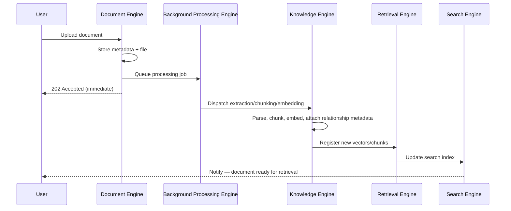
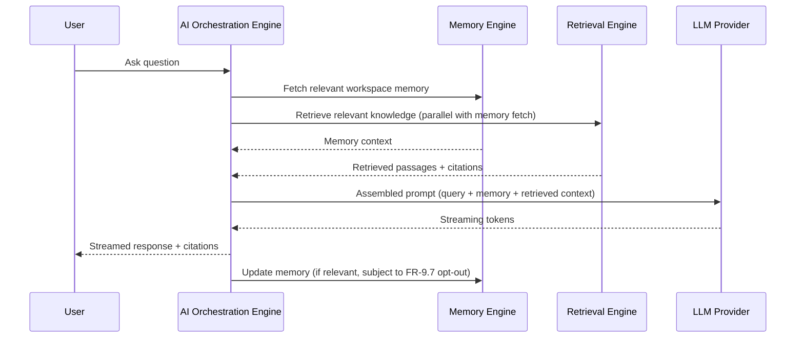

# Chapter 8 — Product Feature Specification

**Document:** NexusAI Workspace — Product Requirements Document (PRD)
**Chapter:** 8 of 8 (Final PRD Chapter)
**Status:** Final
**Depends on:** Chapters 1–7 (full decision log, D1–D36)
**Source:** Original PRD v1.0, Chapter 8

---

## Purpose

This is the last PRD chapter before the SAD begins, which changes what this expansion needs to do: beyond the usual per-chapter treatment, it needs to **audit this chapter against everything decided since Chapter 1** and produce a clean handoff. Anything still ambiguous here ships straight into architecture decisions. Two things make this audit unusually important: this chapter independently confirms the Engines framing proposed in Chapter 7 (good), and it also **silently drops two items this review has been escalating for several chapters** (memory transparency, structured generation) — both need a final, explicit answer before we move on.

## Scope

Covers: the ten/eleven-engine architecture, per-engine purpose/responsibilities/business rules, engine interaction flows, and final MVP scope. Also addresses the trailing tech-stack proposal and the recommendation to begin the SAD as a separate document.

## Objectives of This Chapter

1. Confirm the Engines framing (Chapter 7, D31) is consistent between the proposal and its actual application here — and resolve any naming drift between the two.
2. Confirm structured generation (D20/Module 14) and memory transparency (D19/FR-9.4–9.8) as part of v1.
3. Produce a consolidated decision log across all 8 PRD chapters as a clean handoff artifact for the SAD.

---

## 8.1 Introduction (Expanded)

The what/why/how/business-rules/future-evolution structure is a good, more implementation-oriented complement to Chapter 6's FR-numbered requirements — the two chapters should be read together (Chapter 6 for traceable "the system shall," Chapter 8 for narrative "here's how it actually behaves and why"). Worth stating this relationship explicitly in the canonical document so a reader doesn't wonder why two chapters both describe, say, the Memory module.

## 8.2 High-Level Product Architecture (Expanded — reconciled against Chapter 7's proposal)

**Good news first:** this chapter independently uses Engines terminology extensively (Authentication Engine, Workspace Engine, Knowledge Engine, etc.) — **this confirms D31 (Chapter 7's recommendation to adopt the Engines framing) is already the intended structure**, not just a proposal awaiting approval. Treating D31 as resolved.

**Naming drift found between Chapter 7's proposed list and this chapter's actual sections**, though — worth reconciling explicitly:

| Chapter 7's Proposed 10 Engines | Chapter 8's Actual Sections (8.3–8.13) |
|---|---|
| Authentication Engine | Authentication Engine (8.3) ✅ |
| Workspace Engine | Workspace Engine (8.4) ✅ |
| Document Intelligence Engine | **Document Engine** (8.5) — renamed, and merged with document CRUD (Chapter 6's Module 4) |
| Knowledge Engine | Knowledge Engine (8.6) ✅ |
| Retrieval Engine | Retrieval Engine (8.7) ✅ |
| AI Orchestration Engine | AI Orchestration Engine (8.8) ✅ |
| Memory Engine | Memory Engine (8.9) ✅ |
| Search Engine | Search Engine (8.10) ✅ |
| Background Processing Engine | Background Processing Engine (8.11) ✅ |
| Analytics Engine | Analytics Engine (8.13) ✅ |
| *(not in Ch.7's list)* | **Dashboard Engine** (8.12) — new addition |
| *(not in Ch.7's list)* | **Chat Engine** — folded into AI Orchestration Engine |

Two items worth resolving explicitly:

**"Dashboard Engine" (new):** Dashboard is treated as a full engine in this chapter because it aggregates state across the other engines and presents workspace-level status, not just static rendering.

**"Chat Engine" (gap):** conversation management is folded into the AI Orchestration Engine. Chat threading, history, folders, and pinning are treated as orchestration responsibilities rather than a separate engine.

## 8.3 Authentication Engine (Expanded)

Complete and consistent with Chapter 6's Module 1 / FR-1.1–1.8. The "identity verification only, not workspace permissions" boundary statement is a good explicit non-goal — worth using as a model for how other engines should state their boundaries too (most don't, see the Business Rules gap noted below).

## 8.4 Workspace Engine (Expanded)

*"Deleting a workspace triggers cleanup of associated knowledge"* — **this is the narrative version of FR-3.7**, the cascading-deletion requirement added in Chapter 6 to close Chapter 4's D18. Good — third independent confirmation (Chapter 4's gap, Chapter 6's FR, Chapter 7's NFR §7.17, and now here) that this is the correct, agreed-upon behavior. No further action needed; this is the pattern working as intended.

*"Documents cannot belong to multiple workspaces in the MVP"* is a new, useful, and previously unstated business rule — good addition, consistent with the single-user/single-owner tenancy model (D1).

## 8.5 Document Engine (Expanded — internal inconsistency found)

**This section's own pipeline diagram conflicts with §8.14's engine-interaction diagram**, both within this same chapter. §8.5 shows Document Engine directly performing Extraction → Chunking → Embedding → Indexing. §8.14's document flow shows Document Engine handing off to **Background Processing Engine**, which triggers **Knowledge Engine**, which performs the actual processing — Document Engine doesn't appear again after the handoff. These describe different owners for the same work (chunking/embedding) within four pages of each other.

This is also the same ambiguity flagged in Chapter 4 (D15, Knowledge vs. Memory boundary) applied to a new pair of engines. The resolved flow, consistent with §8.14, is:

> **Document Engine** owns document lifecycle and orchestration: upload, storage, status tracking, and *triggering* processing via Background Processing Engine. **Knowledge Engine** owns the actual intelligence transformation: extraction, cleaning, chunking, embedding generation, and relationship metadata (per Chapter 4's D16). Document Engine's pipeline diagram in §8.5 should be corrected to show a handoff to Background Processing Engine → Knowledge Engine at the "Queue Processing" step, rather than implying Document Engine performs extraction/chunking/embedding itself.

This keeps engine responsibilities cleanly separated (lifecycle vs. intelligence) and matches how §8.14 already describes the flow — recommend §8.5's diagram be corrected to match §8.14, not the other way around.

## 8.6 Knowledge Engine (Expanded)

Correctly described as "the core of the product" — consistent with every prior chapter's framing (Chapter 3's "connective layer" claim, Chapter 4's "AI Knowledge Operating Platform" positioning). With the §8.5 correction above, this section's responsibility list (parse, normalize, chunk, embed, maintain relationships, prepare retrieval context) becomes unambiguously this engine's job, resolving the overlap.

## 8.7 Retrieval Engine (Expanded)

Clean, well-scoped, and matches the disambiguation proposed in Chapter 7 (Retrieval Engine = context orchestration and assembly, distinct from Search Engine = indexing/querying mechanism). *"Returns the most relevant passages with associated metadata"* — good, this is also the mechanism that should carry citation data through to satisfy the Explainability requirement (Chapter 2, Principle 5) and FR-5.11 (display citations). No gaps found.

## 8.8 AI Orchestration Engine (Expanded)

*"Enforcing workspace boundaries"* is listed as a responsibility here — worth flagging as a good, correct architectural decision: workspace-isolation enforcement should happen at the orchestration layer (a single chokepoint every AI request passes through), not scattered across Retrieval Engine, Memory Engine, and Search Engine independently. Recommend the SAD treat this centralization explicitly as a security control, not just a convenience — a single enforcement point is much easier to audit and get right than isolation logic duplicated across three engines.

## 8.9 Memory Engine (Expanded — the chapter's most important gap)

**Memory transparency is part of v1.** Memory is scoped to its workspace, users can view long-term memory records, delete individual records, reset workspace memory, and opt out of passive/inferred capture while keeping explicit user-confirmed memory.

## 8.10 Search Engine (Expanded)

*"Unified interface over documents, conversations, and memories"* — consistent with Chapter 6's Module 8 and the hybrid-search requirement (FR-8.1–8.3). If memory search is unified with document/conversation search, memory-visibility (FR-9.4) can be satisfied through the Search Engine interface rather than a separate UI.

## 8.11 Background Processing Engine (Expanded)

Consistent with Chapter 6/7. One addition, consistent with Chapter 7's §7.13 recommendation (D35): this section should explicitly state that Background Processing Engine runs as an **independently deployable/scalable unit** from the API-facing engines, not just "uses Redis and BullMQ" without a deployment-topology implication. Minor addition, not a new decision — just carrying D35 forward into this chapter's language.

## 8.12 Dashboard Engine (Expanded)

Accepted as canonical per the §8.2 reconciliation above (retracting Chapter 7's suggestion that it not be framed as an engine). *"Visibility into the state of the workspace rather than merely decorative charts"* is a good, specific design intent — worth holding the SAD's dashboard implementation to this standard explicitly (i.e., every dashboard widget should answer "what does the user need to know right now," not just look impressive).

## 8.13 Analytics Engine (Expanded)

Consistent with Chapter 6's Module 12 and Chapter 7's success-metrics discussion (§7.20, partial resolution of D4). No gaps.

## 8.14 Engine Interactions (Expanded)

The corrected document-flow diagram above reflects the §8.5/§8.14 reconciliation (Document Engine hands off, doesn't perform processing itself). The chat-flow diagram adds explicit parallelism between Memory and Retrieval lookups (rather than the original's implied strict sequence) and an explicit memory-write step at the end, gated by the FR-9.7 opt-out — making this diagram the concrete illustration of how memory transparency would actually work in the request path, once confirmed.

## 8.15 MVP Scope

The final MVP list includes authentication, workspace management, document lifecycle, AI-powered conversations, knowledge processing, semantic retrieval, workspace memory, structured generation, background processing, dashboard, and analytics.

Correctly and consistently, collaboration, plugins, external integrations, and agent workflows remain deferred.

---

## Evaluating the Trailing "Final Tech Stack" Proposal

The source material's closing note proposes: React + TypeScript + Tailwind + React Query (frontend); Node.js + Express + TypeScript (API layer); Redis + BullMQ; MongoDB (with PostgreSQL as a possible V2 addition); Qdrant; Python AI Service (FastAPI); an open-source or OpenAI-compatible LLM.

**Assessment: this is a refinement of D2 (already confirmed in Chapter 1), not a contradiction.** D2 established the MERN + Python polyglot split; this proposal adds welcome specificity (TypeScript on both frontend and backend, React Query for data fetching, Tailwind for styling) without changing the underlying architecture. Two things are genuinely new and worth logging rather than silently accepting:

1. **PostgreSQL as a possible V2 addition** — not previously discussed anywhere in Chapters 1–8. Appropriately hedged ("if needed"), so no action required now; logged as a future consideration only (D43 below), not a current-scope change. Worth a one-line note on *why* it might be needed later (e.g., relational reporting/analytics queries that MongoDB handles awkwardly) so it's not a mystery if revisited.

2. **"Open Source LLM / OpenAI-compatible API"** as the default provider is more specific than Chapter 2's broader multi-provider vision (OpenAI, Anthropic, Llama, Qwen, Mistral, per §2.7's Provider Adapter diagram). These aren't contradictory — Module 13 (AI Orchestration Engine / AI Gateway) is provider-agnostic by design specifically so this doesn't need to be a single permanent choice — but the SAD's deployment chapter needs **one concrete default** to actually build and demo against (e.g., which model runs in the docker-compose file, whether it's self-hosted (requiring GPU infrastructure) or a hosted API call). This is a deployment-topology decision, not an architecture-principle one, and it's the last thing standing between this PRD and a buildable SAD deployment chapter.

## Evaluating the "Move to a Separate SAD Document" Recommendation

This matches the plan you already set at the start of this process (PRD's 8 chapters, then SAD). No new decision needed — noting it here only to confirm the source material and your stated plan are aligned, which they are.

---

## Design Decisions & Trade-offs Log (Chapter 8 additions)

| # | Decision Needed | Recommendation | Status |
|---|---|---|---|
| D31 | Engines framing | **Confirmed** — Chapter 8 independently uses it throughout | **Resolved** |
| D37 | Document Engine vs. Knowledge Engine — who chunks/embeds? (internal inconsistency, §8.5 vs. §8.14) | Document Engine = lifecycle/trigger; Knowledge Engine = actual processing | **Resolved** |
| D38 | "Chat Engine" named in §8.2 diagram, no dedicated section (same pattern as Ch.6's original AI Gateway gap) | Folded into AI Orchestration Engine | **Resolved** |
| D39 (final call) | Memory transparency (FR-9.4–9.8) — absent from this, the authoritative final PRD chapter | Included in v1 | **Resolved** |
| D40 | "Dashboard Engine" naming (disagreed with Ch.7's suggestion) | Accepted as canonical per this chapter | **Resolved** |
| D41 (final call) | Structured generation (D20/Module 14) — absent across 3 consecutive chapter-level artifacts | Included in v1 as Generation Engine / Module 14 | **Resolved** |
| D42 | v1 default LLM provider/deployment (self-hosted open-source vs. hosted API) | Hosted API is the v1 default behind the gateway | **Resolved** |
| D43 | PostgreSQL as possible V2 addition | Logged as future consideration only, no v1 impact | **Noted, no action needed** |

## Security Considerations

- D39 (memory transparency) is now part of the authoritative spec and should be carried into the SAD as a launch requirement.
- §8.8's centralized workspace-boundary enforcement at the AI Orchestration Engine (rather than duplicated per-engine) is a genuinely good security architecture decision worth preserving explicitly into the SAD.

## Scalability Considerations

- No new scalability items beyond what Chapter 7 already established (D33, D35); this chapter's engine boundaries are consistent with those recommendations, particularly Background Processing Engine's implied independent scalability.

## Performance Considerations

- The corrected chat-flow diagram's parallel Memory/Retrieval lookup (rather than strictly sequential) is a small but real latency improvement worth carrying into the SAD — sequential lookups would add unnecessary latency to every single query.

## Best Practices Applied in This Expansion

- Caught an internal inconsistency within the same chapter (§8.5 vs. §8.14) rather than only checking cross-chapter consistency.
- Recognized a genuine three-chapter pattern (structured generation's consistent absence) and treated it as a signal requiring a final decision, rather than raising it as speculative a fourth time.
- Updated an earlier recommendation (Dashboard as non-engine) in light of more authoritative, more recent source material, rather than defending the original position for its own sake.

## Implementation Notes for Later Chapters

- The SAD should adopt the corrected §8.14 sequence diagrams as its reference flows for document ingestion and chat request handling.
- D39 and D41 determine whether the SAD carries a Memory transparency sub-system and a Generation Engine, respectively.
- D42 should be the first deployment-chapter decision in the SAD, since it affects infrastructure requirements materially.

## Future Enhancements (Chapter-Level)

- Formal Business Rules subsections for all engines currently missing one (Knowledge, Retrieval, AI Orchestration, Search, Background Processing, Dashboard, Analytics), for documentation consistency.
- PostgreSQL evaluation for relational/reporting needs, if MongoDB proves awkward for analytics queries at scale (D43).

---

## Senior Engineering Review

**Overall assessment:** Chapter 8 is a strong closing PRD chapter — the Engines architecture is coherent, largely well-bounded, and independently validates Chapter 7's naming proposal. Its main issues are a self-contained inconsistency (§8.5 vs. §8.14) and, more importantly, the quiet absence of two items (memory transparency, structured generation) that this review has been escalating since Chapter 2. Those need real answers now, not further flags — this is the last PRD chapter, and both items materially shape the SAD's engine/module boundaries.

**Final validation notes:**
1. Memory Engine (§8.9), the final authoritative description of that subsystem, says nothing about the transparency/deletion mechanism this review has called the "highest-priority open item" for three consecutive chapters. This needs a decision now.
2. The document-processing pipeline is described two different ways within the same chapter (§8.5 vs. §8.14) — a small thing, but exactly the kind of internal inconsistency a rigorous reviewer catches on a first read.
3. Structured generation's consistent, three-chapter absence should be treated as a real signal, not dismissed — but it still needs to be a *stated* decision (yes or no) rather than an implicit one, given three personas' use cases depend on the answer.

## Summary

Chapter 8 closes the PRD with a coherent Engines-based architecture that validates and refines Chapter 7's proposal, correctly reinforces the workspace-deletion cascade (D18), and introduces strong business rules (single-workspace document ownership, centralized boundary enforcement). Memory transparency (D39), structured generation (D41), and deployment default (D42) are explicitly resolved for SAD handoff.

---

## Appendix — Consolidated PRD Decision Log (D1–D43)

A clean handoff summary across all 8 chapters, for reference going into the SAD.

**Resolved / Confirmed:**
D1 (single-user v1 workspaces), D2 (MERN + Python polyglot, LangGraph/Qdrant/HF), D3 (roadmap: NexusOS → Workspace → 4 future products), D5 (Node↔Python contract: sync REST for query-time, queue for ingestion), D7 (embedding provider independence, FR-13.3), D10 ("AI Knowledge Operating Platform" positioning), D11 (honest competitive quadrant vs. all-checkmarks table), D15 (Knowledge vs. Memory boundary rule), D16 (lightweight relationship metadata, not a dedicated graph DB, for v1), D17/D30/D34 (ownership-not-role wording, fixed reactively 3×), D18 (cascading deletion, FR-3.7/FR-2.6), D19 (memory transparency controls in v1), D21 (Technical Professionals folded into existing personas), D22 (lightweight export in v1), D26 (module/diagram reconciliation, AI Gateway formalized), D27 (consistent FR-x.y numbering applied), D28 (document versioning behavior defined), D31 (Engines framing adopted and confirmed), D32 (Ch.7 privacy-section contradiction corrected), D37 (Document vs. Knowledge Engine boundary), D39 (memory transparency included in final spec), D40 (Dashboard Engine accepted as canonical), D41 (structured generation included in v1), D42 (hosted API default LLM provider).

**Recommended follow-ups:** D12 (de-duplicate success criteria across Ch.1/Ch.3), D33 (scalability bottleneck = LLM inference + vector search, not CRUD layer), D35 (separate Worker deployment unit), D36 (AI usage budgets beyond rate limiting), D38 (chat responsibilities folded into AI Orchestration Engine and keep this mapping explicit in SAD), D43 (Postgres as noted future consideration only).

**Minor follow-ups:** D9 (Research Copilot roadmap mapping gap), D13 (v1-scoped fragmentation example), D14 (uncited context-switching research claim).

All major decisions are now resolved for the PRD handoff.
