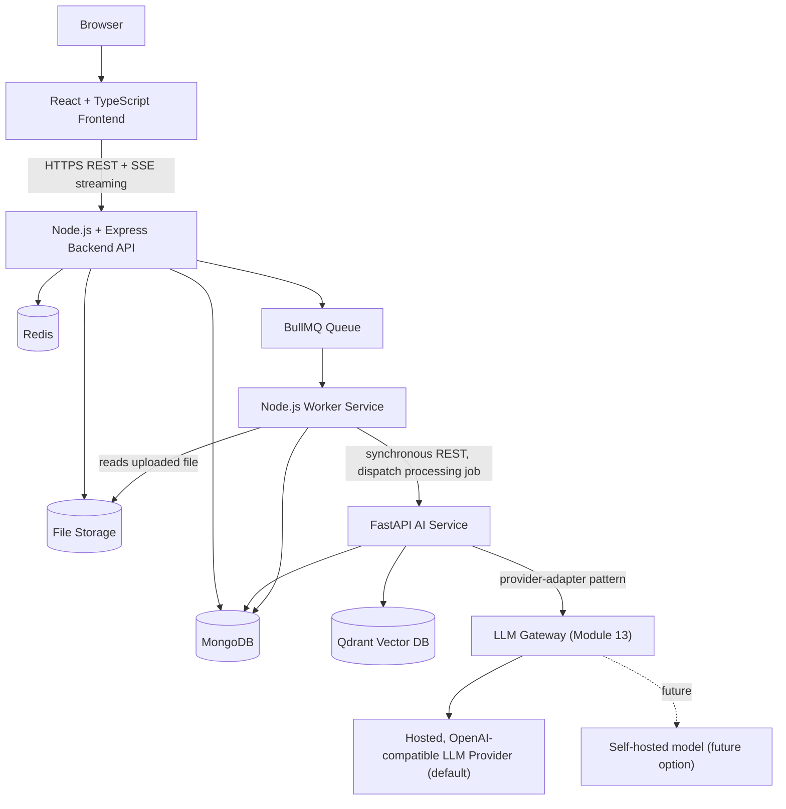
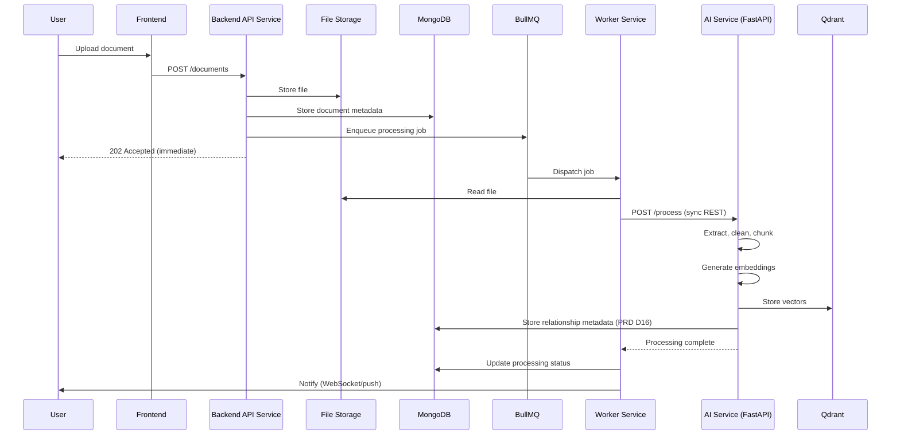
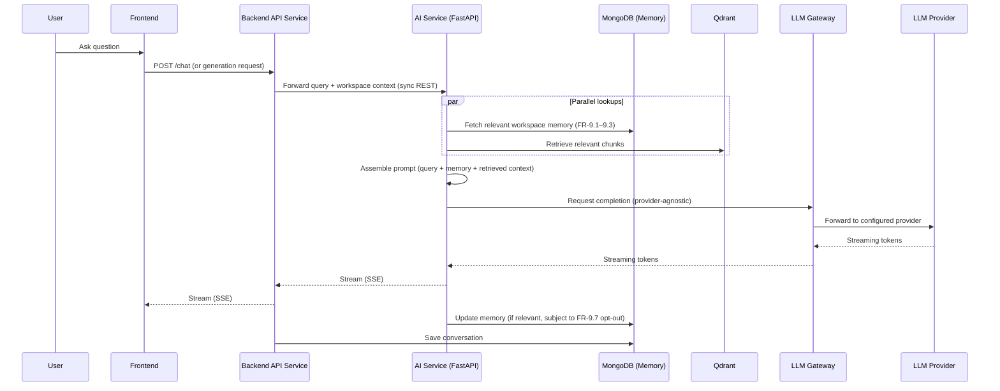

# SAD Chapter 1 — System Architecture

**Document:** NexusAI Workspace — Software Architecture Document (SAD)
**Chapter:** 1
**Status:** Final
**Depends on:** PRD Chapters 1–8 (full decision log, D1–D43)
**Source:** SAD draft Chapter 1 (preserved in substance, corrected where it conflicted with the locked PRD, expanded below)

> **Resolution note:** this chapter's draft contained two direct conflicts with decisions the PRD already locked (D2's LangGraph choice, and the Worker/AI Service division of labor), plus three PRD-level commitments (memory transparency, structured generation, the AI Gateway) with no architectural home. All are resolved below. **Confirmed: the AI Service uses LangGraph, not LangChain**, per PRD D2 — see §1.5 and D44.

---

## Purpose

This chapter establishes the system's runtime topology: what deployable units exist, what each owns, and how they talk to each other. Every later SAD chapter (data model, API contracts, deployment) is scoped against the boundaries drawn here — so this is the highest-leverage chapter in the SAD to get right, and the one most worth being strict about internal consistency in.

## Scope

Covers: architecture philosophy, high-level topology, the rationale for a polyglot (Node + Python) split, the five core services, document-upload and chat data flows, service-to-service communication, and MVP-vs-future scaling posture.

## Objectives of This Chapter

1. Resolve, not just flag, any place this draft conflicts with a decision the PRD already locked — the PRD went through eight rounds of review specifically to eliminate this kind of ambiguity before implementation starts.
2. Give every PRD "Engine" (Chapter 8's logical/functional unit) an explicit home inside one of this chapter's "Services" (deployable/runtime units) — these are different layers of abstraction and the SAD needs to state the mapping, not leave it implicit.
3. Make sure the PRD's most consequential, most-escalated commitments — memory transparency (D19), structured generation (D41), the AI Gateway (Module 13, D42) — are visibly present in the system's first architectural picture, not discoverable only by reading the FR list.

---

## 1.1 Architecture Philosophy (Expanded)

The six principles (single responsibility, independent scalability, loose coupling, async processing, AI provider independence, production readiness) are the right list and map directly onto PRD commitments already made:

| Principle | Where the PRD Already Committed to This |
|---|---|
| Single responsibility per service | Chapter 2's Separation of Concerns engineering principle |
| Independent scalability | Chapter 7's D35 (separate Worker deployment unit) |
| Loose coupling | Chapter 2's API-First principle |
| Asynchronous processing | Chapter 2's Event-Driven principle; Chapter 1's D5 |
| AI provider independence | Chapter 2's AI Provider Independence principle; Module 13 (AI Gateway) |
| Production readiness | Chapter 1 §1.13's engineering objectives |

None of these are new — the value of restating them here is that the SAD is where they stop being principles and become concrete component boundaries, checked below.

## 1.2 High-Level Architecture (Expanded — corrected)

**Issue found:** the original ASCII diagram shows Background Workers branching in parallel to FastAPI, Qdrant, and File Storage as if they were three independent siblings. That doesn't match this chapter's own §1.6 data flow, which shows the file being written to storage *during the upload request* (before the job is even queued), and Qdrant being written to *by FastAPI*, not directly by the Worker. Corrected topology:

Key corrections from the original draft, each tied to a locked PRD decision:
- **File Storage moves under the Backend API's branch**, not the Worker/FastAPI branch — the file is written once, synchronously, during the upload request (§1.6 already describes it this way; the diagram just hadn't matched).
- **Qdrant is written to by the AI Service only** — the Worker never touches Qdrant directly; it dispatches to FastAPI, which owns all vector operations.
- **An explicit LLM Gateway node is added**, representing Module 13 (PRD Chapter 6) — the original diagram jumped straight from FastAPI to "Embedding Model + LLM Provider" with no visible abstraction layer, which under-represents a component the PRD treats as architecturally important (provider independence, D42's hosted-API default, fallback per FR-13.4).

## 1.3 Why This Architecture? (Expanded — Engines-to-Services mapping added)

The original component-responsibility table is accurate but operates at the wrong altitude to be useful for the rest of the SAD: it lists *technologies*, not the PRD's *logical Engines* (Chapter 8's finalized vocabulary — Authentication, Workspace, Document, Knowledge, Retrieval, Memory, AI Orchestration, Generation, Search, Background Processing, Dashboard, Analytics Engines). **These are two different layers of abstraction that need an explicit bridge**: a "Service" here is a *deployable runtime unit* (a container/process); an "Engine" in the PRD is a *logical functional boundary*. Multiple Engines can — and do — live inside one Service.

| SAD Service (deployable unit) | PRD Engines It Hosts |
|---|---|
| Frontend Service | — (presentation layer, not an Engine) |
| Backend API Service | Authentication Engine, Workspace Engine, Document Engine (lifecycle/CRUD only — see §1.5), Dashboard Engine |
| Worker Service | Background Processing Engine (job dispatch/retry only — see the correction in §1.5) |
| AI Service (FastAPI) | Knowledge Engine, Retrieval Engine, Memory Engine, AI Orchestration Engine, Generation Engine, Search Engine (semantic/hybrid portion — see note below) |
| Vector Database | — (infrastructure, not an Engine) |

**Search Engine note:** the PRD's Search Engine unifies keyword, semantic, and hybrid retrieval across documents, conversations, and memories (PRD §8.10). Keyword search over conversation/metadata fields is a MongoDB text-index concern and lives in the Backend API Service; semantic/hybrid search requires the AI Service's embedding and Qdrant access. **Search Engine is confirmed split across two services** with the contract defined in the SAD's data-model chapter — flagged here so it isn't discovered as an awkward seam later.

This mapping table is the single most load-bearing addition in this chapter: every subsequent SAD chapter that talks about "the Memory Engine" or "the Generation Engine" now has an unambiguous answer to "which service does this code live in."

## 1.4 Why Not Everything in Node? (Expanded)

Accurate and well-justified as originally written — Python's ecosystem advantage for PDF parsing, embeddings, and model inference is the correct reason, and it's consistent with the PRD's D2 (confirmed polyglot split back in PRD Chapter 1). No changes needed to the reasoning; worth adding one precision: the PRD's D2 specifically named **LangGraph**, not LangChain, as the AI layer's orchestration framework — carried through consistently below, since this draft's Core Services section conflicts with that choice.

## 1.5 Core Services (Expanded — two corrections)

### 1. Frontend Service — unchanged
Responsibilities and stack (React, TypeScript, Tailwind, React Query, React Router) match the PRD's confirmed stack exactly. No issues.

### 2. Backend API Service — unchanged
Responsibilities and stack (Node, Express, TypeScript, JWT, Zod) match the PRD. The explicit non-goal — "this service should never perform heavy AI computations" — is a good, testable architectural boundary, consistent with PRD §8.3's Authentication Engine non-goal statement (identity verification only) applied at the service level.

### 3. Worker Service — **corrected (resolves an internal inconsistency)**

**Issue found:** the original responsibility list — "Document extraction, Chunking, Embedding generation, Index updates" — describes work that §1.6's own data flow shows happening *inside FastAPI*, not the Node worker. This is the same class of inconsistency the PRD caught and resolved between its Document Engine and Knowledge Engine (PRD D37): a lifecycle/dispatch component's responsibility list had drifted into claiming work that actually belongs to the intelligence-processing component.

**Corrected responsibilities**, consistent with D37 and this chapter's own §1.6:
- Dequeue jobs from BullMQ
- Read the uploaded file from File Storage
- Dispatch the processing request to the AI Service (synchronous REST call, per PRD D5's confirmed query-time contract — the Worker-to-AI-Service hop is synchronous because the Worker itself is already decoupled from the user-facing request path)
- Update job/document processing status in MongoDB on completion or failure
- Retry failed jobs (with idempotency keys, per PRD Chapter 7's reliability recommendation)
- Trigger notifications on completion/failure

Extraction, chunking, and embedding generation are **not** Worker Service responsibilities — they belong to the AI Service (§1.5.4), matching the PRD's Knowledge Engine ownership (D37) and this chapter's own §1.6 flow. Technology stays Node.js + BullMQ + Redis; this is a scope correction, not a technology change.

### 4. AI Service — **expanded (three PRD commitments given an explicit home)**

Original responsibilities (embedding generation, retrieval orchestration, prompt construction, LLM communication, citation assembly) are correct but incomplete relative to what the PRD finalized. Expanded to explicitly include:

- **Document intelligence** (extraction, cleaning, chunking, embedding — corrected from Worker Service above, per D37)
- **Memory Engine** (read/write workspace memory; implement FR-9.4–FR-9.8 — view, delete, reset, opt-out, source-traceability. This is the PRD's most-escalated commitment across the entire document; it needs to be visible in the system's foundational architecture chapter, not just the functional-requirements list)
- **Generation Engine** (the four confirmed Module 14 templates — flashcards, quiz, literature-review outline, revision plan — as fixed-shape pipelines, distinct from open-ended agent planning; see the LangGraph resolution below)
- **AI Gateway / LLM Gateway** (Module 13: provider-adapter pattern, embedding-provider abstraction, fallback on provider failure — FR-13.1–13.4)

**Technology — confirmed (D44):** the original draft listed **LangChain** ("selectively, not everywhere") as the orchestration library and its trailing note questioned *"why not LangGraph in the MVP?"* — this directly conflicted with **PRD Chapter 1's D2**, which confirmed **LangGraph**, not LangChain, specifically because RAG-with-persistent-memory is stateful and non-linear (retrieve → check memory → maybe re-retrieve → synthesize → update memory), which maps onto a graph of nodes and conditional edges rather than a fixed chain — reasoning that was deliberate, not incidental, and was never revisited or reversed anywhere in the PRD's eight finalized chapters.

**Confirmed: the AI Service uses LangGraph**, not LangChain, as its orchestration framework. This resolves both the direct conflict with the draft and a lingering ambiguity from PRD Chapter 2's review (whether LangGraph implies "agentic" behavior the PRD defers to post-v1): **v1's LangGraph usage is a fixed, engineer-designed graph** — the nodes and edges (retrieve → check memory → assemble prompt → call LLM → update memory; or the four Generation Engine templates) are hard-coded by the engineering team, not decided by the model at runtime. This is the same "fixed-shape pipeline, not open-ended agent planning" distinction the PRD used to resolve D6/D20/D41 — LangGraph is simply the *implementation mechanism* for those fixed pipelines, not a contradiction of the "no autonomous agents in v1" boundary. Open-ended, model-directed graph construction remains post-v1, consistent with PRD Chapter 2 §2.12.

### 5. Vector Database — unchanged
Qdrant, matching PRD D2. Rationale (open source, fast, filtering, Docker-friendly) is accurate and consistent.

## 1.6 Data Flow — Document Upload (Expanded — corrected sequence diagram)

This corrects the original flow's implicit ownership ambiguity (who does extraction/chunking/embedding — now unambiguously the AI Service) and adds the relationship-metadata write (PRD D16's lightweight, non-graph-database relationship linking), which the original flow omitted entirely despite it being a confirmed PRD commitment.

## 1.7 Data Flow — AI Chat (Expanded — memory and generation made explicit)

Two corrections from the original: **memory lookup runs in parallel with retrieval**, not implicitly sequential (matching the PRD's own corrected chat-flow diagram, PRD §8.14), and the **memory write is explicitly gated by FR-9.7's opt-out** — a request originating from a user who's disabled passive memory capture must skip that final write, which needs to be an explicit branch in the AI Service's implementation, not an afterthought.

**Generation Engine requests** (flashcards, quiz, literature-review outline, revision plan) follow the same shape — query/context in, memory + retrieval in parallel, LLM Gateway call out — but use a different, fixed LangGraph graph per template rather than the open Q&A graph, and (per PRD Chapter 7's tiered latency targets) are expected to take longer, especially literature-review-outline generation given its multi-document synthesis cost.

## 1.8 Service Communication (Expanded)

| From | To | Mechanism | Notes |
|---|---|---|---|
| Frontend | Backend API | HTTPS REST + SSE (streaming) | Unchanged |
| Backend API | MongoDB | Native driver | User data, workspaces, documents, conversations, memory |
| Backend API | Redis / BullMQ | Job enqueue | Long-running tasks only |
| Backend API | AI Service | **Synchronous REST** | Query-time calls (chat, generation) — confirmed PRD D5 |
| Worker Service | AI Service | **Synchronous REST** | Ingestion processing dispatch — the Worker is already decoupled async via the queue, so this hop can safely be synchronous |
| AI Service | Qdrant | Native client | Vector storage/retrieval |
| AI Service | LLM Gateway → LLM Provider | Provider-adapter (HTTPS) | Hosted, OpenAI-compatible default (PRD D42); swappable without application rewrite |

Explicitly naming both the Backend-API→AI-Service and Worker→AI-Service hops as synchronous REST (rather than leaving one implicit) closes the last piece of PRD D5's ambiguity — the PRD confirmed "query-time = REST, ingestion = queue," and this table makes clear that "queue" describes the Backend-API→Worker hop specifically, while the Worker's own downstream call to the AI Service is REST regardless of which workflow triggered it.

## 1.9 Why This Architecture Is Interview-Friendly (Expanded)

Accurate and consistent with PRD Chapter 1 §1.13's stated engineering objectives. One wording polish: "feasible for a student project" undersells it relative to the PRD's own framing (a "portfolio piece" reviewed by "Google/Microsoft/Amazon/Meta/Atlassian/OpenAI/Anthropic"-caliber engineers, per PRD §1.13) — recommend "while remaining buildable by a single engineer" or similar, to keep terminology consistent with how the PRD frames the project's ambition elsewhere.

## 1.10 MVP vs Future (Expanded)

Accurate and consistent with the PRD's scalability position (D33: LLM inference and vector search are the expected bottlenecks, not the CRUD layer). One addition: **self-hosted LLM** (PRD D42's deferred option) belongs explicitly in the "Future" column here, alongside the already-listed items — it wasn't mentioned in the original MVP-vs-future split, and it's exactly the kind of infrastructure-level future item this section exists to capture (would require GPU provisioning, which is a materially different deployment posture than the MVP's hosted-API default).

---

## Design Decisions & Trade-offs Log (SAD Chapter 1)

| # | Decision Needed | Resolution | Status |
|---|---|---|---|
| D44 | AI Service orchestration: LangChain (as drafted) vs. LangGraph (PRD D2) | **LangGraph** — resolving in favor of the already-locked PRD decision; v1 usage is fixed, engineer-designed graphs, not open-ended agent planning | **Resolved** |
| D45 | Worker Service responsibility list claimed extraction/chunking/embedding, which §1.6 and PRD D37 assign to the AI Service | Corrected: Worker Service dispatches and tracks status only; AI Service performs all document intelligence work | **Resolved** |
| D46 | PRD "Engines" (logical) vs. SAD "Services" (deployable) — no explicit mapping existed | Added Engines-to-Services table (§1.3); Search Engine explicitly noted as split across two services | **Resolved** |
| D47 | Memory Engine / memory transparency (PRD D19, FR-9.4–9.8) had no architectural home in this chapter | Added explicitly as an AI Service responsibility (§1.5.4) and a step in the chat data flow (§1.7) | **Resolved** |
| D48 | Generation Engine / Module 14 (PRD D41) had no architectural home in this chapter | Added explicitly as an AI Service responsibility, using dedicated fixed LangGraph graphs per template | **Resolved** |
| D49 | AI Gateway / provider abstraction (Module 13, PRD D42) wasn't a visible component in the original diagram | Added explicit LLM Gateway node in §1.2 and §1.8's communication table | **Resolved** |
| D50 | File Storage placement in §1.2's diagram contradicted §1.6's own data flow | Moved File Storage under the Backend API's branch, written once at upload time; Worker/AI Service only read it | **Resolved** |

## Security Considerations

- The AI Service's memory read/write path (§1.7) is the architectural implementation of the PRD's most privacy-sensitive commitment (FR-9.4–9.8). The FR-9.7 opt-out check is enforced server-side in the AI Service itself, not left to frontend UI logic, so a client bug or direct API call cannot bypass it.
- Centralizing LLM calls through the LLM Gateway (Module 13) gives a single point to enforce workspace-boundary checks before any external provider call — this is the security chokepoint for preventing cross-workspace data leakage via prompts, consistent with the PRD's centralized-enforcement decision (PRD §8.8).

## Scalability Considerations

- Consistent with PRD D33: this chapter's service boundaries correctly isolate the two expected bottlenecks (AI Service for LLM/vector-search load, separately scalable from the Backend API and Worker Service) — no changes needed, this was already the right shape.
- The Worker Service and AI Service being separate deployable units (§1.5) means ingestion load spikes (e.g., a large ZIP upload, per PRD FR-7.9) don't degrade query-time chat latency, since they're different service instances even though both eventually call the same AI Service — worth load-testing the AI Service specifically for concurrent ingestion + query-time traffic, since it's the shared bottleneck between both paths.

## Performance Considerations

- The corrected chat-flow diagram's parallel memory/retrieval lookup (§1.7) is a strict implementation requirement, not an optimization to revisit later — it's the confirmed design.
- Generation Engine requests (§1.7) are benchmarked separately from chat, consistent with PRD Chapter 7's tiered latency targets. The AI Service exposes distinct internal timing metrics per LangGraph graph type (chat vs. each of the four generation templates) from day one, since they have structurally different cost profiles.

## Best Practices Applied in This Expansion

- Resolved a direct conflict with an already-locked PRD decision (D44) rather than treating it as an open question to re-litigate — the PRD's reasoning for LangGraph was deliberate and never reversed, so the SAD should inherit it, not second-guess it without new information.
- Caught an internal inconsistency within this same draft chapter (§1.5 vs. §1.6, the Worker/AI Service division of labor) using the same pattern already validated in the PRD (D37) — same failure mode, same fix.
- Gave every PRD commitment that lacked an architectural home (memory transparency, structured generation, the AI Gateway) an explicit place in the system's first architectural diagram, rather than letting them surface only in later, more detailed chapters.

## Implementation Notes for Later Chapters

- The SAD's data model chapter defines the MongoDB memory collection's schema directly from FR-9.4–FR-9.8, and the relationship-metadata structure from PRD D16.
- The SAD's API contract chapter specifies the Backend-API↔AI-Service REST contract explicitly (request/response shapes for chat, generation, and ingestion-dispatch) — this chapter confirms the transport, the next one defines the payloads.
- Chapter 2 (Technology Stack & Engineering Decisions) incorporates D44's resolution directly: its planned "why not LangGraph in the MVP?" framing is replaced with "why LangGraph in the MVP," consistent with this chapter.

## Future Enhancements (Chapter-Level)

- Self-hosted LLM as a documented future deployment option (added to §1.10, per PRD D42).
- API Gateway, multi-region deployment, and observability stack — all already correctly listed as future in §1.10, no changes needed.
- Object storage (S3-compatible) as the eventual replacement for local File Storage, once deployment moves beyond single-instance MVP hosting.

---

## Senior Engineering Review

**Overall assessment:** this is a well-structured first architecture chapter with a real technology-boundary rationale (Python's ecosystem advantage) rather than an arbitrary polyglot split. The draft conflicted with one locked PRD decision (LangGraph) and silently omitted three others (memory transparency, structured generation, the AI Gateway) that the PRD spent multiple chapters escalating — all four are resolved in this final version.

**Resolved in this revision:**
1. LangChain vs. LangGraph (D44) — resolved in favor of PRD D2's reasoning (stateful, non-linear RAG+memory orchestration), which this draft hadn't engaged with. The AI Service uses LangGraph, confirmed.
2. Memory transparency, structured generation, and the AI Gateway are now visible in the foundational architecture chapter, not just discoverable in the FR list several chapters later.
3. The §1.5/§1.6 Worker-vs-AI-Service inconsistency is fixed, using the same pattern the PRD already validated once (D37). Worth watching for the same drift pattern in later SAD chapters, since responsibility lists and detailed flows are where it tends to appear.

## Summary

This chapter establishes the system's five core services, resolves two internal inconsistencies (the LangChain/LangGraph conflict and the Worker/AI Service responsibility overlap), and gives three previously-homeless PRD commitments (memory transparency, structured generation, the AI Gateway) an explicit place in the architecture. The Engines-to-Services mapping table (§1.3) is the chapter's most load-bearing addition — every later SAD chapter references "which service owns this Engine" unambiguously against this table.

**Confirmed for all later chapters: LangGraph (not LangChain) is the AI Service's orchestration framework.**

**Next step:** Chapter 2 (Technology Stack & Engineering Decisions) proceeds next, with its LangGraph framing aligned to this chapter's resolution (D44) rather than reopening it.
