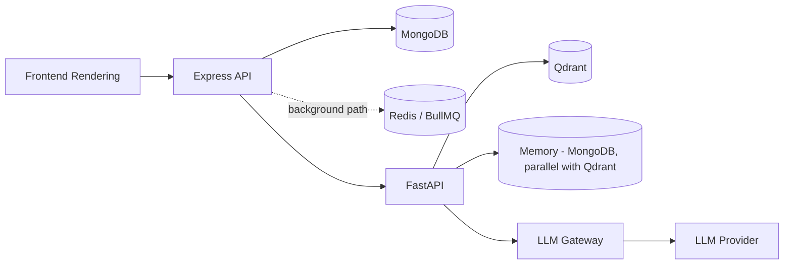

# SAD Chapter 10 — Performance & Scalability Architecture

**Document:** NexusAI Workspace — Software Architecture Document (SAD)
**Chapter:** 10
**Status:** Final
**Depends on:** SAD Chapters 1–9 (D44–D106), PRD Chapters 1–8 (D1–D43)
**Source:** SAD draft Chapter 10 (preserved in substance, corrected and expanded below)

> **The most important thing to flag directly: §10.6's Redis caching section was explicitly handed off to this chapter by Chapter 9 to finally resolve — a gap open since PRD Chapter 2 — and the draft still describes cache candidates generically without a single concrete key, TTL, or invalidation trigger.** That's now been deferred four times. Delivered concretely below, not flagged a fifth time. Also worth naming plainly: the LLM Gateway is missing from this chapter's bottleneck diagram, which is roughly the sixth occurrence of that exact omission across the SAD — see the note under §10.2 for a concrete suggestion on stopping this pattern going forward.

---

## Purpose

Chapter 8 correctly identified this chapter as mostly a consolidation opportunity — scaling, caching, and bottleneck analysis are already scattered across Chapters 1, 2, 4, 7, and 8 — with one genuinely open item worth resolving here specifically: the Redis cache specification. That's this chapter's real job, alongside standard performance-architecture content.

## Scope

Covers: performance philosophy, bottleneck identification, request classification, horizontal scaling, MongoDB/Redis/queue/AI/vector-search/file-processing optimization, database connections, API and frontend optimization, performance monitoring, the scaling roadmap, capacity planning, graceful degradation, cost/performance trade-offs, and load testing.

## Objectives of This Chapter

1. Deliver the concrete Redis cache-key/TTL specification — this is the fourth deferral of the same open item (PRD Ch.2 → implicit gap through SAD Ch.8 → explicit hand-off in SAD Ch.9 → here).
2. Fix the LLM Gateway's recurring absence from AI-related diagrams one more time, and name the pattern directly enough that it's worth addressing structurally rather than chapter-by-chapter.
3. Reconcile the flat "AI First Token <2-3s" target with the tiered latency targets PRD Chapter 7 and SAD Chapter 7 already confirmed.

---

## 10.1 Performance Philosophy (Unchanged)

Accurate and well-framed — "reduce unnecessary work before scaling hardware" is the right default posture. No issues.

## 10.2 Performance Bottlenecks (Corrected — recurring omission, named directly)

**Gap found (D108), sixth occurrence of this specific pattern.** The diagram (`Frontend → Express → MongoDB → Redis → BullMQ → FastAPI → Qdrant → LLM Provider`) omits the **LLM Gateway (Module 13)** — a component confirmed since SAD Chapter 1 and missing from diagrams in Chapters 1 (original draft), 3, 6, 7, and 8 (original drafts) before each was individually fixed. At this frequency, it's worth stating plainly: **any future SAD content with an AI-related diagram should include Memory Lookup and the LLM Gateway by default**, the same way this document set now defaults to including workspace-boundary checks — treating these as boilerplate diagram elements would prevent needing a seventh fix.

**Also worth a light clarification:** as a strictly linear waterfall, this diagram slightly misrepresents the confirmed architecture — Redis/BullMQ isn't sequentially "after" MongoDB in the main request path (it's a parallel path for background jobs), and memory/retrieval lookups are confirmed to run in parallel (SAD Chapter 6 §6.4), not sequentially through Qdrant alone. Corrected, with both fixes:

*Read as: layers to monitor independently, not a literal single-file request sequence — the slowest component on the path actually taken determines response time, and different requests take different paths (e.g., a CRUD request never touches FastAPI at all).*

## 10.3 Request Classification (Corrected — reconciled with confirmed tiered targets)

**Gap found (D109).** The single "AI First Token: 2–3s" row flattens **PRD Chapter 7's confirmed tiered latency targets** (refined further in SAD Chapter 7's streaming strategy) into one number, losing the distinction between simple Q&A, multi-document synthesis, and Generation Engine requests — three categories already established to have meaningfully different cost profiles. Corrected:

| Request | Expected Response |
|---|---|
| Login | < 300 ms |
| Workspace CRUD | < 500 ms |
| Search Metadata | < 500 ms |
| Upload Acknowledgement | < 500 ms |
| **Memory operations (view/delete/reset)** | **< 500 ms (SAD Ch.7 §7.4 — plain MongoDB CRUD)** |
| Chat — first token (simple Q&A) | 2–4 s |
| Chat — first token (multi-document synthesis) | 3–6 s |
| **Generate — flashcards/quiz** | **fast enough for standard JSON response, no streaming needed** |
| **Generate — literature-review-outline** | **first section within 4–8 s; total < 30 s p95, progressive SSE (SAD Ch.7 §7.11a)** |
| Document Indexing | Background |
| Large PDF Processing | Background |

This matches PRD Chapter 7's tiered targets and SAD Chapter 7's streaming decisions exactly, rather than presenting a simpler but inconsistent single number.

## 10.4 Horizontal Scaling (Confirmed accurate)

Consistent with SAD Chapter 1 §1.10 and Chapter 8 §8.13's scaling posture — stateless Express/Worker/FastAPI instances behind a load balancer, state externalized to MongoDB/Redis/Qdrant. No issues.

## 10.5 MongoDB Optimization (Expanded — cross-referenced)

**Gap found (D110, minor).** The example index list (`users.email`, `documents.workspaceId`, `messages.conversationId`, `jobs.status`) is a reasonable illustrative subset but risks being mistaken for the complete indexing strategy. **SAD Chapter 4 §4.16 is the authoritative, complete index list**, including several added during that chapter's corrections (`memory.source`, `memory.sourceConversationId`, `documents.previousVersionId`/`isSuperseded`, `generatedArtifacts.workspaceId`, `jobs.idempotencyKey`). Recommend this section explicitly cross-reference Chapter 4 §4.16 rather than stand alone as a second, potentially-drifting index list.

## 10.6 Redis Caching Strategy (Corrected — the chapter's most important fix, delivered concretely)

**This is the fourth deferral of an item flagged since PRD Chapter 2's review** ("Redis's role is named without defined scope... What's cached? Hot query results? Session tokens?"). SAD Chapter 9 explicitly handed this off to be resolved here. Delivering concretely rather than describing candidates in the abstract:

| Cache Key Pattern | TTL | Invalidation Trigger |
|---|---|---|
| `workspace:{workspaceId}:metadata` | 5 min | Workspace update (rename, settings change) |
| `user:{userId}:profile` | 15 min | Profile update |
| `document:{documentId}:metadata` | 5 min | Re-upload (new version, per D28) or delete |
| `dashboard:{workspaceId}:stats` | 1 min | Time-based expiry only — acceptable to be briefly stale |
| `search:{workspaceId}:{queryHash}` | 2 min | Time-based expiry; acceptable staleness for repeated identical queries |
| `ratelimit:{endpoint}:{userIdOrIp}` | Matches the limit window (e.g., 60s) | Time-based expiry (standard sliding-window rate limiting) |
| `revoked-tokens:{tokenId}` | Remaining JWT lifetime | Time-based expiry only |

**One correction to the original candidate list:** *"AI model configuration"* isn't actually a good Redis cache candidate — it's static configuration (the LLM Gateway's provider/model settings, SAD Chapter 8 §8.5's environment variables), loaded once at process startup, not a value that benefits from cache-with-TTL semantics. Removed from the cache-candidate list; it belongs in application config, not Redis.

**Explicitly not cached:** raw chat responses or generated artifacts (these are persisted directly to MongoDB, not cached — caching AI-generated content risks serving stale or incorrect grounding if source documents change), and anything containing memory or generated-artifact content (consistent with SAD Chapters 8 and 9's logging-security stance — the same "never expose this content outside its authoritative store" principle applies to caching, not just logging).

## 10.7 Queue Optimization (Expanded — one clarification)

Accurate, and *"Cleanup Tasks"* as an example queue is exactly the right home for the cascading-deletion job established in **SAD Chapter 4 §4.17** — worth stating that connection explicitly. One clarification: **Generation Engine requests (Module 14) are not queued via BullMQ** — per SAD Chapter 1's D5 and Chapter 7's confirmed contract, they're synchronous REST calls (with SSE for the longer literature-review-outline template), not background jobs. Stating this explicitly here to prevent a future chapter from assuming Generation belongs in the queue list alongside Document Processing and Embedding Generation.

## 10.8 AI Latency Optimization (Unchanged)

Accurate; "reusing persistent HTTP connections" is a good concrete detail consistent with the confirmed Node↔FastAPI sync REST contract (SAD Chapter 1 D5) — connection pooling/keep-alive on that specific boundary. No issues.

## 10.9 Vector Search Optimization (Expanded — one addition)

Accurate. One addition: *"metadata filtering before ranking"* should explicitly include filtering on **`isSuperseded: false`** (SAD Chapter 4 §4.13, D64) — this is literally the mechanism that field exists for (excluding stale, superseded document versions from retrieval by default). Cross-encoder reranking is correctly deferred as future, consistent with SAD Chapter 6 §6.12.

## 10.10 File Processing Optimization (Unchanged)

Accurate and standard. No issues.

## 10.11 Database Connection Management (Unchanged)

Accurate and standard. No issues.

## 10.12 API Optimization (Unchanged)

Accurate; ETags/conditional requests/HTTP caching correctly deferred as future. No issues.

## 10.13 Frontend Performance (Confirmed accurate)

TanStack Query reference matches the confirmed frontend stack (SAD Chapter 2 §2.2) exactly. No issues.

## 10.14 Monitoring Performance (Expanded — cross-referenced)

Accurate list. Given **SAD Chapter 8 §8.11** already added Generation-per-template success/failure rates and memory-operation volume as monitored metrics, recommend this section cross-reference that addition rather than present a separate, narrower metrics list that could drift out of sync with it over time.

## 10.15 Scaling Roadmap (Confirmed accurate)

Already correctly consistent with SAD Chapters 1 §1.10 and 8 §8.20 — Phase 2's "Managed MongoDB, Managed Redis" matches Chapter 4's D61 (self-hosted MVP, managed as a later phase, not the default). No issues.

## 10.16 Capacity Planning (Unchanged)

Accurate and standard. No issues.

## 10.17 Graceful Degradation (Expanded — one scenario added)

Accurate and consistent with PRD Chapter 7 and SAD Chapter 3 §3.9's failure scenarios. One addition: **LLM Gateway/hosted-provider failure** — already established as a named failure scenario in SAD Chapter 3 §3.9 (with fallback per FR-13.4) — belongs in this list too, for consistency: *"Primary LLM provider unavailable → LLM Gateway falls back to the configured alternate provider; if that also fails, return an informative error and preserve conversation state for retry."*

## 10.18 Cost vs. Performance Trade-offs (Confirmed accurate)

Good table; "smaller embedding model" row is directly consistent with the confirmed BAAI/bge-small-en-v1.5 choice (SAD Chapter 2 §2.15). No issues.

## 10.19 Load Testing (Expanded — one scenario added)

Accurate scenario list. One addition, given the Generation Engine's confirmed higher cost profile (especially literature-review-outline): *"Concurrent Generation requests, including literature-review-outline specifically, given its multi-document synthesis cost"* — worth testing separately from general "Multiple AI chats," since it's a structurally different, more expensive workload.

## 10.20 Chapter Summary (Unchanged)

Accurate. No issues.

---

## Design Decisions & Trade-offs Log (SAD Chapter 10)

| # | Decision Needed | Resolution | Status |
|---|---|---|---|
| D107 | Redis caching strategy remained generic despite being explicitly handed off for concrete resolution here (4th deferral since PRD Ch.2) | Delivered concrete cache keys, TTLs, and invalidation triggers (§10.6) | **Resolved** |
| D108 | LLM Gateway missing from the bottleneck diagram — 6th occurrence across the SAD | Fixed; recommended treating Memory Lookup + LLM Gateway as default diagram elements going forward | **Resolved** |
| D109 | Request Classification flattened PRD/SAD's confirmed tiered AI latency targets into one number | Expanded to match the confirmed tiers, added Memory and Generate rows | **Resolved** |
| D110 | Example MongoDB index list risked being mistaken for the complete list | Cross-referenced Ch.4 §4.16 as authoritative | **Resolved** |
| D111 | Ambiguity about whether Generation requests are queued via BullMQ | Clarified: no, synchronous REST/SSE, not queued | **Resolved** |
| D112 | Vector search optimization didn't mention `isSuperseded` filtering | Added | **Resolved** |
| D113 | Performance monitoring list didn't cross-reference Ch.8's Generation/Memory metrics | Cross-referenced | **Resolved** |
| D114 | Graceful degradation didn't include LLM provider failure, already named in Ch.3 §3.9 | Added for consistency | **Resolved** |
| D115 | Load testing scenarios didn't separately cover Generation's higher cost profile | Added | **Resolved** |

## Security Considerations

- §10.6's "explicitly not cached" list (raw AI content, memory, generated artifacts) is a security/privacy decision as much as a performance one — consistent with SAD Chapters 8 and 9's logging-security stance applied to a new surface (caching).

## Scalability Considerations

- The concrete cache spec (D107) directly supports PRD D33's scalability position — caching workspace/user/document metadata reduces MongoDB load at exactly the layer that would otherwise scale linearly with request volume, freeing capacity for the genuinely hard-to-scale bottlenecks (LLM inference, vector search).

## Performance Considerations

- This entire chapter is performance considerations; the corrected Request Classification table (§10.3) is now the authoritative source for latency targets across the SAD, superseding the flatter version.

## Best Practices Applied in This Expansion

- Delivered a concrete specification rather than deferring an already-four-times-deferred item a fifth time — this was the single highest-priority thing this chapter needed to do.
- Named the LLM Gateway omission's frequency directly (sixth occurrence) rather than just fixing it silently again, since the pattern itself is worth the user's attention at this point.
- Reconciled a flattened metric against already-confirmed tiered targets rather than letting two different latency specifications coexist in the document set.

## Implementation Notes for Later Chapters

- If Chapter 11 (Testing & QA) proceeds next, its performance-testing section should test against §10.3's corrected tiered targets specifically, not a single flat number.
- The cache-invalidation triggers in §10.6 should be implemented as part of the relevant service's write path (e.g., `workspace.service.ts`'s update method invalidates `workspace:{id}:metadata`) — cache invalidation should live next to the write it responds to, not in a separate, easy-to-forget location.

## Future Enhancements (Chapter-Level)

- ETags, conditional requests, HTTP caching (§10.12) — already correctly deferred.
- Cross-encoder reranking (§10.9) — already correctly deferred, consistent with SAD Chapter 6.

---

## Senior Engineering Review

**Overall assessment:** most of this chapter is solid, standard performance-architecture content, consistent with everything confirmed since Chapter 1 — scaling posture, cost/performance trade-offs, and the roadmap all required no correction. Its one serious issue is also its most important: the chapter's specifically-assigned job (resolve the Redis cache specification) wasn't done in the draft, and needed to be delivered here rather than deferred again.

**Resolved in this revision:**
1. The Redis cache specification (D107) — concrete keys, TTLs, and invalidation triggers — closing an item open since PRD Chapter 2, deferred three times since.
2. The LLM Gateway's sixth diagram omission (D108) — fixed, with a direct recommendation to stop treating this as a per-chapter surprise.
3. Request classification (D109) reconciled with the tiered latency targets this document set already locked, rather than presenting a simpler but inconsistent number.

## Summary

This chapter delivers the concrete Redis caching specification that's been deferred since PRD Chapter 2, fixes the LLM Gateway's sixth missing appearance in an AI-related diagram, and reconciles request-latency targets with what's already confirmed elsewhere in the document set. Most other sections required no correction — a good sign for a chapter explicitly framed as mostly consolidation.

**Next step:** proceed to Chapter 11 (Testing & Quality Assurance) as previewed — its performance-testing section should validate against §10.3's corrected tiered targets, and its AI-evaluation section should build directly on SAD Chapter 6 §6.23's benchmark approach rather than redefining it.
