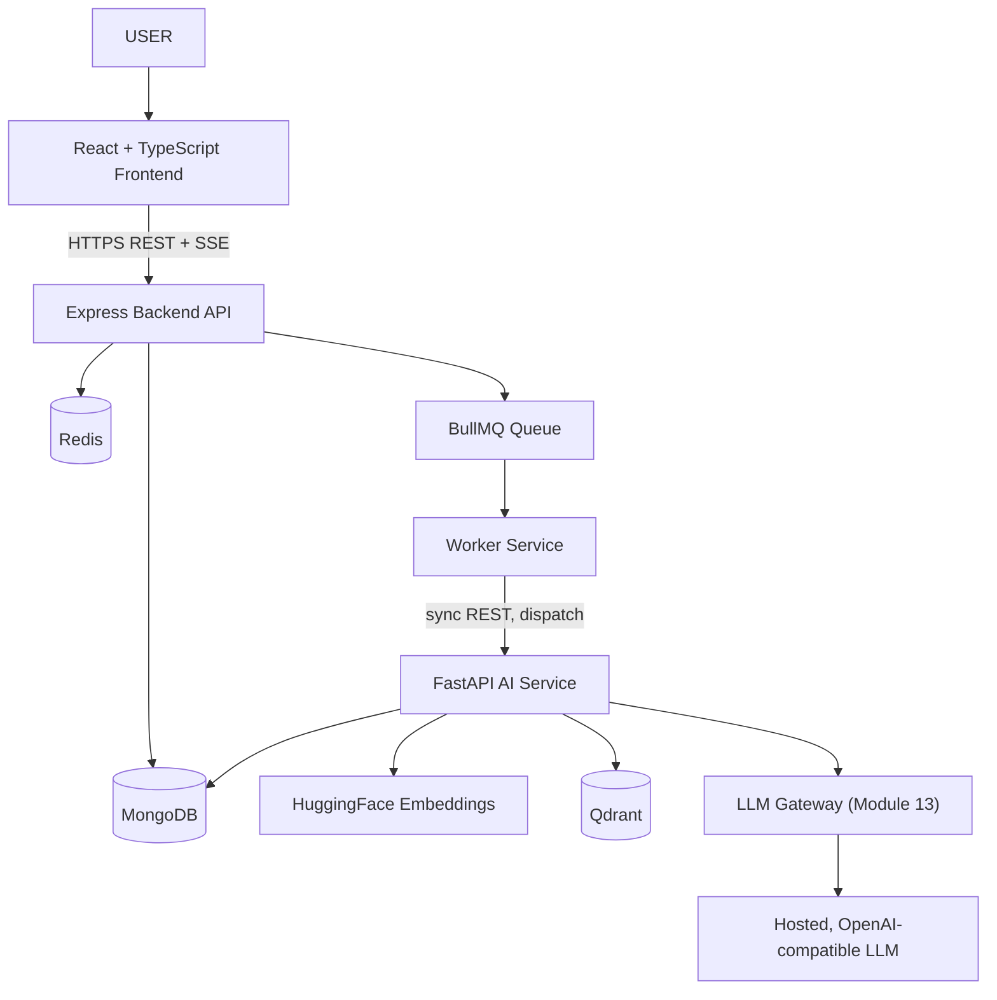
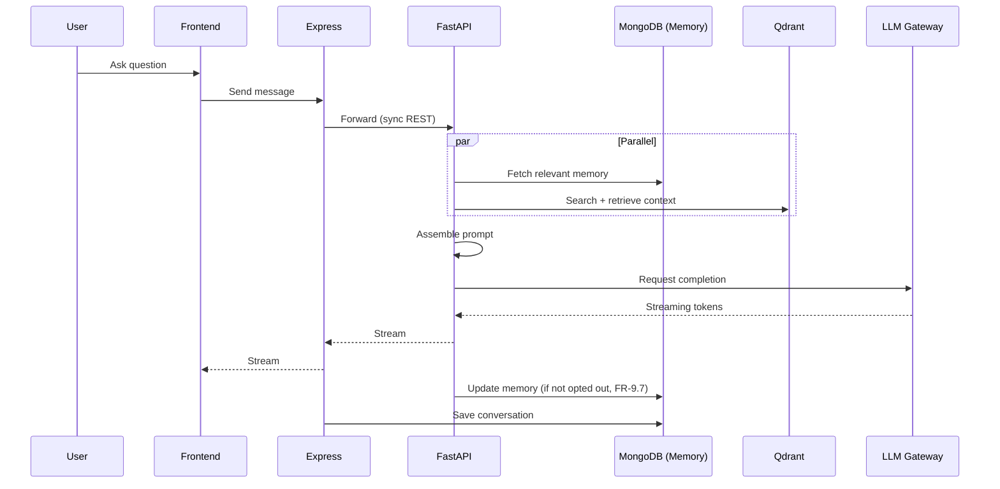

# SAD Chapter 3 — System Behavior, Data Ownership & Resilience

**Document:** NexusAI Workspace — Software Architecture Document (SAD)
**Chapter:** 3
**Status:** Final
**Depends on:** SAD Chapters 1 (D44–D50), 2 (D51–D54), PRD Chapters 1–8 (D1–D43)
**Source:** SAD draft "Chapter 3 — High-Level System Architecture" (preserved in substance, corrected and deduplicated against Chapter 1 below)

> **Structural note, read this first:** this draft's §3.1–§3.6 substantially re-derive content SAD Chapter 1 already covers — same topology, same service list, same document-upload and chat flows, under a near-identical title ("High-Level System Architecture" vs. Chapter 1's "System Architecture"). That's not just redundant; **re-deriving the same diagrams independently is exactly how three specific inconsistencies crept back in** that Chapter 1 already fixed once (Worker Service overclaiming AI work, missing Memory/Generation Engine, missing memory steps in the chat flow) — all corrected again below. Recommend this chapter be retitled to reflect its genuinely new content — data ownership, API boundaries, failure handling, security boundaries, and scalability specifics (§3.7–§3.12) — and that §3.1–§3.6 either be trimmed to a brief cross-reference to Chapter 1, or kept only as corrected, fully-synced restatements, depending on whether you want each chapter self-contained. Preserved and corrected below rather than deleted, since that's your call to make when compiling the final document.

---

## Purpose

This chapter's real job — once separated from the material it duplicates — is to define **system behavior under the boundaries Chapter 1 already drew**: who owns which data, what the frontend is and isn't allowed to touch, what happens when a component fails, and how the system scales. That's genuinely new and valuable content. The topology/flow sections are corrected for consistency but should be read as reinforcement of Chapter 1, not a second source of truth.

## Scope

Covers (corrected): architecture overview, rationale for service separation, request lifecycles, service responsibilities, upload/chat sequence diagrams, data ownership, API boundaries, failure scenarios, security boundaries, scalability strategy, and interview framing.

## Objectives of This Chapter

1. Fix the same three inconsistency patterns Chapter 1 already resolved once — Worker Service overclaiming AI work, missing Memory/Generation Engine, missing memory steps in data flows — since they all reappeared here, independently drafted.
2. Deliver the genuinely new content (data ownership, failure scenarios, security boundaries) at the same rigor as everything else in this document set.
3. Flag the duplication itself as a document-organization issue, not just patch the symptoms.

---

## 3.1 Architecture Overview (Corrected — synced with Chapter 1)

**Issues found and fixed:**
- The original diagram shows `HuggingFace → OpenAI Compatible LLM` as a sequential pipeline. That's not how these two capabilities relate — embedding generation (HuggingFace/sentence-transformers) and LLM text generation are **independent capabilities** the AI Service uses, not a chain where one feeds the other.
- **No LLM Gateway node** — Chapter 1 and Chapter 2 both established an explicit Module 13 / LLM Gateway component (provider-adapter pattern, hosted-API default per D42, fallback per FR-13.4). Omitting it here would be a step backward from what's already confirmed.

Corrected:

HuggingFace and Qdrant are now shown as parallel capabilities the AI Service draws on, not a sequential chain; the LLM Gateway sits explicitly between the AI Service and the LLM provider, matching Chapters 1–2.

## 3.2 Why Separate Services? (Unchanged)

Accurate and consistent — the "beginner project does everything in one Express server" framing is a good, concrete contrast, and the four-way split (Express/business logic, Worker/async jobs, FastAPI/AI, Qdrant/vector search) is consistent with Chapter 1's five-service topology (this list omits Frontend and MongoDB/Redis as implicit). No changes needed beyond what's already fixed above.

## 3.3 Request Lifecycle (Corrected — synced with Chapter 1)

The Login and Upload examples are accurate and unchanged. The **AI Chat example is corrected** — as originally drafted (`Express → FastAPI → Generate Embedding → Qdrant Search → Retrieve Context → LLM → Streaming Response → Conversation Stored`), it omits memory entirely, which is the same gap Chapter 1's original draft had before being fixed (D47). Corrected:

> Browser → Express → FastAPI → **[Memory lookup + Qdrant search, in parallel]** → Assemble context → LLM Gateway → LLM → Streaming Response → **[Memory update, if not opted out]** → Conversation Stored

This is not a stylistic preference — FR-9.1–FR-9.3 (memory scoping) and FR-9.7 (opt-out) are confirmed v1 requirements, and a request-lifecycle description that omits them entirely understates what actually happens on every chat request.

## 3.4 Service Responsibilities (Corrected — two recurring gaps fixed)

**Worker Service — corrected (D56, third occurrence of this exact pattern).** The original list — "PDF extraction, Chunking, Embedding requests, Re-indexing, Notifications, Retry logic" — again claims extraction and chunking as Worker responsibilities, directly contradicting both **SAD Chapter 1's D45** and this chapter's own §3.5 sequence diagram (which correctly shows FastAPI, not the Worker, performing extraction/chunking/embedding). This is the third time this specific inconsistency has appeared across the document set (PRD D37 for Document/Knowledge Engine, SAD D45 for the same Worker/AI Service pair) — worth naming as a pattern: responsibility lists and detailed flow diagrams keep drifting apart when drafted independently, and it's always the same seam (lifecycle/dispatch component vs. intelligence-processing component). Corrected:

> **Worker Service:** dequeue jobs, dispatch processing requests to FastAPI (sync REST), re-indexing triggers, notifications, retry logic with idempotency keys. Extraction, chunking, and embedding generation belong to FastAPI, not the Worker.

**FastAPI AI Service — expanded (D57).** The original list (embedding generation, retrieval orchestration, prompt construction, LLM invocation, citation assembly) again omits Memory Engine, Generation Engine, and the orchestration framework — the same gap Chapter 1's draft had before D47/D48 added them. Corrected:

> **FastAPI AI Service:** document extraction/chunking/embedding generation, retrieval orchestration (Retrieval Engine), **memory read/write with transparency controls (Memory Engine, FR-9.4–9.8)**, prompt construction, LLM invocation via the LLM Gateway, citation assembly, and **structured generation (Generation Engine — flashcards, quiz, literature-review outline, revision plan)**. Orchestrated via **LangGraph** (confirmed, SAD Chapter 2 D51), using fixed, engineer-designed graphs — one for chat/RAG, one per Generation Engine template.

MongoDB, Redis, BullMQ, and Qdrant sections are accurate and unchanged.

## 3.5 Sequence Diagram — Document Upload (Confirmed accurate)

This diagram already correctly shows FastAPI (not the Worker) performing extraction, chunking, embedding, and vector storage — it's §3.4's responsibility list that needed to catch up to it, not the other way around. Matches SAD Chapter 1 §1.6. No changes needed.

## 3.6 Sequence Diagram — AI Chat (Corrected — synced with Chapter 1)

**Same gap as §3.3, now in diagram form.** Corrected to match SAD Chapter 1 §1.7's canonical chat-flow diagram:

## 3.7 Data Ownership (Expanded — two rows added)

Good, genuinely new content relative to Chapter 1 — this table is exactly the kind of thing a data-model chapter needs as a starting reference. Two rows were missing, both tied to confirmed v1 commitments:

| Data | Owner |
|---|---|
| Users | MongoDB |
| Workspaces | MongoDB |
| Document metadata | MongoDB |
| Files | File Storage |
| Embeddings | Qdrant |
| Queue state | Redis/BullMQ |
| AI prompts (runtime) | FastAPI (ephemeral, not persisted) |
| Conversations | MongoDB |
| **Memory records (FR-9.1–9.8)** | **MongoDB** — dedicated collection, workspace-scoped |
| **Generated artifacts (flashcards, quizzes, etc.)** | **MongoDB**, with optional Markdown export to File Storage on demand (FR-14.3) |

## 3.8 API Boundaries (Unchanged)

Good, correctly stated, and consistent with the centralized-enforcement principle already established (SAD Chapter 1 §1.5.4, PRD §8.8) — the frontend talking only to Express, never directly to internal services, is exactly the chokepoint that lets workspace-boundary enforcement live in one place. No changes needed; this section reinforces rather than duplicates Chapter 1.

## 3.9 Failure Scenarios (Unchanged — good, genuinely new content)

Accurate and consistent with PRD Chapter 7's Fault Tolerance (§7.11) and Reliability (§7.5) requirements. The four scenarios (FastAPI unavailable, Qdrant unavailable, worker crash, Redis unavailable) are well-chosen and each has a sensible degradation behavior. One addition worth naming: an **LLM Gateway provider failure** (the hosted LLM itself being unavailable) should be added as a fifth scenario, since it's now an explicit component (§3.1) and FR-13.4 already commits to provider fallback — this is the natural place to state that behavior concretely:

> If the primary LLM provider is unavailable, the LLM Gateway falls back to a configured alternate provider (FR-13.4); if no fallback succeeds, the API returns an informative error and preserves conversation state for retry.

## 3.10 Security Boundaries (Unchanged)

Good, correctly stated. Worth one cross-reference: the "no internal service should trust external input without validation" principle is exactly why workspace-boundary enforcement was deliberately centralized at the LLM Gateway/orchestration layer (SAD Chapter 1's security note, PRD §8.8) rather than duplicated per-engine — this section is the general principle; that decision is the concrete application of it.

## 3.11 Scalability Strategy (Unchanged)

Consistent with SAD Chapter 1 §1.10 and PRD D33 (LLM inference and vector search as the expected bottlenecks). "Scale FastAPI instances independently based on AI demand" is exactly the right lever per D33 — no changes needed.

## 3.12 Why This Architecture Is Strong for Interviews (Unchanged)

Consistent with the framing used in SAD Chapter 1 §1.9 and PRD Chapter 1 §1.13. No issues.

---

## Design Decisions & Trade-offs Log (SAD Chapter 3)

| # | Decision Needed | Resolution | Status |
|---|---|---|---|
| D55 | This chapter substantially duplicates SAD Chapter 1's diagrams and service list under a near-identical title | Corrected/synced content preserved below; recommend retitling and/or trimming §3.1–§3.6 to a cross-reference when compiling the final document | **Flagged — your call on final trim** |
| D56 | Worker Service responsibility list again claims extraction/chunking (3rd occurrence of this exact pattern — PRD D37, SAD D45, now here) | Corrected to dispatch/track/retry only, matching §3.5's own diagram | **Resolved** |
| D57 | AI Service responsibility list again omits Memory Engine, Generation Engine, and LangGraph (same gap as Chapter 1's original draft) | Added explicitly | **Resolved** |
| D58 | §3.1 diagram showed HuggingFace→LLM as sequential, and omitted the LLM Gateway | Corrected to parallel capabilities; LLM Gateway added | **Resolved** |
| D59 | §3.6 AI Chat sequence diagram omitted memory lookup/write (3rd occurrence of this omission pattern) | Corrected to match SAD Chapter 1 §1.7 | **Resolved** |
| D60 | Data Ownership table (§3.7) missing Memory records and Generated artifacts rows | Added both | **Resolved** |

## Security Considerations

- The added LLM Gateway failure scenario (§3.9) closes a real gap — a hosted-API dependency (PRD D42) needs an explicit documented failure mode, not just an implied one.
- Memory records now explicitly owned by MongoDB (§3.7) — this is the schema anchor point for FR-9.4–9.8's implementation in the data model chapter.

## Scalability Considerations

- No new items beyond what Chapters 1–2 already established (D33, D35) — this chapter's scalability section is consistent, not additive.

## Performance Considerations

- The parallel memory/retrieval lookup, now correctly shown in §3.6, is confirmed (not optional) — consistent with Chapters 1–2's performance stance on this exact point.

## Best Practices Applied in This Expansion

- Named a recurring pattern explicitly (D56/D59 — the Worker/AI Service and memory-omission gaps reappearing a third time) rather than silently fixing it again, since a pattern that recurs three times independently is worth surfacing as a process observation, not just a content fix.
- Flagged structural duplication (D55) as its own issue rather than only patching the content symptoms it caused.
- Preserved the chapter's genuinely new, valuable content (§3.7–§3.12) without diluting it by treating the whole chapter as equally redundant.

## Implementation Notes for Later Chapters

- The data model chapter should treat §3.7's Data Ownership table (now complete with Memory and Generated Artifacts rows) as its starting checklist — every row needs a concrete schema.
- Future SAD chapters should reference Chapter 1's canonical diagrams rather than redrawing flows independently — this chapter is the second demonstration that redrawing is where drift keeps entering the document set.

## Future Enhancements (Chapter-Level)

- None beyond what's already logged in Chapters 1–2 (self-hosted LLM, dedicated graph database, entity/relationship extraction).

---

## Senior Engineering Review

**Overall assessment:** once separated from its overlap with Chapter 1, this chapter's unique content (data ownership, API boundaries, failure scenarios, security boundaries) is genuinely valuable and well-executed — §3.9's failure-scenario table in particular is exactly the kind of concrete, testable resilience thinking a reviewer wants to see. The overlapping sections reintroduced three inconsistencies Chapter 1 had already resolved, which is the more important finding here: **not because the individual fixes are hard, but because it's the third time the same category of drift has appeared**, which says something about how these chapters are being produced (independently derived from source material each time, rather than built incrementally on the previous chapter's corrected state).

**Resolved in this revision:**
1. The Worker/AI Service responsibility overlap (D56) — same fix as PRD D37 and SAD D45, applied a third time.
2. Missing Memory Engine, Generation Engine, and LangGraph in the AI Service's responsibilities and the chat sequence diagram (D57, D59) — same fix as SAD D47/D48, applied again.
3. The HuggingFace/LLM diagram sequencing error and missing LLM Gateway (D58).
4. Two missing rows in an otherwise strong Data Ownership table (D60).

## Summary

This chapter's genuinely new content — data ownership, API boundaries, failure scenarios, security boundaries, and scalability specifics — is strong and consistent with everything locked so far. Its overlapping architecture-diagram content required the same three corrections Chapter 1 already made once, now flagged explicitly as a recurring pattern (D55) worth considering when future chapters are drafted: building forward from the previous chapter's corrected state, rather than re-deriving from source material independently, would prevent this category of drift going forward.

**Next step:** proceed to the SAD's data model chapter, using §3.7's completed Data Ownership table as its starting checklist.
