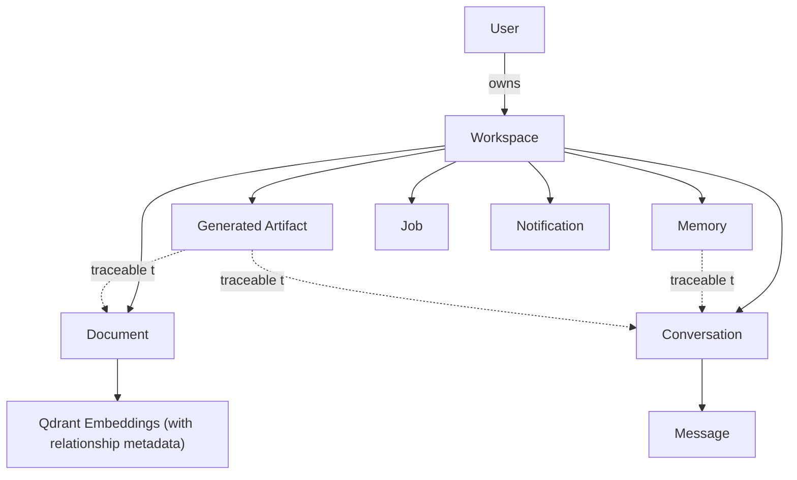
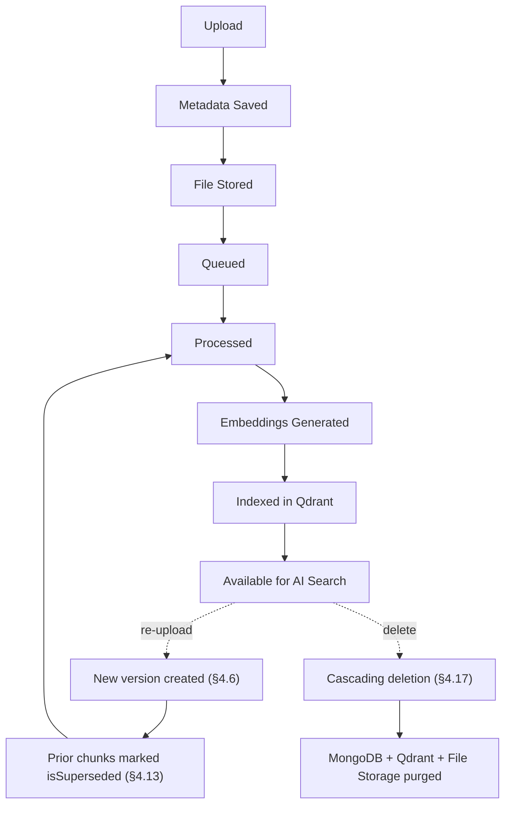

# SAD Chapter 4 — Database Architecture & Data Model

**Document:** NexusAI Workspace — Software Architecture Document (SAD)
**Chapter:** 4
**Status:** Final
**Depends on:** SAD Chapters 1–3 (D44–D60), PRD Chapters 1–8 (D1–D43)
**Source:** SAD draft Chapter 4 (preserved in substance, corrected and expanded below)

> **Resolution note:** this chapter's Memory collection schema (§4.9) — the concrete implementation of the PRD's single most-escalated decision (memory transparency, FR-9.4–9.8) — is **missing the fields needed to actually implement it**. This is the fourth time across the full document set that memory transparency has needed to be actively restored (PRD Chapter 8, SAD Chapter 1, SAD Chapter 3, now here). Fixed below, along with document versioning (FR-4.7), a missing Generated Artifacts collection (Module 14), relationship metadata's schema home (PRD D16), and one deployment-consistency conflict (MongoDB Atlas vs. the already-confirmed Docker self-hosting decision).

---

## Purpose

Every collection defined here is the literal, buildable answer to a functional requirement locked somewhere in the PRD or SAD. This chapter's job is to make sure that mapping is complete — a confirmed FR with no corresponding schema field is a requirement that can't actually ship, no matter how many times it's been "resolved" in prose.

## Scope

Covers: database philosophy (polyglot persistence), MongoDB collections (users, workspaces, documents, conversations, messages, memory, notifications, jobs, audit logs, and a new Generated Artifacts collection), Qdrant's payload schema, Redis's data types, entity relationships, indexing strategy, soft deletes and cascading deletion, data lifecycle, and future database enhancements.

## Objectives of This Chapter

1. Give FR-9.4–FR-9.8 (memory transparency) actual schema fields — the fourth and, going forward, final restoration of this requirement across the document set.
2. Give every other confirmed-but-schema-less requirement (document versioning, Generated Artifacts, PRD D16's relationship metadata, cascading deletion) a concrete home.
3. Resolve one real conflict: MongoDB Atlas vs. the already-confirmed Docker Compose self-hosting decision.

---

## 4.1 Database Philosophy (Expanded — one conflict resolved)

**Conflict found and resolved (D61):** the diagram labels the primary store "MongoDB Atlas" — a managed cloud service. This conflicts with **SAD Chapter 2's confirmed containerization list** (§2.19), which includes MongoDB as one of the services running in Docker/Docker Compose for MVP, and with the reasoning already used to choose self-hosted Qdrant over managed Pinecone (SAD Chapter 2 §2.14: portability, no vendor lock-in, full control). Using a managed Atlas cluster for MongoDB while self-hosting Qdrant for exactly the opposite reason is an inconsistent posture.

**Resolved:** MVP uses **self-hosted MongoDB in Docker**, consistent with the rest of the stack. MongoDB Atlas is logged as a legitimate **future production-hosting option** (§4.19) — a reasonable path once operational maturity or managed-backup requirements justify it — but it is not the MVP default. The polyglot-persistence diagram is otherwise accurate and well-reasoned (right database for the right data shape); only the specific "Atlas" label needed correcting.

## 4.2 Why Multiple Databases? (Unchanged)

Accurate. The polyglot-persistence framing is correct and consistent with everything established in SAD Chapters 1–3. No issues.

## 4.3 MongoDB Collections (Expanded — one collection added)

**Gap found (D63):** the collection list omits a home for **Module 14's Generated Artifacts** (flashcards, quiz questions, literature-review outlines, revision plans) — confirmed v1 scope (PRD D41) and already assigned to MongoDB in SAD Chapter 3's Data Ownership table (D60). Adding it as a first-class collection:

> **Collections (MVP):** users, workspaces, documents, conversations, messages, memory, **generatedArtifacts**, notifications, jobs, auditLogs. *(Future: apiKeys, integrations.)*

Schema defined in a new §4.9a below.

## 4.4 Users Collection (Unchanged)

Accurate. `preferences.defaultModel` correctly anchors FR-2.4 (AI settings configuration). No issues.

## 4.5 Workspaces Collection (Confirmed consistent with D1)

`"ownerId": ObjectId` — a single owner field, not an array of members — is exactly right for PRD D1 (v1 is single-user workspaces; multi-user is explicitly post-v1). Worth stating this explicitly since it's easy to accidentally model as `ownerIds: []` "to be safe," which would be premature scope. The denormalized `documentCount`/`conversationCount` counters are a reasonable performance optimization for the Dashboard Engine (FR-10.3/10.4) — flagging as an implementation note: these need to be updated transactionally (or via a reconciliation job) alongside their source collections, or they'll drift.

## 4.6 Documents Collection (Expanded — versioning fields added)

**Gap found (D64):** the schema has no fields for **document versioning**, despite FR-4.7 being a confirmed v1 requirement (PRD D28): re-upload creates a new version, triggers re-embedding, and marks prior chunks as superseded rather than silently overwritten. Added:

```json
{
  "_id": "ObjectId",
  "workspaceId": "ObjectId",
  "fileName": "OperatingSystems.pdf",
  "fileType": "pdf",
  "fileSize": 2419200,
  "storagePath": "/uploads/...",
  "processingStatus": "completed",
  "chunkCount": 248,
  "uploadedBy": "ObjectId",
  "version": 2,
  "previousVersionId": "ObjectId | null",
  "isSuperseded": false,
  "isDeleted": false,
  "deletedAt": null,
  "createdAt": "..."
}
```

`version`/`previousVersionId`/`isSuperseded` implement FR-4.7 directly; `isDeleted`/`deletedAt` apply §4.17's soft-delete pattern (referenced there but not shown in the original example — now consistent).

## 4.7 Conversations Collection (Unchanged)

Accurate; the separation from messages for pagination and document-size reasons is the right call. No issues.

## 4.8 Messages Collection (Unchanged)

Accurate. `citations: []` correctly anchors FR-5.11 and the Retrieval Engine's citation-assembly responsibility. No issues.

## 4.9 Memory Collection (Corrected — the chapter's most important fix)

**Gap found (D62 — fourth restoration of this requirement across the document set).** The original schema — `workspaceId`, `type`, `summary`, `importance`, `createdAt` — has **no fields supporting FR-9.7 (opt-out of passive capture, explicit memory unaffected) or FR-9.8 (traceability to source conversation)**. Without these fields, those two confirmed requirements cannot actually be implemented against this schema, regardless of how many times they've been confirmed in prose at the PRD and architecture level. Corrected:

```json
{
  "_id": "ObjectId",
  "workspaceId": "ObjectId",
  "type": "project_fact",
  "summary": "Uses Redis for BullMQ queues.",
  "importance": 0.92,
  "source": "explicit | inferred",
  "sourceConversationId": "ObjectId | null",
  "sourceMessageId": "ObjectId | null",
  "createdAt": "...",
  "updatedAt": "..."
}
```

- **`source`** ("explicit" vs. "inferred") is what makes **FR-9.7** implementable: opting out of passive memory capture means filtering future writes where `source: "inferred"` would apply, while `source: "explicit"` (user-confirmed) memory is retained regardless.
- **`sourceConversationId` / `sourceMessageId`** implement **FR-9.8** directly — every memory record can be traced back to the conversation/message that produced it, which is also what makes FR-9.4 (view memory) genuinely useful rather than a list of unexplained facts.

**This is the fourth time memory transparency has needed to be actively restored** (PRD Chapter 8's Memory Engine section, SAD Chapter 1's original draft, SAD Chapter 3's original draft, and now this chapter's schema) — each time at a different level of detail (functional requirement → architecture → data model). Worth naming plainly: FR-9.4–9.8 should be treated as a fixed checklist applied to *every* future chapter that touches memory, rather than re-derived and re-forgotten each time.

## 4.9a Generated Artifacts Collection (New — D63)

**Purpose:** stores Module 14 outputs (flashcards, quiz questions, literature-review outlines, revision plans) — confirmed v1 scope (PRD D41).

```json
{
  "_id": "ObjectId",
  "workspaceId": "ObjectId",
  "type": "flashcards | quiz | literature_review_outline | revision_plan",
  "title": "OS Midterm Flashcards",
  "content": { "...template-specific structure..." },
  "sourceDocumentIds": ["ObjectId", "..."],
  "sourceConversationId": "ObjectId | null",
  "createdBy": "ObjectId",
  "createdAt": "...",
  "exportedAt": "... | null"
}
```

`sourceDocumentIds` and `sourceConversationId` give generated artifacts the same traceability principle applied to Memory (§4.9) — a flashcard set should be able to show which documents it was grounded in, consistent with the AI Quality/anti-hallucination NFR (PRD Chapter 7 §7.18). `exportedAt` tracks whether/when FR-14.3's Markdown export was used, without needing a separate audit entry for the common case.

## 4.10 Notifications Collection (Unchanged)

Accurate. No schema example was given in the original; not adding one here since the collection's purpose and examples are already clear and low-risk relative to the schema gaps above.

## 4.11 Jobs Collection (Expanded — idempotency field added)

**Gap found (D68, minor):** no field supports the idempotent-retry behavior already recommended (PRD Chapter 7 §7.5, and SAD Chapter 1's implementation notes) — a retried job needs a way to detect it's a duplicate of one already processed. Added:

```json
{
  "_id": "ObjectId",
  "type": "document_processing",
  "status": "running",
  "workspaceId": "...",
  "idempotencyKey": "documentId:version",
  "startedAt": "...",
  "completedAt": null
}
```

`idempotencyKey` (e.g., a hash of document ID + version, per §4.6's new versioning fields) lets a retried or re-queued job be recognized as a duplicate before it re-processes and re-embeds content that already succeeded.

## 4.12 Audit Logs Collection (Unchanged)

Accurate and consistent with PRD §7.6's security logging requirement. "Workspace deletion" and "Document removal" as tracked events connect naturally to the cascading-deletion behavior described in §4.17 below.

## 4.13 Qdrant Collections (Expanded — relationship metadata and versioning fields added)

**Two gaps found and resolved:**

**D65 — PRD D16's relationship metadata had no concrete schema home.** SAD Chapter 1 flagged that the data model chapter needed to define this structure; it wasn't defined here. Resolved by extending Qdrant's payload — not a new MongoDB collection — since relationship linking is naturally adjacent to the chunk data it connects:

**D64 (continued) — chunk-level versioning**, matching §4.6's new document-versioning fields, so retrieval can deprioritize superseded content per FR-4.7's confirmed behavior.

```json
{
  "id": "chunk_234",
  "vector": [0.12, -0.33],
  "payload": {
    "workspaceId": "...",
    "documentId": "...",
    "documentVersion": 2,
    "isSuperseded": false,
    "chunkIndex": 17,
    "page": 4,
    "text": "...",
    "source": "OperatingSystems.pdf",
    "relatedChunkIds": ["chunk_198", "chunk_402"],
    "relatedConversationIds": ["ObjectId"],
    "entityTags": ["Redis", "BullMQ", "message queue"]
  }
}
```

`relatedChunkIds`/`relatedConversationIds`/`entityTags` implement PRD D16's lightweight relationship metadata directly in the payload already being stored — no additional infrastructure, consistent with D16's explicit rejection of a dedicated graph database for v1. `documentVersion`/`isSuperseded` let retrieval ranking prefer current content and exclude superseded chunks by default, which is the concrete mechanism FR-4.7 needed and didn't have until now.

## 4.14 Redis Data (Unchanged)

Accurate and correctly scoped (transient only, no durability guarantee required). No issues.

## 4.15 Entity Relationships (Expanded — Generated Artifacts added)



The two new dashed relationships (Memory and Generated Artifacts tracing back to their sources) are the visual representation of the `sourceConversationId`/`sourceDocumentIds` fields added in §4.9 and §4.9a — this is what makes both FR-9.8 and the Generated Artifacts' groundedness auditable, not just theoretically traceable.

## 4.16 Indexing Strategy (Expanded — indexes added for new fields)

Original indexes are all correct and retained. Added, corresponding to this chapter's schema additions:

| Index | Supports |
|---|---|
| `memory.source` | FR-9.7 (filter explicit vs. inferred memory) |
| `memory.sourceConversationId` | FR-9.8 (traceability lookups) |
| `documents.previousVersionId` / `documents.isSuperseded` | FR-4.7 (version chain queries) |
| `generatedArtifacts.workspaceId` | Module 14 listing/retrieval |
| `jobs.idempotencyKey` (unique) | Duplicate-job detection on retry |

## 4.17 Soft Deletes (Expanded — cascading deletion made concrete)

**Gap found (D66):** soft deletes are described generally, but the confirmed cascading-deletion requirements (**FR-3.7**, workspace deletion; **FR-2.6**, account deletion — both locked in the PRD) were never connected to a concrete mechanism here. Added:

> **Cascading deletion behavior:** when a workspace is soft-deleted (`isDeleted: true`, `deletedAt` set), a background job — triggered after the retention window, or immediately for a hard delete — cascades to:
> 1. Soft/hard-delete all child MongoDB documents: `documents`, `conversations`, `messages`, `memory`, `generatedArtifacts`, `jobs`, `notifications` where `workspaceId` matches.
> 2. Purge all corresponding Qdrant vectors (`payload.workspaceId` match).
> 3. Delete associated files from File Storage (`documents.storagePath`).
>
> Account deletion (FR-2.6) triggers the same cascade for every workspace owned by the deleted account. This job should be idempotent (§4.11's `idempotencyKey` pattern applies here too) and logged to `auditLogs`.

This is the concrete data-layer answer to what was, until now, a requirement confirmed in prose (PRD Chapter 6, Chapter 7 §7.17) without a stated implementation mechanism.

## 4.18 Data Lifecycle (Expanded — update/delete branches added)

**Gap found (D67) — same pattern as PRD Chapter 4's original knowledge-lifecycle diagram**, which had this exact issue before being corrected there: the original lifecycle is write-only (Upload → ... → Available for AI Search), with no path for update or deletion.



The update branch matches §4.6/§4.13's versioning fields; the delete branch matches §4.17's cascade behavior — this diagram is now consistent with the schema rather than a simplified, incomplete restatement of it.

## 4.19 Future Database Enhancements (Unchanged, one addition)

Consistent with SAD Chapter 2's future items — "Knowledge graph database (e.g., Neo4j)" directly matches D54's dedicated-graph-database future item, and "Full-text search engine (e.g., Elasticsearch/OpenSearch)" is a reasonable future upgrade path for the Search Engine's keyword-search component (SAD Chapter 1 §1.3). One addition: **MongoDB Atlas migration** (§4.1's resolution) belongs here explicitly as a future production-hosting option, now that MVP is confirmed self-hosted.

## 4.20 Chapter Summary (Unchanged)

Accurate summary of the polyglot-persistence approach. No issues.

---

## Design Decisions & Trade-offs Log (SAD Chapter 4)

| # | Decision Needed | Resolution | Status |
|---|---|---|---|
| D61 | MongoDB Atlas (managed) vs. self-hosted MongoDB (Docker) — conflicted with SAD Chapter 2's containerization decision | Self-hosted MongoDB in Docker for MVP; Atlas logged as a future production option | **Resolved** |
| D62 | Memory collection schema missing fields for FR-9.7/FR-9.8 (4th restoration of this requirement) | Added `source`, `sourceConversationId`, `sourceMessageId` | **Resolved** |
| D63 | No Generated Artifacts collection for Module 14 | Added `generatedArtifacts` collection, schema, index, entity-diagram entry | **Resolved** |
| D64 | Document versioning (FR-4.7/D28) not reflected in schema | Added `version`/`previousVersionId`/`isSuperseded` to documents; `documentVersion`/`isSuperseded` to Qdrant payload | **Resolved** |
| D65 | PRD D16's relationship metadata had no schema home | Added `relatedChunkIds`/`relatedConversationIds`/`entityTags` to Qdrant payload | **Resolved** |
| D66 | Cascading deletion (FR-3.7/FR-2.6) had no concrete data-layer mechanism | Added explicit cascade-behavior subsection under Soft Deletes | **Resolved** |
| D67 | Data Lifecycle diagram was write-only (same pattern as PRD Ch.4's original gap) | Added update/supersede and delete branches | **Resolved** |
| D68 | Jobs collection missing idempotency field | Added `idempotencyKey` | **Resolved** |

## Security Considerations

- The cascading-deletion mechanism (§4.17) is the concrete implementation of the PRD's privacy commitments (right-to-erasure-style behavior flagged since PRD Chapter 1) — it should be treated as launch-blocking for the workspace/account deletion features, not an operational nice-to-have.
- `memory.source` (explicit vs. inferred) is the field that makes FR-9.7's opt-out meaningfully enforceable at the data layer — without it, "opt out of passive capture" has no way to distinguish what to stop writing.

## Scalability Considerations

- Denormalized counters on Workspaces (`documentCount`, `conversationCount`) trade write-complexity for dashboard read-performance — a reasonable choice at MVP scale (PRD Chapter 3's hundreds-to-thousands-of-documents target), worth revisiting if write-consistency issues appear at larger scale.
- Qdrant's payload growing to include relationship metadata (§4.13) is a modest storage cost increase, not a scalability risk — well within Qdrant's designed use case (metadata filtering alongside vector search).

## Performance Considerations

- `isSuperseded` filtering at the Qdrant payload level (§4.13) means retrieval can exclude stale content at query time via a payload filter, rather than needing a separate cleanup pass — this is the efficient way to implement "deprioritize superseded chunks in retrieval ranking" (D28's original requirement).

## Best Practices Applied in This Expansion

- Treated FR-9.4–9.8 as a non-negotiable checklist rather than re-flagging its absence a fifth time — fixed directly, with an explicit note that this pattern (memory transparency dropping out at each new level of detail) needs to stop recurring going forward.
- Resolved the MongoDB Atlas inconsistency by checking it against an already-locked decision (SAD Chapter 2's containerization list) rather than treating it as a fresh choice.
- Connected previously-separate confirmed decisions (FR-4.7 versioning, PRD D16 relationship metadata, FR-3.7/FR-2.6 cascading deletion) to concrete schema fields, rather than letting them remain permanently prose-only commitments.

## Implementation Notes for Later Chapters

- The SAD's backend-service-architecture chapter (next, per this chapter's own preview) should implement the cascading-deletion job (§4.17) as a defined background worker task, using the `idempotencyKey` pattern established in §4.11.
- API contracts for memory endpoints (FR-9.4–9.8) should expose `source` and traceability fields to the frontend, so the memory-transparency UI can actually show *why* a memory record exists, not just that it does.
- Generated Artifacts' `sourceDocumentIds`/`sourceConversationId` should be populated by the Generation Engine at creation time — this is a AI Service (LangGraph pipeline) responsibility, not a later backfill.

## Future Enhancements (Chapter-Level)

- MongoDB Atlas migration path (added to §4.19, per D61's resolution).
- Everything already listed in the original §4.19 (workspace members, roles/permissions, API keys, billing, team analytics, dedicated graph database, full-text search engine) remains accurate and consistent with prior chapters' future-evolution items.

---

## Senior Engineering Review

**Overall assessment:** this is a well-organized, mostly complete data model — the collection boundaries are sensible and the polyglot-persistence reasoning is sound throughout. Its most important issue is that the Memory collection, specifically, did not contain the fields needed to implement the PRD's most-escalated requirement — a pattern that has now appeared at every level of this document set (requirements, architecture, and now schema) and is worth treating as fully closed after this fix, not revisited a fifth time.

**Resolved in this revision:**
1. Memory transparency (FR-9.7, FR-9.8) now has concrete schema support (D62) — this closes the requirement at the data layer, the last remaining level it hadn't been implemented at.
2. Document versioning (FR-4.7/D28), relationship metadata (PRD D16), and cascading deletion (FR-3.7/FR-2.6) all now have concrete schema/mechanism homes, closing three requirements that had been confirmed in prose across multiple chapters without ever reaching an implementable schema.
3. The MongoDB Atlas vs. self-hosted conflict (D61) is resolved in favor of the already-confirmed containerization decision.

## Summary

This chapter defines a complete, mostly sound persistence layer, corrected in eight places (D61–D68) — most consequentially, giving memory transparency its first actual schema implementation after three prior chapters confirmed the requirement without building it into a data model. Document versioning, relationship metadata, and cascading deletion are similarly given concrete mechanisms for the first time, rather than remaining confirmed-but-unbuildable requirements.

**Next step:** proceed to Chapter 5 (Backend Service Architecture) as previewed — its folder structure, service/repository layers, and background-worker design should implement the cascading-deletion job and idempotency pattern established here directly.
