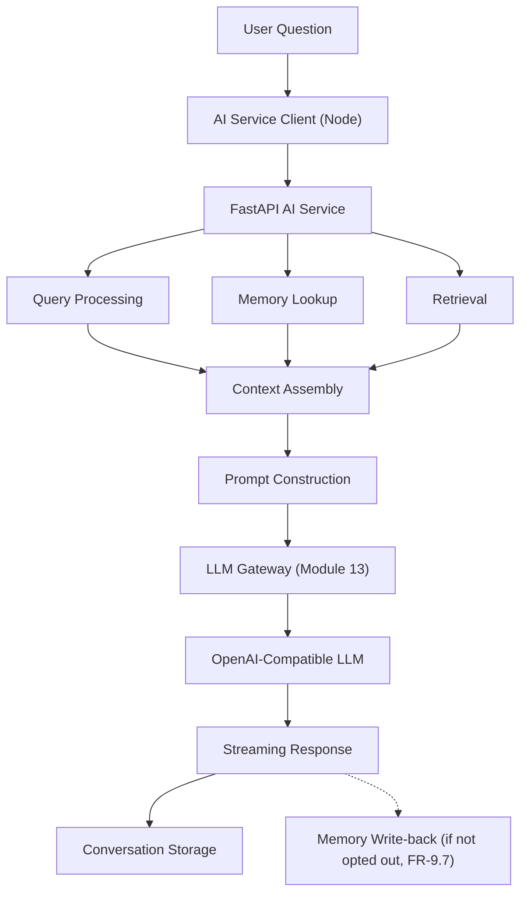
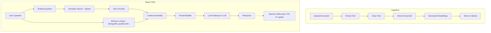
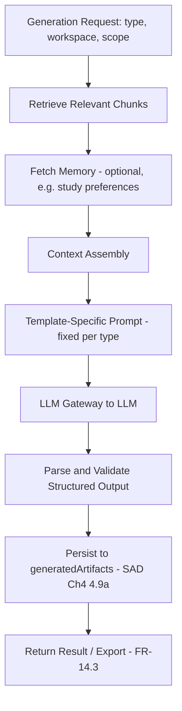

# SAD Chapter 6 — AI Architecture (RAG + Knowledge Engine)

**Document:** NexusAI Workspace — Software Architecture Document (SAD)
**Chapter:** 6
**Status:** Final
**Depends on:** SAD Chapters 1–5 (D44–D74), PRD Chapters 1–8 (D1–D43)
**Source:** SAD draft Chapter 6 (preserved in substance, corrected and substantially expanded below)

> **This is the most-corrected chapter in the SAD so far**, and it's worth being direct about why: it's the chapter most likely to be drafted from general RAG-architecture knowledge rather than from this project's own locked decisions, and it shows — the LangGraph reversal (already fixed twice, in SAD Chapters 1 and 2) reappears a third time here, the AI Gateway naming collision (fixed once, in Chapter 5) reappears a second time, and memory transparency (fixed four times already) needed restoring a fifth. All resolved below, plus one substantial gap: the chapter titled "the heart of NexusAI Workspace" had no dedicated coverage of the Generation Engine at all, despite it being confirmed, locked v1 scope.

---

## Purpose

This chapter is the technical core of the product's actual differentiation — the opening framing ("where is the AI in your project?") is exactly right, and it deserves the most rigorous consistency check of any SAD chapter, since it's the one a technical reviewer will scrutinize hardest.

## Scope

Covers: AI philosophy, high-level AI architecture, RAG rationale, the complete RAG pipeline, document ingestion, text extraction/cleaning, chunking, metadata, embeddings, vector storage, retrieval strategy, context assembly, prompt construction, conversation memory, response generation, citations, guardrails, LangChain/LangGraph usage, fine-tuning strategy, AI evaluation, AI safety, and the future AI roadmap. Expanded to include a dedicated Generation Engine section (§6.16a, new).

## Objectives of This Chapter

1. Resolve the LangGraph reversal decisively and finally — this is its third appearance, and it needs to stop being something future chapters can casually contradict.
2. Fix the recurring memory-transparency gap in the one chapter most responsible for describing how memory actually works.
3. Give the Generation Engine — confirmed v1 scope, four templates, entirely absent from this chapter — the coverage a chapter calling itself "the heart of the product" should have given it.

---

## 6.1 AI Philosophy (Unchanged)

Accurate and well-stated — the "not a chatbot, a Knowledge Intelligence Platform" framing is consistent with the PRD's "AI Knowledge Operating Platform" positioning (D10). No issues.

## 6.2 High-Level AI Architecture (Corrected — naming collision and missing Gateway)

**Naming collision found and resolved (D75, second occurrence).** The diagram labels a Node-side box "AI Gateway (Node)" — this is the exact collision already found and fixed in **SAD Chapter 5 (D70)**, where the equivalent component was renamed **AI Service Client** specifically to avoid conflicting with the LLM Gateway (Module 13), which lives inside FastAPI. Corrected here to match.

**Missing component:** the diagram jumps directly from "Prompt Construction" to "OpenAI-Compatible LLM" with no LLM Gateway node — omitting a component confirmed in every prior SAD chapter (1, 2, 3). Corrected:



**Terminology note (D82):** "Query Processing," "Context Assembly," and "Prompt Construction" are **internal stages within the AI Orchestration Engine's LangGraph pipeline** — not additional Engines beyond the set already confirmed in PRD Chapter 8 and mapped to services in SAD Chapter 1 §1.3. Naming them as boxes in this diagram is fine for illustrating data flow, but they should not be read as new architectural Engines requiring their own service boundary or entry in the Engines-to-Services table.

## 6.3 Why Retrieval-Augmented Generation (RAG)? (Unchanged)

Accurate and a good, simple illustration of the core value proposition. No issues.

## 6.4 Complete RAG Pipeline (Corrected — synced with §6.2)

**Gap found (D77) — this chapter contradicts itself.** §6.2's own diagram includes Memory Lookup as a parallel step; this section's more detailed pipeline (`Embed Question → Semantic Search → Top-k Chunks → Prompt Builder → LLM → Response`) omits memory entirely — the same "responsibility list vs. detailed diagram disagree" pattern already caught in SAD Chapters 1, 3, and 5. Corrected:



This is now the canonical, complete pipeline — matching §6.2 rather than contradicting it.

## 6.5 Document Ingestion Pipeline (Unchanged)

Accurate and consistent with SAD Chapter 1 §1.6's confirmed sequence. No issues.

## 6.6 Text Extraction (Unchanged)

Good, concrete library choices per file type. Consistent with PRD's confirmed supported formats (FR-4.1: PDF, DOCX, TXT, Markdown, CSV, ZIP). One addition: ZIP handling (PRD FR-7.9, confirmed) should route each extracted file back through this same per-type table — worth a one-line cross-reference, not a new mechanism.

## 6.7 Text Cleaning (Unchanged)

Good, specific, and the "retain page numbers in metadata for citations" instruction correctly anticipates §6.17's citation requirement. No issues.

## 6.8 Chunking Strategy (Unchanged)

Reasonable MVP parameters (500–800 tokens, 100–150 overlap) with a sensible, appropriately-deferred future enhancement (semantic/heading-based chunking). No issues.

## 6.9 Metadata (Corrected — synced with SAD Chapter 4's confirmed schema)

**Gap found (D78).** This example omits every field SAD Chapter 4 §4.13 already confirmed for the Qdrant payload — `text`, `source`, `documentVersion`, `isSuperseded`, `relatedChunkIds`, `relatedConversationIds`, `entityTags`. Corrected to match, with one addition (`section`) flowing back the other way:

```json
{
  "workspaceId": "...",
  "documentId": "...",
  "documentVersion": 2,
  "isSuperseded": false,
  "fileName": "DistributedSystems.pdf",
  "text": "...",
  "source": "DistributedSystems.pdf",
  "page": 12,
  "section": "Replication",
  "chunkIndex": 18,
  "relatedChunkIds": ["chunk_198"],
  "relatedConversationIds": [],
  "entityTags": ["replication", "consistency"]
}
```

**Two-way sync note:** `section` is a genuinely useful field this chapter introduced that Chapter 4's original schema didn't have — recommend it be added to the canonical Chapter 4 payload schema as well, so both chapters describe the same final structure rather than two overlapping-but-different versions.

## 6.10 Embedding Generation (Confirmed)

BAAI/bge-small-en-v1.5 — matches SAD Chapter 2 §2.15 exactly. Consistent, no issues.

## 6.11 Vector Database (Qdrant) (Unchanged)

Accurate and consistent with every prior chapter's Qdrant rationale. No issues.

## 6.12 Retrieval Strategy (Corrected — wording and a clarifying boundary note)

**Wording issue found and fixed (D79).** Describing keyword filtering as "(optional)" undersells a confirmed requirement — PRD FR-8.3 locks in hybrid retrieval (semantic + keyword) as v1 scope, not an optional enhancement. Corrected: *"Semantic similarity (embedding search), keyword/exact-term filtering (confirmed hybrid retrieval, FR-8.3), metadata filtering (workspace, document, tags)."*

**Clarifying boundary, since two components now do "keyword search":** SAD Chapter 5 established that Node's **Search Service** performs standalone keyword search against MongoDB (serving the dedicated Search feature, FR-8.1) and forwards semantic/hybrid queries to this AI Service. This section's "keyword filtering" is a **different, narrower thing**: an in-RAG-pipeline filter (e.g., boosting exact matches on IDs, error codes, or proper nouns within the already-retrieved semantic candidates) used to improve a single chat query's grounding — not the standalone search feature. These are complementary, not duplicated, but worth stating explicitly so a future reader doesn't assume Node and FastAPI are redundantly implementing the same keyword search.

Future cross-encoder reranking is appropriately deferred — no changes needed there.

## 6.13 Context Assembly (Unchanged)

Accurate description of a real, necessary stage (dedup, ordering, context-window trimming, citation preservation). Confirmed as a LangGraph pipeline stage per §6.2's terminology note (D82), not a separate Engine.

## 6.14 Prompt Construction (Unchanged)

Accurate. "Prompt templates should be versioned" is a good, concrete recommendation worth carrying into the implementation directly (e.g., a `promptVersion` field alongside generated artifacts and conversation records, for reproducibility when templates change).

## 6.15 Conversation Memory (Corrected — the chapter's most important fix, fifth restoration)

**Gap found (D80) — fifth restoration of memory transparency across the full document set** (after PRD Chapter 8, SAD Chapters 1, 3, and 4's schema). This section describes short-term/long-term memory generically but says nothing about the behavior this same architecture now has schema support for (SAD Chapter 4 §4.9: `source`, `sourceConversationId`, `sourceMessageId`). Corrected:

> **Long-term memory writes** are tagged `source: "inferred"` when passively extracted from conversation, or `source: "explicit"` when the user directly confirms a fact (e.g., "remember this"). Every write includes `sourceConversationId`/`sourceMessageId` for traceability (FR-9.8). **Before any inferred write**, the AI Orchestration Engine checks the workspace's passive-capture opt-out flag (FR-9.7); if opted out, only explicit memory writes proceed. Memory injection into the prompt (§6.14) should also respect deletions — a record removed via FR-9.5/9.6 must not be resurrected from a stale cache on the next query.

**This is the fifth and, going forward, final restoration this requirement should need** — it's now specified at every level (PRD requirement, SAD architecture, SAD schema, and here, SAD AI-layer behavior). Recommend treating FR-9.4–9.8 compliance as a mandatory review checklist item for any future chapter or code change touching memory, rather than something to re-derive.

## 6.16 Response Generation (Unchanged)

Accurate. Streaming for perceived performance is consistent with PRD Chapter 7's NFR-2 latency targets. No issues.

## 6.16a Generation Engine Pipeline (New — closes a significant gap, D81)

**Gap found: this chapter — explicitly "the heart of NexusAI Workspace" — had no coverage of the Generation Engine at all**, despite Module 14 (flashcards, quiz, literature-review outline, revision plan) being confirmed, locked v1 scope. The only reference to related capability was a "Study Planner" listed under §6.21's *future* agent workflows — which is a miscategorization, since these four templates are confirmed **fixed-graph** v1 features, not future autonomous agents.

**Generation Engine pipeline**, structurally similar to the chat/RAG pipeline (§6.4) but using a dedicated, fixed LangGraph graph per template:



Key implementation notes:
- Each of the four templates is its **own fixed LangGraph graph** — flashcards and quiz use simpler, mostly single-document retrieval; literature-review-outline requires the multi-document synthesis capability confirmed in PRD Chapter 4 §4.2/FR-6.3, and is the most expensive of the four (PRD Chapter 7's tiered latency targets apply directly here).
- Step G (structured-output validation) matters more here than in chat: flashcards and quiz outputs need a consistent, parseable shape (e.g., a JSON schema) to render correctly in the frontend — an unstructured LLM response that doesn't validate should trigger a retry with a stricter prompt, not be passed through malformed.
- `sourceDocumentIds`/`sourceConversationId` (Chapter 4's `generatedArtifacts` schema) are populated from step B/C's actual retrieval results, giving every generated artifact the same groundedness guarantee chat responses have (§6.17's citation principle, applied to generated content).

## 6.17 Citation Generation (Unchanged)

Accurate and a good concrete example. Applies equally to Generation Engine outputs (§6.16a) as to chat responses — worth noting explicitly since generated artifacts are a new context this principle now needs to cover.

## 6.18 AI Guardrails (Unchanged)

Accurate and directly implements PRD Chapter 7 §7.18's anti-hallucination NFR. No issues.

## 6.19 LangChain Usage (Corrected — reconciled with LangGraph)

Consistent in substance with **SAD Chapter 2's D52 resolution**: LangChain components (document loaders, prompt templates, output parsing) are used selectively as **utilities within LangGraph nodes**, not as the orchestration mechanism itself. The original wording here doesn't mention LangGraph at all, which reads — again — as if LangChain were the primary orchestration choice. Corrected to explicitly state the relationship, matching Chapter 2's language exactly rather than re-deriving a slightly different version of the same idea.

## 6.20 Why Not Build Everything with LangChain? (Unchanged in intent)

The underlying point (don't over-abstract core application logic) is correct and consistent with Chapter 2. No changes to the reasoning — just noting it should be read alongside §6.19's correction, not in isolation.

## 6.21 LangGraph in the MVP (Corrected — resolves the third occurrence of this reversal)

**Conflict found and resolved (D76 — third occurrence).** The original section, "Future LangGraph Support," states LangGraph is reserved for "later versions" and "introduced only when multi-step, stateful workflows become necessary." This directly reverses **SAD Chapter 1's D44** and **Chapter 2's D51**, both of which confirmed LangGraph as the v1 orchestration framework — and it's self-contradicting within this document set specifically, because the "multi-step, stateful workflows" this section says would justify LangGraph are **exactly what v1 already has**: memory-aware RAG (§6.4/§6.15) and the four Generation Engine templates (§6.16a). The trigger condition this section describes as a future threshold has already been met by confirmed v1 scope.

**Resolved:** LangGraph is used in v1, as established in Chapters 1, 2, and restated in §6.2/§6.4/§6.16a above. The section's actual future-relevant content — the agent-workflow list (Research Assistant, Code Review Assistant, Study Planner, Meeting Summarizer) — is retained, but **reframed correctly**:

> **Future: autonomous agent workflows built with LangGraph.** v1 uses LangGraph for *fixed*, engineer-designed graphs (chat/RAG, and one per Generation Engine template). Post-v1, the same framework can support genuinely autonomous, model-directed agents — where the graph structure itself is decided at runtime rather than fixed in advance — for workflows like a Research Assistant or Code Review Assistant. This is the same fixed-graph-vs-autonomous-planning distinction already established in PRD Chapter 2 §2.12 and SAD Chapter 2's D51 resolution, applied to name concrete future agent candidates.

"Study Planner" from the original list is worth flagging as already partially delivered in v1 via the Generation Engine's revision-plan template (§6.16a) — the *autonomous* version (an agent that adapts a study plan dynamically based on ongoing performance) is the legitimate future item; the fixed-template version already exists.

## 6.22 Fine-Tuning Strategy (Unchanged)

Reasonable and consistent with the hosted-LLM-API posture (PRD D42) — fine-tuning a third-party hosted model is typically infeasible or provider-dependent anyway, which reinforces why this is correctly deferred. No issues.

## 6.23 AI Evaluation (Confirmed — closes PRD D4)

**This section is the concrete implementation of PRD D4**, open since Chapter 1 (build a measurable eval framework) and only partially resolved at the operational-metrics level in PRD Chapter 7 §7.20. The retrieval-relevance, citation-accuracy, and hallucination-rate metrics listed here are exactly the IR-quality benchmark D4 was still missing. Recommend the "small benchmark dataset of representative workspace questions" explicitly use the **canonical Redis Optimization scenario** established in PRD Chapter 3 §3.4 as its first labeled example, consistent with that chapter's own recommendation to reuse one running example throughout the project rather than inventing a new one per chapter. **D4 is now fully resolved** — operational metrics (PRD §7.20) plus this IR-quality benchmark (here) together close it.

## 6.24 AI Safety (Unchanged)

Accurate and directly addresses the document-ingestion prompt-injection risk flagged back in PRD Chapter 2's review. "Retrieval of data from other workspaces" correctly ties to the centralized workspace-boundary enforcement principle (PRD §8.8, SAD Chapter 1's security note). No issues.

## 6.25 Future AI Roadmap (Unchanged)

Consistent with prior future-evolution items across the document set (knowledge graph → SAD D54; local LLM → SAD D42/§1.10; cross-encoder reranking → §6.12 above). No issues.

## Chapter Summary (Expanded)

The AI architecture consists of **five** phases, not four — the original summary's "Ingestion, Retrieval, Generation, Memory" list omits the Generation Engine as its own phase (distinct from general "Generation" of chat responses):

> 1. **Ingestion** — transform documents into searchable knowledge.
> 2. **Retrieval** — find the most relevant context (semantic + keyword + memory).
> 3. **Response Generation** — produce grounded, context-aware chat answers.
> 4. **Structured Generation** — produce fixed-shape artifacts (flashcards, quiz, literature-review outline, revision plan) via dedicated LangGraph graphs.
> 5. **Memory** — preserve and transparently manage useful knowledge across interactions (FR-9.4–9.8).

---

## Design Decisions & Trade-offs Log (SAD Chapter 6)

| # | Decision Needed | Resolution | Status |
|---|---|---|---|
| D75 | §6.2 diagram again used "AI Gateway (Node)" (2nd occurrence of the naming collision fixed in SAD Ch.5, D70); LLM Gateway node missing | Renamed to AI Service Client; LLM Gateway added | **Resolved** |
| D76 | §§6.19–6.21 again framed LangGraph as future-only (3rd occurrence — SAD Ch.1, Ch.2 drafts, now here), contradicting locked D44/D51 | Resolved: LangGraph confirmed for v1 fixed graphs; future item reframed as autonomous agents built with LangGraph, not LangGraph itself | **Resolved** |
| D77 | §6.4's detailed pipeline omitted memory, contradicting §6.2's own diagram (same chapter) | Corrected to include memory lookup + write-back | **Resolved** |
| D78 | §6.9's metadata example didn't match SAD Ch.4's confirmed Qdrant payload schema | Synced; `section` field flows back to Ch.4 as a two-way addition | **Resolved** |
| D79 | §6.12 called keyword filtering "optional," undermining confirmed FR-8.3 | Corrected wording; clarified boundary vs. Node's standalone Search Service | **Resolved** |
| D80 | §6.15 omitted memory-transparency behavior (5th restoration across the document set) | Added explicit `source`-tagging, opt-out gating, and deletion-respecting behavior | **Resolved** |
| D81 | No Generation Engine coverage anywhere in the chapter, despite confirmed v1 scope | Added §6.16a, full pipeline | **Resolved** |
| D82 | "Context Assembly," "Query Processing" introduced without reconciling against the confirmed Engines vocabulary | Clarified as LangGraph pipeline stages within AI Orchestration Engine, not new Engines | **Resolved** |

## Security Considerations

- §6.15's corrected opt-out gating (D80) is the actual enforcement point for FR-9.7 — this needs to be a hard check in the LangGraph memory-write node, not a UI-layer suggestion.
- §6.16a's structured-output validation (Generation Engine) is also a safety boundary, not just a UX concern — an unvalidated, malformed LLM response reaching the frontend is a different failure mode than a wrong-but-well-formed one, and should be caught server-side.

## Scalability Considerations

- The Generation Engine's four separate fixed graphs (§6.16a) can be scaled/tuned independently — literature-review-outline's heavier multi-document cost shouldn't force flashcards/quiz to inherit the same latency budget, consistent with PRD Chapter 7's tiered targets.

## Performance Considerations

- Structured-output validation with retry (§6.16a) adds latency on the failure path — worth budgeting for in the tiered targets, since a retry effectively doubles worst-case latency for that request.

## Best Practices Applied in This Expansion

- Resolved the LangGraph reversal for the third and, this time, most decisive time — connecting it explicitly to the fact that v1's own confirmed scope already meets the "multi-step, stateful" threshold the original draft used to justify deferring it, rather than just re-asserting the earlier decision.
- Gave the Generation Engine real architectural coverage rather than leaving it as a single miscategorized bullet point in a future-work list.
- Explicitly named the fifth recurrence of the memory-transparency gap and stated plainly that it should be the last.

## Implementation Notes for Later Chapters

- Chapter 7 (API Architecture, previewed next) should define the concrete request/response contracts for both the chat endpoint and the four Generation Engine template endpoints, using §6.16a's pipeline as the reference.
- The `promptVersion` field suggested in §6.14 should be added to Chapter 4's schema (conversations/generatedArtifacts) for reproducibility.

## Future Enhancements (Chapter-Level)

- Autonomous agent workflows (§6.21, corrected) — Research Assistant, Code Review Assistant, Meeting Summarizer, and an adaptive/autonomous Study Planner (distinct from v1's fixed revision-plan template).
- Cross-encoder reranking, multimodal retrieval, OCR, knowledge graph integration, local LLM deployment — all already correctly deferred in §6.25.

---

## Senior Engineering Review

**Overall assessment:** this chapter's individual sections are technically sound — the RAG pipeline, chunking strategy, and evaluation approach all reflect real production RAG practice. Its problems are entirely about **consistency with this specific project's already-locked decisions**, not RAG knowledge in general, and three of them are recurrences of issues already fixed elsewhere in this document set.

**Resolved in this revision:**
1. The LangGraph reversal (D76) — third occurrence — resolved with the added observation that v1's own scope already satisfies the condition the draft used to justify deferring it.
2. The AI Gateway naming collision (D75) — second occurrence — resolved consistently with SAD Chapter 5's D70.
3. Memory transparency (D80) — fifth restoration — given actual behavioral specification (opt-out gating, source-tagging) for the first time, not just re-confirmed.
4. The Generation Engine (D81) — entirely missing from "the heart of the product" chapter — now has a complete pipeline.

## Summary

This chapter now correctly describes a five-phase AI architecture (ingestion, retrieval, response generation, structured generation, memory) built on a confirmed LangGraph orchestration layer, with memory transparency specified behaviorally for the first time and the previously-invisible Generation Engine given full coverage. Three recurring inconsistencies (LangGraph, AI Gateway naming, memory transparency) are resolved with explicit acknowledgment of how many times each has needed fixing — worth treating as a signal to check future chapters against this document set directly rather than general AI-architecture knowledge.

**Next step:** proceed to Chapter 7 (API Architecture & Communication) as previewed — it should define concrete contracts for chat, the four Generation Engine templates, and the memory-transparency endpoints (FR-9.4–9.8), all of which now have architectural specifications to build against.
