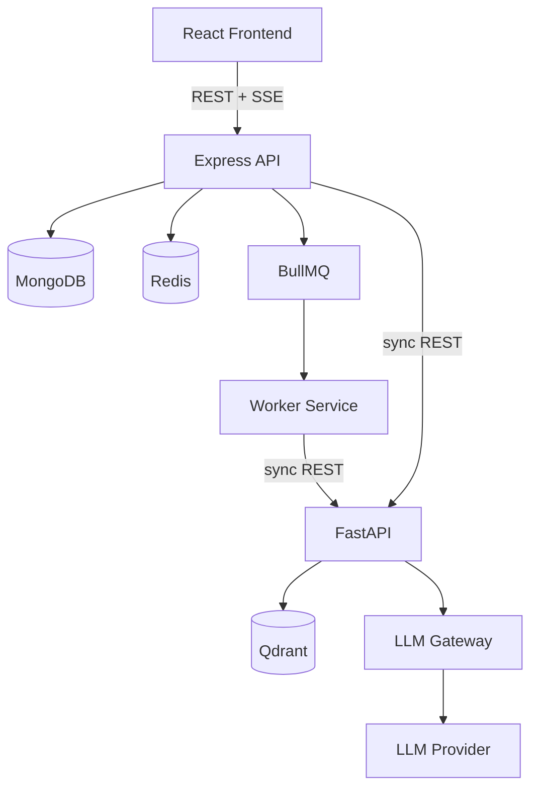
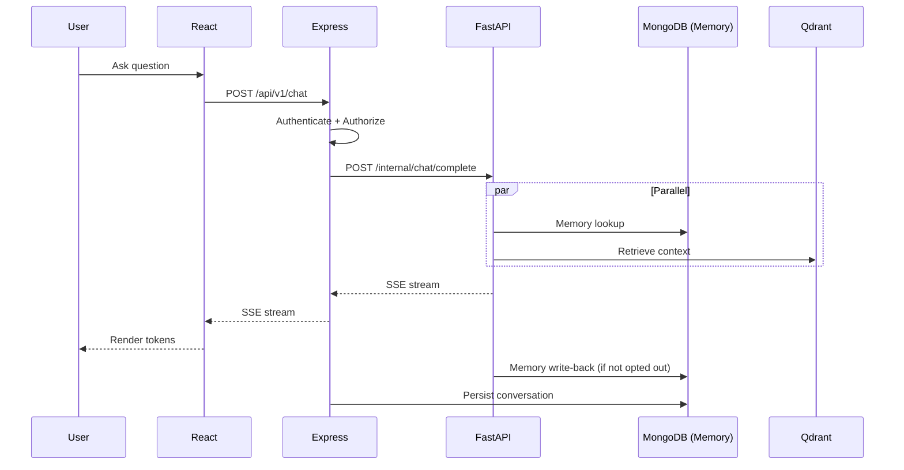

# SAD Chapter 7 — API Architecture & Service Communication

**Document:** NexusAI Workspace — Software Architecture Document (SAD)
**Chapter:** 7
**Status:** Final
**Depends on:** SAD Chapters 1–6 (D44–D82), PRD Chapters 1–8 (D1–D43)
**Source:** SAD draft Chapter 7 (preserved in substance, corrected and expanded below)

> **This chapter is literally "here are the API contracts," and two of the project's most-emphasized, most-corrected features — memory transparency and the Generation Engine — had no endpoints defined at all.** Everything else in this chapter is solid, standard API design, correctly consistent with prior chapters' service boundaries. The gaps are specific and fixed below, including memory's sixth omission from a chat-flow diagram — worth reading that one as a standing instruction for any future chapter, not just another one-off fix.

---

## Purpose

Chapter 6 defined how the AI layer works internally. This chapter defines the actual contracts a frontend developer (or an interviewer reading the API surface) would see — which means completeness against the confirmed FR list matters as much here as it did in Chapter 5's folder structure.

## Scope

Covers: API philosophy, high-level communication, versioning, resource-oriented design, authentication/authorization flows, request lifecycle, response format, status codes, file upload, chat and (newly added) generation APIs, streaming, pagination, filtering, search, internal service communication, idempotency, rate limiting, documentation, security, error handling, API evolution, and production readiness.

## Objectives of This Chapter

1. Add the missing Memory (FR-9.4–9.8) and Generation Engine (Module 14) API contracts — this chapter is where they were supposed to be defined, and they weren't.
2. Fix memory's omission from the chat flow — sixth occurrence across the document set — and resolve a naming collision the new Generation endpoint would otherwise create.
3. Confirm everything else against the already-locked service boundaries (Chapter 5) and communication contract (Chapter 1's D5).

---

## 7.1 API Philosophy (Unchanged)

Accurate and standard — predictable, versioned, secure, consistent, extensible, backward-compatible. No issues.

**Trailing note confirmed:** the pre-chapter clarification (Frontend↔Node: REST+SSE; Node↔FastAPI: HTTP for MVP, gRPC future) matches **SAD Chapter 1's D5** exactly. No changes needed — good independent confirmation of an already-locked decision.

## 7.2 High-Level Communication (Expanded — completed)

**Gap found (D83):** the diagram shows only the synchronous query-time path (Express → Mongo/Redis/FastAPI → Qdrant+LLM), omitting the BullMQ/Worker Service path entirely — even though §7.10 describes the upload flow separately. Also omits the LLM Gateway (Module 13) node, consistent with FastAPI's internal structure established in Chapters 1, 3, and 6.



The frontend still communicates only with Express — that boundary is correctly stated and unchanged.

## 7.3 API Versioning (Expanded — endpoints added)

**Gap found (D84, part 1):** the endpoint list omits `/memory` and `/generate` — both already scaffolded in **SAD Chapter 5's completed folder structure** (§5.3, `memory.routes.ts`, `generation.routes.ts`) but never given actual API paths here. Completed:

> `/api/v1/auth`, `/api/v1/workspaces`, `/api/v1/documents`, `/api/v1/chat`, `/api/v1/search`, `/api/v1/memory`, `/api/v1/generate`, `/api/v1/dashboard`, `/api/v1/notifications`

## 7.4 Resource-Oriented API Design (Expanded — two resources added with full contracts)

**Gap found (D84, part 2) — the chapter's most consequential gap.** Resources listed omit **Memory** (FR-9.4–9.8) and **Generated Artifacts** (Module 14) entirely — the two features that have needed correcting in nearly every prior chapter now have no API contract at all in the one chapter meant to define contracts. Added:

**Memory resource:**

```
GET    /api/v1/memory?workspaceId=...        # FR-9.4 — view memory records
DELETE /api/v1/memory/:id                     # FR-9.5 — delete an individual record
POST   /api/v1/memory/reset                   # FR-9.6 — reset all memory for a workspace (body: workspaceId)
PATCH  /api/v1/memory/settings                # FR-9.7 — toggle passive-capture opt-out (body: workspaceId, passiveCaptureEnabled)
```

**Generated Artifacts resource:**

```
POST   /api/v1/generate                       # Module 14 — create a generation request
GET    /api/v1/generate?workspaceId=...       # list generated artifacts
GET    /api/v1/generate/:id                   # retrieve one artifact
GET    /api/v1/generate/:id/export             # FR-14.3 — Markdown export
```

`POST /api/v1/generate` request body: `{ "workspaceId": "...", "type": "flashcards | quiz | literature_review_outline | revision_plan", "scope": { "documentIds": [...] } }` — directly matching SAD Chapter 6 §6.16a's pipeline input and Chapter 4's `generatedArtifacts` schema.

## 7.5 Authentication Flow (Expanded — one clarification)

Accurate and standard. One addition: **rate limiting (by IP, §7.18) is not the same control as account lockout after repeated failed attempts (PRD FR-1.8, confirmed).** The two are complementary — recommend this flow explicitly note that failed-login tracking is per-account, not just per-IP, so a distributed attempt against one account from many IPs is still caught.

## 7.6 Authorization (Unchanged)

Accurate, and the ownership/workspace-boundary check pattern shown here applies identically to the new Memory and Generated Artifacts endpoints (§7.4) — no separate authorization model needed for them.

## 7.7 Standard Request Lifecycle (Unchanged)

Accurate and consistent with SAD Chapter 5 §5.2's layered architecture. No issues.

## 7.8 Standard Response Format (Expanded — one clarification)

Accurate for standard JSON REST responses. Worth clarifying: **the success/error envelope does not apply to SSE streams** (chat and, per §7.12 below, some generation responses) — those use `event-stream` framing (sequential `data:` chunks), not a single JSON envelope. This distinction matters for frontend implementation and should be explicit rather than assumed.

## 7.9 HTTP Status Codes (Unchanged)

Accurate and comprehensive. No issues.

## 7.10 File Upload API (Unchanged)

Accurate and consistent with SAD Chapter 1 §1.6's confirmed upload sequence. No issues.

## 7.11 AI Chat API (Corrected — sixth restoration of the memory-omission pattern)

**Gap found (D85, sixth occurrence across the full document set — PRD Ch.8, SAD Chs. 1, 3, 4's original drafts, 6, now here).** The flow (`Authenticate → Retrieve Workspace → Forward To AI Service → Receive Stream → Stream To Client → Persist Conversation`) omits memory entirely — the same gap, recurring for the sixth time. Corrected:

> `POST /api/v1/chat` → Authenticate → Authorize workspace access → Forward to FastAPI (parallel: Retrieval + Memory lookup, per SAD Ch.6 §6.4) → Receive stream → Stream to client (SSE) → Memory write-back (if not opted out, FR-9.7) → Persist conversation.

**This should be the last time this specific omission needs fixing.** Given it has now recurred in essentially every chapter that describes a chat/AI flow, worth adopting as a standing rule for any future content: any diagram or flow description touching chat or AI orchestration must show memory lookup and write-back explicitly, by default, not as an optional detail to remember.

## 7.11a Generation API (New — closes part of D84, mirrors §7.11)

No equivalent section existed for the Generation Engine. Added, mirroring the chat API's structure:

> `POST /api/v1/generate` → Authenticate → Authorize workspace access → Validate `type` against the four confirmed templates → Forward to FastAPI's Generation Engine pipeline (SAD Ch.6 §6.16a: retrieve → memory → template prompt → LLM → validate structured output) → Persist to `generatedArtifacts` → Return result.

**Streaming note:** per PRD Chapter 7's tiered latency targets (simple templates fast, literature-review-outline potentially slow), recommend flashcards/quiz return a standard JSON response (fast enough not to need streaming), while literature-review-outline uses SSE for **progressive section delivery** (not token-by-token — structural progress, e.g., one outline section at a time) rather than leaving the client waiting on the single longest-latency operation in the whole system with no feedback.

## 7.12 Streaming Architecture (Confirmed, expanded)

SSE rationale is sound and matches the pre-chapter clarification. Now explicitly applies to two endpoints, not one: chat (token-by-token, §7.11) and literature-review-outline generation (section-by-section, §7.11a) — flashcards, quiz, and revision-plan generation are fast enough to return as standard responses.

## 7.13 Pagination (Unchanged)

Accurate; applies identically to the new `/memory` and `/generate` list endpoints (§7.4) — no changes needed to the pattern itself.

## 7.14 Filtering & Sorting (Unchanged)

Accurate. No issues.

## 7.15 Search API (Unchanged)

Accurate, and the "clients shouldn't need to understand retrieval internals" principle is directly consistent with SAD Chapter 5's Node/Python search split (D71) — the client sees one endpoint regardless of which service actually resolves the query. No issues.

## 7.16 Internal Service Communication (Corrected — naming collision resolved)

**Naming collision found and resolved (D87).** The internal Express→FastAPI endpoint is named `/generate` here, describing the **chat/RAG completion flow** (embedding → retrieval → LLM). This collides with the new **public** `/api/v1/generate` endpoint (§7.4, §7.11a) for the Generation Engine — two different things sharing one name would be genuinely confusing in code, not just documentation. Resolved:

> **Internal FastAPI endpoints (not the same as the public API):**
> - `POST /internal/chat/complete` — chat/RAG completion (embedding → retrieval → memory → LLM → stream)
> - `POST /internal/generate` — Generation Engine (Module 14 templates)
>
> These are internal-only contracts between the Backend API/Worker Service and FastAPI (SAD Chapter 1's confirmed sync-REST boundary) — distinct from the public `/api/v1/chat` and `/api/v1/generate` endpoints the frontend calls, which Express translates into these internal calls.

## 7.17 Idempotency (Expanded — distinguished from job-level idempotency)

Accurate for HTTP-level idempotency (safe retries on `PATCH`/`PUT`). Worth distinguishing explicitly from a **different, already-established mechanism**: **SAD Chapter 4 §4.11's `idempotencyKey`** on background jobs, which prevents a retried BullMQ job from re-processing/re-embedding a document. These operate at different layers (HTTP request idempotency vs. background job idempotency) and shouldn't be conflated — a reader implementing "idempotency" for this system needs both, not one or the other.

## 7.18 Rate Limiting (Expanded — generation endpoint added)

**Gap found (D88):** no rate limit is specified for the new `/generate` endpoint, which — per SAD Chapter 6's tiered latency targets — costs meaningfully more per request than chat (multi-document synthesis for literature-review-outline especially). Added:

> **Generate: 10 requests/minute/user** (lower than chat's 60/minute, reflecting higher per-request cost — consistent with PRD Chapter 2's flagged cost-control tension for AI-native-by-default architecture, and PRD D36's decision that rate limiting, not full usage budgets, is sufficient for v1).

## 7.19 API Documentation (Unchanged)

Accurate — OpenAPI/Swagger, generated from source where practical. No issues.

## 7.20 API Security (Unchanged)

Accurate and comprehensive. No issues.

## 7.21 Error Handling (Expanded — one example added)

Accurate pattern. Adding one concrete example tied to Chapter 6's new content:

> `{ "code": "GENERATION_OUTPUT_INVALID", "message": "Unable to produce a valid flashcard set from the available content." }` — the client-facing surface of SAD Chapter 6 §6.16a's structured-output validation failure path, after the internal retry-with-stricter-prompt has also failed.

## 7.22 API Evolution (Unchanged)

Accurate, standard versioning discipline. No issues.

## 7.23 Sequence Diagram — Chat Request (Corrected — same fix as §7.11, shown as a diagram)



## 7.24 Production Readiness Checklist (Expanded — two items added)

Adding, given this chapter's new content:

> - Memory transparency endpoints (§7.4) tested end-to-end (view, delete, reset, opt-out)
> - Generation endpoints (§7.11a) rate-limited (§7.18) and structured-output validation verified

Everything else in the original checklist (versioning, HTTPS, auth, validation, rate limiting, streaming, pagination, OpenAPI docs, monitoring, logging) is accurate and unchanged.

## Chapter Summary (Unchanged)

Accurate, now describing a complete API surface rather than one missing contracts for two major confirmed features.

---

## Design Decisions & Trade-offs Log (SAD Chapter 7)

| # | Decision Needed | Resolution | Status |
|---|---|---|---|
| D83 | §7.2 diagram omitted the Worker/BullMQ path and the LLM Gateway node | Completed diagram | **Resolved** |
| D84 | No API contracts existed anywhere for Memory (FR-9.4–9.8) or Generated Artifacts (Module 14) | Added full REST contracts for both (§7.3, §7.4) | **Resolved** |
| D85 | Chat API flow omitted memory lookup/write-back — 6th occurrence of this pattern | Corrected; recommended as a standing rule for future chapters | **Resolved** |
| D86 | No Generation API section existed | Added §7.11a | **Resolved** |
| D87 | Internal `/generate` endpoint name collided with the new public `/api/v1/generate` | Renamed internal endpoints: `/internal/chat/complete`, `/internal/generate` | **Resolved** |
| D88 | No rate limit specified for the new, more expensive `/generate` endpoint | Added 10 req/min/user | **Resolved** |
| D89 | HTTP-level idempotency (§7.17) not distinguished from job-level idempotency (Ch.4 §4.11) | Clarified as two distinct mechanisms | **Resolved** |
| D90 | No error-code example for Generation Engine failures | Added `GENERATION_OUTPUT_INVALID` | **Resolved** |
| D91 | Response envelope (§7.8) didn't address SSE framing | Clarified SSE uses different framing, not the JSON envelope | **Resolved** |
| D92 | Rate limiting (IP-based) not distinguished from account lockout (FR-1.8) | Clarified as complementary controls | **Resolved** |
| D93 | Production checklist missing memory/generation-specific verification items | Added | **Resolved** |

## Security Considerations

- The Memory and Generated Artifacts endpoints (§7.4) rely on the same ownership/workspace-boundary check as every other resource (§7.6) — no new authorization model was needed, which is a good sign the centralized enforcement principle (established since PRD §8.8) generalizes cleanly to new resources.
- D92's account-lockout clarification closes a real gap: IP-based rate limiting alone doesn't stop a distributed credential-stuffing attempt against one account.

## Scalability Considerations

- Generation's lower rate limit (D88) is a direct, practical application of PRD D33's scalability position (LLM inference is the expected bottleneck) — throttling the most expensive endpoint hardest is the correct lever, not a generic across-the-board limit.

## Performance Considerations

- The progressive-SSE recommendation for literature-review-outline (§7.11a) directly addresses a gap in PRD Chapter 7's tiered latency targets — a 30-second p95 target is much more tolerable with visible progress than as a single opaque wait.

## Best Practices Applied in This Expansion

- Treated this chapter's job (defining contracts) literally — checked every confirmed FR against whether it had an actual endpoint, which is what surfaced D84 as the chapter's most important gap.
- Caught a naming collision (D87) created by this chapter's own additions before it could reach implementation, rather than after.
- Explicitly marked the memory-omission pattern's sixth occurrence (D85) and recommended it become a standing rule rather than a per-chapter fix, since reactive fixing clearly hasn't stopped it from recurring.

## Implementation Notes for Later Chapters

- Chapter 8 (DevOps/Deployment, previewed next) should account for the Generation endpoint's distinct rate limit and the internal endpoint renaming (§7.16) in any API gateway or reverse-proxy configuration.
- OpenAPI documentation (§7.19) should be generated to include the newly added Memory and Generation contracts from day one, not retrofitted later.

## Future Enhancements (Chapter-Level)

- gRPC between Node and FastAPI (already correctly deferred, per the pre-chapter note and SAD Chapter 1's D5).
- API Gateway, already listed as future in SAD Chapter 1 §1.10.

---

## Senior Engineering Review

**Overall assessment:** the API design principles in this chapter are sound and consistently applied — versioning, response format, error handling, and security are all standard, correct practice. The chapter's real gap is coverage: it's the chapter whose entire job is contracts, and it was missing contracts for the two features that have needed the most correction throughout this entire document set.

**Resolved in this revision:**
1. Memory (FR-9.4–9.8) and Generated Artifacts (Module 14) now have complete REST contracts (D84) — closing the gap at the one layer where "the requirement is confirmed but has no way to actually be called" would otherwise persist indefinitely.
2. The chat flow's memory omission (D85) — sixth occurrence — is fixed, with an explicit recommendation that this become a standing rule for future content rather than a recurring reactive fix.
3. A naming collision this chapter's own additions would have created (D87) is caught and resolved before reaching implementation.

## Summary

This chapter now defines a complete API surface: every confirmed resource — including Memory and Generated Artifacts, previously undefined at the contract level — has REST endpoints, correctly scoped rate limits, and consistent response handling. The recurring memory-omission pattern is fixed for a sixth and hopefully final time, and a genuine naming collision introduced by this chapter's own new endpoints is resolved before it could cause confusion in implementation.

**Next step:** proceed to Chapter 8 (DevOps, Deployment & Production Infrastructure) as previewed — it should account for the two new endpoint categories' distinct rate limits and the internal/public endpoint naming split established here.
