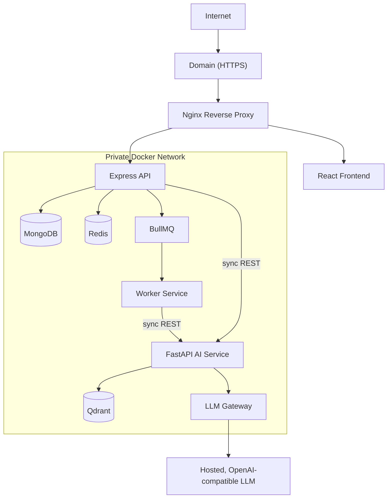

# SAD Chapter 8 — DevOps, Deployment & Production Infrastructure

**Document:** NexusAI Workspace — Software Architecture Document (SAD)
**Chapter:** 8
**Status:** Final
**Depends on:** SAD Chapters 1–7 (D44–D93), PRD Chapters 1–8 (D1–D43)
**Source:** SAD draft Chapter 8 (preserved in substance, corrected below). A trailing proposal to expand the SAD to 12 chapters is evaluated separately, not adopted automatically.

> **Good news up front, for balance:** this chapter shows noticeably better internal consistency than several earlier ones — the container list (§8.3) already correctly includes the Worker Service, the file-storage posture (§8.7) already matches the self-host-for-MVP philosophy established in Chapter 4, the scaling strategy (§8.13) already matches PRD D33's bottleneck position, and the deployment roadmap (§8.20) already correctly defers managed MongoDB to Phase 2 — consistent with Chapter 4's D61. The issues below are real but narrower than in prior chapters: one topology diagram lagging behind its own chapter's container list, one security-boundary ambiguity, and a few completeness gaps.

---

## Purpose

This chapter is where every architectural decision made so far becomes something actually runnable — the deployment topology, environment configuration, and operational checklist. Its job is to be the last mile between "designed" and "deployable," which means it needs to be checked against the *complete* set of components confirmed since Chapter 1, not redrawn from a simplified mental model.

## Scope

Covers: DevOps philosophy, deployment architecture, containerization, Docker Compose, environment configuration, reverse proxy, file storage, CI/CD, health checks, logging, monitoring, queue monitoring, scaling, statelessness, backups, disaster recovery, security hardening, secrets management, local development, the production roadmap, cost optimization, and the production readiness checklist.

## Objectives of This Chapter

1. Sync the deployment diagram (§8.2) with this same chapter's own, already-correct container list (§8.3) — the Worker Service and LLM Gateway are missing from the picture but present everywhere else.
2. Resolve an ambiguity in the Nginx routing example that could be read as exposing FastAPI directly to the internet, contradicting the confirmed frontend-only-talks-to-Express boundary.
3. Evaluate the trailing 12-chapter expansion proposal honestly — distinguishing genuinely new content (testing) from valuable consolidation of material already scattered across existing chapters.

---

## 8.1 DevOps Philosophy (Unchanged)

Accurate and appropriately scoped for an MVP-stage project. No issues.

## 8.2 Deployment Architecture (Corrected — synced with this chapter's own container list)

**Gap found (D94):** the diagram omits the **Worker Service/BullMQ** entirely, even though §8.3 (three sections later, same chapter) correctly lists `worker` as one of eight containers. It also omits the **LLM Gateway (Module 13)** node, showing FastAPI connecting directly to "OpenAI / Llama / Mistral" — the same omission already fixed in SAD Chapters 1, 3, 6, and 7. Corrected:

"All internal services communicate within a private Docker network" (original text) is correct and retained — this correction just makes the diagram match that claim completely.

## 8.3 Dockerized Services (Confirmed accurate)

This list was already correct — `frontend`, `backend`, `worker`, `fastapi-ai`, `mongodb`, `redis`, `qdrant`, `nginx` — matching SAD Chapter 2 §2.19's confirmed containerization decision exactly, including the Worker Service as its own container. It was §8.2's diagram that needed to catch up to this list, not the other way around.

## 8.4 Docker Compose (MVP) (Unchanged)

Accurate. No issues.

## 8.5 Environment Configuration (Corrected — provider-agnostic naming)

**Gap found (D96):** `OPENAI_API_KEY` hard-codes the variable name to a specific provider, which conflicts with the provider-agnostic LLM Gateway (Module 13, confirmed since SAD Chapter 1) and the confirmed hosted-but-swappable posture (PRD D42) — the whole point of the provider-adapter pattern is that the actual provider (OpenAI, Groq, Together, Fireworks, etc.) is configuration, not a hard-coded assumption. Corrected:

> `LLM_PROVIDER_API_KEY`, `LLM_PROVIDER_BASE_URL`, `LLM_MODEL_NAME` (primary provider config); `LLM_FALLBACK_PROVIDER_API_KEY`, `LLM_FALLBACK_PROVIDER_BASE_URL` (supports FR-13.4's confirmed fallback-on-failure requirement, which the original variable list had no configuration surface for at all).

`HF_MODEL_NAME` is correctly kept as-is (embeddings are a separate, already-fixed choice per SAD Chapter 2 §2.15 — no provider-swapping concern there). The rest of the list (`MONGODB_URI`, `REDIS_URL`, `QDRANT_URL`, `JWT_SECRET`, `JWT_REFRESH_SECRET`, `UPLOAD_PATH`, `MAX_FILE_SIZE`, `PORT`) is accurate and unchanged.

## 8.6 Reverse Proxy (Nginx) (Corrected — resolves a security-boundary ambiguity)

**Ambiguity found and resolved (D95).** The routing example includes `/ai/* → FastAPI (internal if exposed)` — this phrasing could be read as offering direct external exposure of FastAPI as an option. That directly conflicts with **SAD Chapter 3's confirmed API Boundary (§3.8)**: *"Only the Express API is exposed to the frontend... the frontend never communicates directly with... FastAPI."* This isn't a minor wording issue — it's the security chokepoint the whole workspace-isolation and centralized-enforcement design depends on (PRD §8.8, restated in every SAD chapter's security notes). Corrected:

> **Nginx routes only two destinations: `/` → React Frontend, `/api/*` → Express API.** FastAPI is never routed through Nginx and has no external route — it is reachable only from Express and the Worker Service, inside the private Docker network (§8.2). There is no "internal if exposed" option; it is not exposed, full stop.

## 8.7 File Storage Strategy (Confirmed accurate)

Already correctly consistent with the self-host-for-MVP, cloud-option-for-future posture established for MongoDB in Chapter 4 (D61) — local storage now, S3/R2/MinIO later, behind an abstraction layer. No changes needed; worth noting explicitly as a good example of a later chapter independently arriving at the same architectural posture as an earlier one, rather than needing correction.

## 8.8 CI/CD Pipeline (Expanded — one addition)

Accurate pipeline (push → tests → lint → build → deploy). One addition worth considering: including the AI evaluation benchmark (SAD Chapter 6 §6.23, which closes PRD D4) as an automated CI step would catch retrieval-quality regressions the same way unit tests catch code regressions — recommend adding this once the benchmark dataset exists, not necessarily in the very first CI pipeline iteration.

## 8.9 Health Checks (Expanded — one addition)

**Gap found (D97, minor):** the health-check list doesn't explicitly cover Worker Service liveness — a BullMQ worker process can die silently while Redis/MongoDB/FastAPI all still report healthy, leaving jobs stuck in the queue with no health signal catching it. Added: *"Worker queue-processing liveness (last-job-completed timestamp within an expected threshold)."*

## 8.10 Logging Strategy (Expanded — one clarification)

Accurate. "Avoid logging sensitive information" is correct but general — worth making explicit given how much emphasis this project has placed on memory privacy specifically: **memory record contents and generated-artifact contents should never appear in logs**, even at debug level — log metadata (IDs, timestamps, operation type) about memory/generation operations, never the content itself.

## 8.11 Monitoring (Expanded — closes an open PRD recommendation)

**Gap found (D99).** PRD Chapter 7's review recommended tracking memory-operation volume and generation job success/failure rate as metrics, given both are newer, higher-scrutiny features — that recommendation was never implemented in a concrete monitoring section until now. Added:

> **AI metrics, expanded:** generation success/failure rate, broken down per template type (flashcards, quiz, literature-review outline, revision plan) — since SAD Chapter 6 established these have meaningfully different cost/failure profiles and shouldn't be monitored as one aggregate number.
> **New category — Memory:** memory view/delete/reset operation volume (adoption signal for the transparency features), passive-capture opt-out rate.

## 8.12 Queue Monitoring (Unchanged)

Accurate and standard. No issues.

## 8.13 Scaling Strategy (Confirmed accurate)

Already correctly consistent with PRD D33 (LLM inference and vector search as the expected bottlenecks) — "Workers and AI services scale independently based on workload" is exactly the right lever. No changes needed.

## 8.14 Stateless Services (Unchanged)

Accurate. No issues.

## 8.15 Backup Strategy (Expanded — one note)

Accurate. Worth a one-line addition given what MongoDB now stores (Chapter 4): backups of MongoDB implicitly include Memory records and Generated Artifacts — both privacy-sensitive — so backup access controls and retention policy should be held to the same standard as the live data, not treated as a lower-sensitivity copy.

## 8.16 Disaster Recovery (Unchanged)

Accurate, concrete recovery steps — appropriately more detailed here than PRD Chapter 7's deliberately deferred DR section, which is the right division of labor (PRD states the requirement exists; SAD states how). No issues.

## 8.17 Security Hardening (Unchanged)

Accurate and comprehensive. No issues — the cascading-deletion job (Chapter 4 §4.17) and memory-transparency endpoints (Chapter 7 §7.4) are already covered by "input validation" and "authentication" at this level of abstraction; no new line item needed here specifically.

## 8.18 Secrets Management (Unchanged)

Accurate and consistent with SAD Chapter 2's "never hardcode credentials" principle. No issues.

## 8.19 Local Development Workflow (Unchanged)

Accurate. No issues.

## 8.20 Production Deployment Roadmap (Confirmed accurate)

Already correctly consistent with everything: Phase 1 (MVP, self-hosted single VM, Docker Compose, local storage) → Phase 2 (managed MongoDB, cloud object storage, managed Redis — correctly deferred, matching Chapter 4's D61) → Phase 3 (Kubernetes, auto-scaling, multi-region, CDN). No changes needed.

## 8.21 Cost Optimization (Unchanged)

Accurate, and "select smaller embedding models for routine tasks" is already consistent with the confirmed BAAI/bge-small-en-v1.5 choice (Chapter 2 §2.15). No issues.

## 8.22 Production Readiness Checklist (Expanded — cross-referenced rather than duplicated)

Accurate. Rather than re-deriving items already owned by Chapter 7's checklist (§7.24: memory/generation endpoint verification), recommend this section add a cross-reference — *"See also Chapter 7 §7.24 for API-specific readiness items"* — so the two checklists stay in sync by pointing at each other rather than drifting as two independently-maintained lists.

## Chapter Summary (Unchanged)

Accurate summary of a deployment architecture that — once the diagram is synced with its own container list and the FastAPI exposure ambiguity is closed — is genuinely solid and consistent with everything established since Chapter 1.

---

## Evaluating the "Expand to 12 Chapters" Proposal

**Assessment: worth doing, but the four proposed chapters aren't equally "new."** Three of the four would substantially consolidate and deepen content already scattered across the existing 15 chapters (8 PRD + 8 SAD... wait, 8 SAD chapters through this one); one is a genuine, currently-unaddressed gap. Breaking this down honestly rather than accepting the framing wholesale:

| Proposed Chapter | New Content or Consolidation? | Assessment |
|---|---|---|
| **9 — Security Architecture** | Mostly consolidation | JWT lifecycle, multi-tenant isolation, and prompt-injection defenses are already specified (SAD Ch.1, 3, 6 §6.24) but scattered across 6+ chapters with slightly different framing each time. Real value: one authoritative security reference. Genuinely new: refresh-token rotation mechanics, specific OWASP Top 10 mapping. |
| **10 — Performance & Scalability** | Mostly consolidation | Scaling strategy, bottleneck analysis (D33), and caching are touched on in Chapters 1, 2, 4, 7, 8 already. Real value: finally specifying **exact Redis cache keys/TTLs** — flagged as underspecified back in PRD Chapter 2's review and never actually resolved. This chapter is the natural place to close that out. |
| **11 — Testing Strategy** | **Genuinely new** | No dedicated testing content exists anywhere in the PRD or SAD — the closest is "basic testing" in PRD Chapter 7's readiness checklist. This is a real gap, not a consolidation opportunity, and arguably the **highest-priority** of the four given the project's stated goal of demonstrating production-quality engineering. Should include AI evaluation testing as a formalized test suite built on Chapter 6 §6.23's benchmark approach. |
| **12 — Future Roadmap & System Evolution** | Mostly consolidation, two new items | Knowledge graph (D54), LangGraph agents (Ch.6 §6.21, corrected), plugin ecosystem, multimodal RAG, local LLM — all already logged as future items across multiple chapters. **Genuinely new:** MCP (Model Context Protocol) support, mobile app, and browser extension weren't mentioned anywhere before — reasonable additions, consistent with the project's AI-native positioning, not scope-creep. |

**Recommendation:** proceed with all four, but calibrate effort to the honest assessment above — Chapters 9, 10, and 12 should be approached as **synthesis chapters** (pull together and deepen what's already decided, resolve the few genuinely open specifics like cache TTLs and token rotation) rather than fully-new architecture, while **Chapter 11 (Testing) deserves the most original effort**, since it's the one area with no existing foundation to build on.

---

## Design Decisions & Trade-offs Log (SAD Chapter 8)

| # | Decision Needed | Resolution | Status |
|---|---|---|---|
| D94 | §8.2 diagram omitted the Worker Service/BullMQ (despite §8.3's own correct list) and the LLM Gateway node | Diagram corrected to match §8.3 and prior chapters | **Resolved** |
| D95 | Nginx routing example implied FastAPI could be directly exposed ("internal if exposed"), contradicting the confirmed frontend-only-talks-to-Express boundary | Resolved: Nginx routes only to Frontend and Express; FastAPI has no external route, unconditionally | **Resolved** |
| D96 | `OPENAI_API_KEY` hard-coded a specific provider, contradicting the provider-agnostic LLM Gateway | Generalized to `LLM_PROVIDER_API_KEY`/`BASE_URL`/`MODEL_NAME` plus fallback-provider variables (FR-13.4) | **Resolved** |
| D97 | Health checks didn't cover Worker Service liveness | Added | **Resolved** |
| D98 | Logging guidance didn't explicitly exclude memory/generated-artifact content | Added explicit exclusion | **Resolved** |
| D99 | Monitoring didn't cover Generation Engine or Memory-operation metrics (open PRD recommendation) | Added both | **Resolved** |
| D100 | Trailing 12-chapter expansion proposal | Recommended, with Chapters 9/10/12 reframed as consolidation/deepening and Chapter 11 (Testing) identified as the genuine, highest-priority gap | **Recommended — confirm** |

## Security Considerations

- D95 is the most important fix in this chapter — an ambiguous routing example is exactly the kind of thing that could get implemented as "expose FastAPI for debugging convenience" and quietly become a permanent security hole. Resolved unconditionally, not just clarified.
- D96's fallback-provider environment variables are what actually make FR-13.4 (provider fallback) operationally real — the requirement existed since Chapter 1 without a configuration surface to implement it against until now.

## Scalability Considerations

- No new items — this chapter's scaling posture (§8.13) was already correctly aligned with PRD D33.

## Performance Considerations

- No new items beyond what's already logged; the proposed Chapter 10 (Performance & Scalability) is the right place for the still-open Redis cache-key/TTL specification.

## Best Practices Applied in This Expansion

- Gave credit where earlier chapters' lessons had clearly been internalized (container list, file-storage posture, scaling strategy, deployment roadmap) rather than treating every chapter as equally in need of correction.
- Caught a security-boundary ambiguity (D95) that was subtler than the direct contradictions found in earlier chapters — a hedge phrase ("internal if exposed") rather than an outright reversal — and resolved it unconditionally rather than leaving room for the ambiguity to persist.
- Evaluated the trailing chapter-expansion proposal honestly, distinguishing genuine new scope from valuable consolidation, rather than accepting or rejecting it as a single unit.

## Implementation Notes for Later Chapters

- If Chapters 9–12 proceed, Chapter 9 (Security) should consolidate the JWT/workspace-isolation/prompt-injection content already specified across Chapters 1, 3, and 6 rather than re-deriving it independently — the same risk that caused this document set's recurring drift (LangGraph, memory transparency, AI Gateway naming) applies here too if each new chapter is drafted from scratch.
- Chapter 10 (Performance) should resolve the still-open Redis cache-key/TTL specification (flagged since PRD Chapter 2).
- Chapter 11 (Testing) should formalize SAD Chapter 6 §6.23's AI evaluation approach as an actual automated test suite, using the canonical Redis Optimization scenario (PRD Chapter 3 §3.4) as its first labeled case.

## Future Enhancements (Chapter-Level)

- Everything already listed in §8.20's Phase 2/3 roadmap, plus whatever Chapters 9–12 formalize if the expansion proceeds.

---

## Senior Engineering Review

**Overall assessment:** this is the most internally consistent chapter in the SAD relative to its own scope — several sections (container list, file storage, scaling, deployment roadmap) required no correction at all, which is a meaningful improvement over the pattern in Chapters 1, 3, 6, and 7. The remaining issues are real but narrower: one diagram lagging behind its own chapter's text, one security-boundary phrasing ambiguity, and a few completeness gaps rather than direct contradictions of locked decisions.

**Resolved in this revision:**
1. The deployment diagram (D94) now matches this chapter's own correct container list — the fix was internal consistency, not a cross-chapter conflict.
2. The Nginx routing ambiguity (D95) is closed unconditionally — FastAPI is never externally reachable, not "internal if exposed."
3. Environment configuration (D96) now reflects the provider-agnostic architecture the rest of the document set has maintained since Chapter 1.

## Summary

This chapter completes the deployment picture: a corrected topology diagram, an unambiguous security boundary around FastAPI, provider-agnostic environment configuration with fallback support, and monitoring that finally covers the two features (memory, generation) most emphasized throughout this document set. The trailing proposal to extend the SAD to 12 chapters is worth pursuing, with Testing (Chapter 11) as the genuine priority and Security/Performance/Roadmap (9, 10, 12) approached as consolidation of material already decided rather than new architecture.

**Next step:** if proceeding with the 12-chapter expansion, send Chapter 9 (Security Architecture) — recommend drafting it explicitly against this document set's existing security content (SAD Chapters 1, 3, 6 §6.24, 7) rather than as freestanding security best practices, to avoid the drift pattern that recurred throughout Chapters 1–7.
